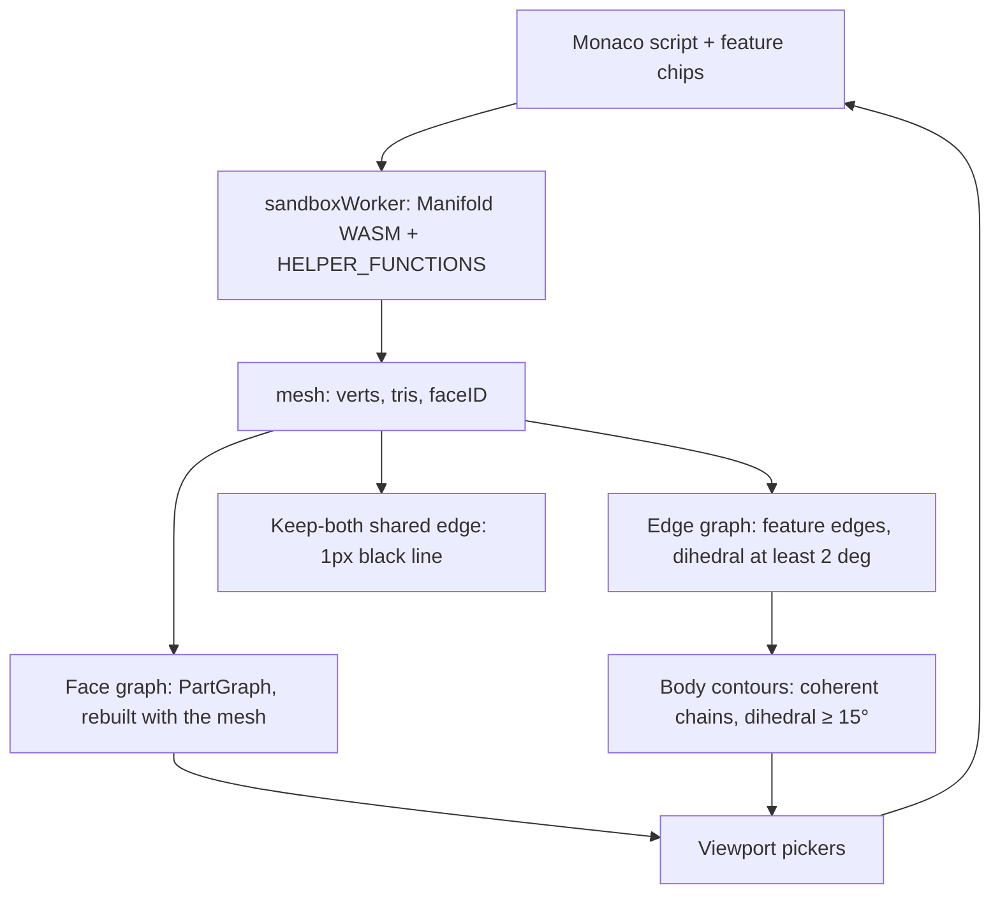

# Architecture

**Maintenance:** every PR that changes kernel helpers, face/edge/contour graphs, multi-body rules, or UI pickers must update this file in the same PR (or a tiny follow-up before the next feature). Drop stale sections when behavior changes.

Runtime map for SurfCAD. Screen placement is `docs/UI_MAP.md`. Popup chrome is `docs/POPUP_STYLE.md`. Blend kernels are `.claude/skills/fillets/SKILL.md`. `EDGES.md` is an older plan; the graphs below are what the code builds.

Two different things are called contours. **Sketch contours** are `makeCrossSection` profiles (contour mode). **Body contours** are the coherent edge chains the viewport paints and that Fillet / Sweep path picks walk. This file uses those names.

## Layers

1. **Script.** Monaco holds the program. Feature chips come from `parseFeatureMarkers`. Confirm writes text into that buffer and Auto-Runs. The worker does not see picker state.
2. **Helpers.** `executeScript` prefixes the script with `"use strict";\n` and runs `new Function(...helperNames, wrappedScript)`. `HELPER_FUNCTIONS` are the parameters. Those names are bindings of the user script. See Goldens.
3. **Mesh.** A successful run replaces the three.js geometry and stores `faceID` on it. `c4MeshData` is a separate worker graph, rebuilt on each helper call that needs faces or edges. It is not the viewport PartGraph. `edge` / `edgesBetween` use `indexBoundaryEdges`, cached in a WeakMap on that Manifold object.
4. **Viewport.** Pickers and paint read the three.js mesh. They do not read `c4MeshData`.

## Helpers

Injected names are the keys of `HELPER_FUNCTIONS` in `src/workers/sandboxWorker.js`. Anything not in that object is not a script helper.

| Helper | Inputs → output | Multi-body |
| --- | --- | --- |
| `makeExtrude`, `makeRevolve`, `makeLoft` | contours or sections → a new solid | No split. UI unions onto `part` when `part` already exists. |
| `loft`, `sweep`, `sweepPoints` | profiles / path → a new solid | Same. |
| `makeCrossSection`, `profileCircle`, `profileRectangle`, `profilePolygon` | plane + 2D profile → a sketch contour, not a solid | — |
| `makeSweepPath` | edge list → one ordered path | Orders the edges it is given. It does not walk bodies. |
| `filletAlongPath` | solid, path, radius, opts → blend (subtract, or union for a concave run) | On a multi-body solid, fillets the body that owns the path, then `compose`s the untouched bodies. The scrap check still runs on that one result. See below. |
| `filletEdges` | solid, edges, radius → planar blend | No `decompose` scrap check. |
| `chamferEdges` | solid, edges, size → chamfer | No `decompose` scrap check. Fillet-mode Chamfer emits `filletAlongPath(..., { profile: 'chamfer' })`, not this. |
| `shell` | solid, thickness, opening → the cavity | No `decompose` / `compose`. Offsets the mesh it is given. |
| `hollow` | same → the walls (`solid − shell`) | Same. |
| `draftFaces` | solid, faces, angle, `{ pull, reference, sense }` → tilted solid | Moves vertices of the selected faces only. No `decompose`. A fillet between the neutral plane and the wall hinges at the blend tangency; the blend face is not drafted. |
| `addDraft` | solid, degrees, axis → `draftFaces(..., 'sides', { reference: 'min' })` | Same. |
| `cut` | solid, plane, `{ bodies, keep, drop }` → kept pieces | `decompose`, cut the named bodies, `compose` what remains. Default `keep` is `'both'`. |
| `move` | solid, `[dx,dy,dz]`, `{ bodies: [{ at }] }` → that body translated | Same split as `cut`. Exactly one body. Other bodies stay. `{ at }` is the vertex centroid. An exact literal uses `cut`'s 1e-4 gate. A re-run may shift that average, so the nearest body within 1% of its radius (at least 0.05) still matches when the next body is farther. A point that is not near a centroid throws. |
| `moveFace` | solid, faces, distance, `{ flip }` → those faces offset along their normals | No `decompose`. Adjacent faces extend or trim. Facets within 10° that are all held or all offset are one plane. A scrap within 10° that lies on a larger face of the same body is that face. Not `move()`. Other bodies' vertices stay. |
| `deleteFace` | solid, faces `{ center, normal }` → those faces removed and the solid healed | No `decompose`. Neighbors extend or trim until they meet. If they cannot keep a closed solid, throws. Does not return an open or non-manifold mesh. |
| `edge`, `edgesBetween`, `boundaryEdges` | current solid + ids → segments | Ids are for this mesh. A miss throws `re-pick edges`. |
| `facesByNormal`, `planarFaceAt`, `edgesByOrientation`, `convexEdges`, `concaveEdges`, `signedFeatureEdges`, `workplaneFromFace`, `placeInFrame`, `transformByFrame`, `placeOnFace` | queries / frames on one solid | Worker faces do not merge across bodies (below). |
| `hole`, `holeSpan`, `cboreHole`, `cskHole`, `holePattern`, `clearanceHole`, `tapDrillHole`, fastener lookups | solid + frame → solid with holes | No body split. |
| `roundedBox`, `tube`, `rectTube`, `hexPrism`, `mirror`, `array3D`, `polarArray`, `center`, `align`, `getDimensions`, loft/sweep vector helpers | as named | No body split. |

`cut` and `move` are the helpers that `decompose` the input and `compose` the output. `shell`, `hollow`, and `draftFaces` do not. A second body already in the solid is just more triangles in that mesh.

Worker faces (`c4MeshData`): a Manifold `faceID` is split into edge-connected components, then components on the **same plane and the same body** are merged. The 0.1° coplanar merge also skips an edge whose two triangles are in different bodies. Body id is the vertex-connected component (`_triComponentIds`): a keep-both cut does not share vertices, so each piece is its own body even when `faceID` is reused. That is what the comment means by each body keeping its own contour. Curved components are not re-merged. A fillet boolean can still leave two copies of a cap vertex about 0.001mm apart, so that merge keeps two faces. A named `moveFace` pick includes the other face when it is the same plane, the same body, and a vertex of each lies within 0.02mm. It also includes a larger face on that body when the pick is a scrap within 10° of it, they share a vertex, and the scrap lies within 0.012mm of the larger plane. The curved blend is degrees off that plane and stays out. `hollow`, `draftFaces`, `cut`, and `deleteFace` still resolve one face.

## When to rebuild graphs

There is no `rebuildGraphs()` and no per-op hook. Cut, Draft, Move Face, and Delete Face do not rebuild anything while the picker is open.

| Graph | Where | Built | Invalidated | Rebuilt |
| --- | --- | --- | --- | --- |
| **Face** (PartGraph) | `faceGraphFor` WeakMap on the BufferGeometry. Overlay copy in `partGraphRef`. | `warmFaceGraph` in `renderMeshData` when the mesh is shown, including after fillet. A click builds it if that paint missed. The overlay builds its own copy when patch colours are on. The 250k-tri cap applies to the **overlay only**. | `renderMeshData` drops `partGraphRef` and replaces the geometry. The WeakMap misses, then that paint fills the new mesh. | That paint. Not while Cut, Draft, Move Face, or Delete Face is still on the old mesh. |
| **Edge** | `buildFeatureEdges` inside `syncFeatureEdges`. Cache key is the geometry object (`featureEdgesSourceRef`). | Dihedral **≥ 2°**. Each edge gets `bodyId` from `meshBodyComponents` (shared vertex index = one body). | Success path sets the source ref to null, then syncs. An empty script clears and does not rebuild. | End of every successful run, including Cut and Draft confirm. Also on Fillet enter, leaving Fillet while still in Edge, and Sweep path pick. |
| **Body contours** | `buildCoherentEdges` in that same sync. Not a third cache. | Feature edges with dihedral **≥ 15°**, traced into chains. A keep-both cut shares no vertices, so a vertex walk cannot cross pieces. `bodyId` also blocks collinear merge and the spatial / parallel-face bridges (those links do not require a shared index). | Same as the edge graph. | Same call. If `faceID` is present, `indexBoundaryEdges` also runs and annotates those edges (fillet `fN` / `eN`). |

`indexBoundaryEdges` (worker `edge()` and viewport labels) keeps a boundary when dihedral ≥ 15° **and** the smaller face is ≥ 5% of the largest face. That is a stricter set than the coherent chains. Shallow blend facets stay out of both.

**After Cut confirm and after Draft confirm** the path is the same: Confirm writes one call, Auto-Run, `renderMeshData`, then `syncFeatureEdges` on the new geometry.

- Edge graph and body contours are rebuilt in that success path.
- The face graph is rebuilt in that same paint (`warmFaceGraph`). A new geometry is a WeakMap miss, so the graph is the new mesh, not the pre-fillet one.
- In that rebuild, coplanar pieces of one plane in the same body become one face when a fillet sits between them, even if the face ids still differ. Vertices within 0.02mm count as touching, so a duplicate-vertex seam on that plane is the same face after the needle between the copies is dropped from the drawn mesh. The curved blend stays its own patch. Coplanar walls whose path leaves the plane stay separate faces.
- Face and edge picks are cleared, except Fillet mode and Sweep contour mode, which keep the edge wire and re-stamp boundary ids.
- The live Cut preview (`previewCut` on a clone) and the Move preview (translated triangles) do not replace `resultRef.geometry`. Graphs stay on the uncut / unmoved solid. Preview meshes do not raycast.
- Draft highlights do not change the mesh. Taps before Confirm still read the pre-draft graphs.
- Shell confirm uses this same run path. Nothing in the graph code special-cases shell.
- **Move Face confirm** is the same path: one `moveFace()`, Auto-Run, then the edge graph, body contours, and face graph rebuild. Fillet confirm is the same paint: the face graph is rebuilt with the filleted mesh.
- The Move Face preview runs `moveFace` on a clone. It does not replace `resultRef.geometry` and does not rebuild graphs. Dismiss writes nothing.
- **Delete Face confirm** writes one `deleteFace()` for every picked face, replaces the previous Delete Face block, Auto-Runs, then the edge graph, body contours, and face graph rebuild. A heal that cannot stay a closed solid throws on that run.
- A Delete Face tap only adds or removes the face. It does not run `deleteFace`. Leaving without Confirm writes nothing.
- **Assembly.** Graphs stay on the active part, the script in the editor. A successful run of that part rebuilds the face graph when the new mesh is shown, and rebuilds the edge graph and body contours at the end of the run. A failed run, or hiding that part, clears its mesh and does not rebuild from a previous solid. Other visible parts are extra meshes. Showing or hiding them does not rebuild graphs.

What the new mesh contains is the difference, not the rebuild:

- **Keep-both cut.** Two vertex-disjoint bodies. Vertex walks cannot cross them. Face and edge graphs clip to the seed body: `selectGraphFace`, legacy taps (Move Face and Delete Face included), and the part-graph merge drop triangles that belong to another body. An edge walk skips a neighbor whose `bodyId` differs. The shared edge is painted (below).
- **Draft.** One body, unless the input was already split. Vertices of the drafted faces move, so dihedrals change, so the 2° / 15° gates can drop or keep different edges. No draft flag is stored on an edge.

## One click, one face

`resolveViewportFaceClick`:

- **Default (one click).** The PartGraph patch of the hit triangle. A flat is every coplanar triangle on that plane in the body, including a cap a fillet split onto the other source body's face id. A curved face is the curvature-merged band. The blend stays its own patch. If the mesh has more than one body, triangles outside the seed body are removed. The hit triangle alone is not the face.
- **Default (double click).** The vertex-connected body (`selectOwningBody`), not a wider face.
- **Shell, Draft, Cut** pass `legacy`. One click on a flat is that same planar patch. Two clicks are the 3° neighbour walk, three clicks are the connected component. A double click does **not** become the body, so Confirm still writes the tapped face. A click on the blend stays the coplanar facet.
- **Move.** One click is the full face and does not change the target. Double click sets that body (`{ at }` centroid).
- **Move Face.** One click is that same planar face, not the curved fillet. A double click is still the 3° walk, not the body, so Confirm still writes the tapped faces. Triangles outside the seed body are removed. The fillet and the cap are one vertex-connected body. `moveFace` still carries a tangent blend with the offset; the click does not select that blend. The offset also includes the other coplanar face across a duplicate-vertex seam (≤ 0.02mm), and a larger face when the pick landed on a scrap of that plane. The needle between those copies is not drawn. The highlight outline drops that seam, so the click has no line between the fillet side and the main side.
- **Delete Face.** Same legacy tap as Shell and Move Face, including that seed-body clip. A double click is not the body. The tap does not delete.

Worker face picks (`{ center, normal }` passed to `hollow` / `draftFaces` / `cut` / `moveFace` / `deleteFace`) resolve in `c4MeshData`, not in PartGraph. A named pick stays on the body whose surface contains the center. It does not move to another body because that face's center is nearer. The two face graphs are not kept in sync. `moveFace` then includes the coplanar face across that 0.02mm seam, and the larger plane when the named face is a scrap of it, so the offset matches the one face the click already selected. `deleteFace` uses that same center and normal and does not take the extra face.

## Contour paint

What you see as an edge is not one list.

1. **Crease.** The solid uses flat `MeshNormalMaterial`. A crease is wherever two adjacent triangles have different view-space normals. The shader has no angle cutoff. A coplanar diagonal (same normal) does not show. This is not stored. A needle left between two copies of a cap vertex is dropped before the mesh is shown (`dropPlanarFins`), so it is not a crease and not an edge of the face graph. A thin fillet facet is the only cover of its own surface and stays.
2. **Pick contour.** `paintEdgeLines` draws `edgePolyline` of the **selected** or hovered coherent chain (and saved sketch-contour wires). It does not draw every coherent edge. Fillet and Sweep path consume those selected chains (`assembleSweepPath` / `makeSweepPath`). An edge enters that chain only through the gates above: dihedral ≥ 2° to exist, ≥ 15° to join a contour, and the chain must survive the simplify / spine tests. Pieces of a keep-both cut do not share vertices, and `bodyId` blocks the bridges that would join them anyway. The tangent walk stops when the next edge's tangents diverge by more than 28°.
3. **Shared cut.** Only `contactSeamSegments`. See below.
4. **Face highlight.** `highlightFace` paints the picked triangles and a line on each boundary edge. An edge two of those triangles share by index is not a boundary. An edge whose midpoint already lies on another triangle of that same pick, within 0.02mm, is a duplicate-vertex seam and is not drawn. The curved fillet is a separate pick. A click on the cap does not trace the line between the fillet side and the main side, and the fillet's own outline stays.

**Edges that end on a drafted face.** No painter checks "drafted", and there is no draft flag. After Draft confirm the mesh is new and the same gates run on the new dihedrals. An edge under 15° is absent from the coherent contour. The 28° tangent walk stops when the next tangent diverges. A 12° draft leaves the wall edges well above 15° (about 78–102° on the playtest cube), and that 28° walk already stopped at the 90° corner before the draft. Those gates were not why the wrap stopped short. The documented guess that they were is wrong.

The varying-profile cutter swept one tube through that 90° corner. The easy path already splits a run at a turn sharper than `FRAME_DENSIFY_MAX_TURN_DEG` (5°). The varying-profile path now does the same: one tube per straight leg, then union. A smooth loft (turns ≤ 5°) stays one run. The shredded mesh was what broke the drafted-face contours into short fragments.

An open fillet end extends in two cases. Neither is a sphere cap, and neither is the concave open-end pad.

- The end lands on a tilted face. The distance is how far the end profile must travel to clear that plane, capped, plus the sweep expand pad. Clearance about 0 means the end is already on the face. Alignment tighter than cos(2°) is not that test. A rounded run samples the back end only.
- The end is not an original path end, and the turn there is about 20° or less (a same-radius joint, or a shallow kink the 5° split cut). It is pushed along the outward tangent by the sweep expand pad. A hard corner, about 90°, is not.

Path thinning (the 1.2 mm floor) can drop the vertex where a circular run meets a long straight. That joint is put back when the thinned shortcut turns more than 5° and the span is a circle running into a long straight. The 18° gate that rebuilds a whole collapsed quarter stays.

## Keep-both cut and the shared edge

`cut` defaults to `keep: 'both'`. Each selected body is `splitByPlane`. Kept pieces are `Manifold.compose`d when more than one remains. `decompose()` splits them apart again. They do not share vertices, so each piece is its own body. A body that does not cross the plane is returned unchanged. `faceID` may still be reused across the cut; worker face merge will not join those faces (body id is part of the plane key).

The new faces on the cut are real 90° edges on each piece, but the two side faces have the same normal, so the material crease never changes and the cut disappears. `contactSeamSegments` lists only that pair: a feature edge (not a coplanar diagonal) that two different bodies occupy, side normals agreeing (dot ≥ 0.85) and cap normals opposing (dot ≤ −0.85). Which triangle was stored first does not matter. A drafted side is tilted off the cap and still draws this same line when the sides agree and the caps oppose. One body, or a cut that keeps one side, produces no segments.

`attachContactSeam` draws those segments as `gl.LINES` in black (`vec4(0, 0, 0, 1)`), on the edge itself. There is no side-face lift (`CONTACT_SEAM_LIFT` is gone). `mvPosition.z += 0.5` is a depth bias so the line is not lost against the face (far plane is 2000). It is not a second, offset edge.

## filletAlongPath on a multi-body solid

When the input `decompose()`s into two or more bodies, the helper fillets only the body that owns the path, then `Manifold.compose`s the untouched bodies back. Ownership is the smallest worst-point distance of up to 48 path samples to that body's triangles. A tie (the shared cut edge, both ~0) keeps the first decompose index. A bad path throws before the split. One body does not split.

The fillet piece is unioned into that owning body. The blend is one solid with the owner, not a leftover wedge beside it. Keep-both siblings are not part of that union (union would weld the cut). The boolean and the scrap check then see that one body. If decompose still sees separate scrap after the join, the gate below fails loud. Thresholds are unchanged.

The fillet and the cap are already one body (one `decompose` component, one vertex component). The face graph is rebuilt when that mesh is shown (`warmFaceGraph` in `renderMeshData`). Coplanar triangles on one plane in that body become one face even when a fillet sits between them and the face ids still differ. Vertices within 0.02mm count as touching. The curved blend stays its own patch. A click on the cap includes both former bodies and does not include the fillet. `moveFace` on that cap offsets both copies. The drawn mesh drops the needle between them.

| Result of `decompose` | What it does |
| --- | --- |
| 1 component | Keep it. |
| Closed path, 2+ | Throw `decompose found N components on closed path`. No keep-largest. The message has no "scrap vol". |
| Open path, 2+ | Keep the largest, unless scrap volume `> 5%` of that largest **and** `> 0.01`. Then throw `decompose found N components with scrap vol …`. |
| Semi-arc batch (`plan.mode === 'runs'`, a wrap split at corners) | Same 5% / 0.01 test. The message is `semi-arc batch decompose found N components with scrap vol …`. |

Scrap volume is `(sum of component volumes) − largest`. That still means disconnected cutter scraps (thin sheets), not a second designed body. The other keep-both piece is composed back after the check, so it is not scored as scrap.

`golden:fillet-after-cut` is keep-both plus `filletAlongPath`. `golden:fillet-join-body` is an internal fillet whose wedge is in that one body, and a face pick that cannot select another body. `golden:fillet-move-seam` moves the face next to that fillet and checks the body-split line on a drafted face. `golden:fillet-face-pick` is one click on the coplanar cap: both former bodies, not the curved fillet. `golden:fillet-cap-move` offsets that whole cap, both sides of the duplicate-vertex seam. The highlight of that click does not draw the seam. `golden:fillet-wrap-draft` is a wrap that finishes onto a drafted face. Fillet after hollow is a different path: a concave segment forces the variable-profile builder. `golden:draft-fillet-tangency` covers draft hinge vs a fillet.

## UI confirm

Sticky pickers (Shell, Draft, Cut, Move, Move Face, Delete Face) write **one** call and **replace** the previous marked block of that kind. A second confirm does not append. Grey X writes nothing. Chip behaviour is `docs/POPUP_STYLE.md`.

| Mode | Tap | Confirm emits | Next confirm |
| --- | --- | --- | --- |
| Shell | add / remove opening faces. Closed → `'none'`. | one `hollow()` | replace |
| Draft | first tap = neutral (pull). Later taps toggle drafted faces. Undo drops the last drafted face. | one `draftFaces()` | replace |
| Cut | plane, then bodies (tap add/remove), then pieces (tap hides). | one `cut()`. `keep` omitted means both. | replace |
| Move | double-click one body. XYZ, or a distance along the previous cut normal or a face normal. | one `move()` | replace |
| Move Face | tap add / remove. Undo drops the last face. Clear drops the faces. Flip reverses each normal. | one `moveFace()` | replace |
| Delete Face | tap add / remove only. The tap does not run `deleteFace`. Undo drops the last face. Clear drops the faces. | one `deleteFace()` for every picked face | replace |
| Fillet / Chamfer | edge pick. Tangent on by default. | `makeSweepPath` + `filletAlongPath` | **append** if that kind's markers are already in the buffer, else replace |
| Sketch contour (Extrude, Revolve, Loft, Sweep, Profile) | profile on a plane | profile, and a solid for the four tools | replace that marked block |

Fillet's marker comment still says the second Accept replaces. The call site passes `commitMode: 'append'` when `hasFilletModeBlock` (Chamfer the same). `composeFilletCommit` keeps the old block only in that append case.

## Interaction matrix

| | Face graph | Edge + body contours | Shared-edge line | Notes |
| --- | --- | --- | --- | --- |
| Cut confirm (keep both) | rebuilt, then clipped to the seed body | rebuilt; pieces share no vertices | 1px black, on the edge | `filletAlongPath` fillets the body that owns the path, then composes the rest |
| Cut confirm (one side) | rebuilt | rebuilt; one body | none | |
| Draft confirm | rebuilt | rebuilt from new dihedrals | recomputed; one body still has none; a drafted face that still meets the other body keeps the 1px line | wrap splits at a corner sharper than 5°; an open end extends when clearance is not already ~0, and a shallow internal split (≤ ~20°) takes the sweep expand pad; 15° / 28° unchanged |
| Fillet / Chamfer confirm | rebuilt with the new mesh; coplanar caps join across the fillet; the blend stays its own patch | rebuilt; picked wire kept | recomputed from the new mesh | one click on that cap is one face |
| Shell / hollow confirm | rebuilt | rebuilt; no shell-specific rule | recomputed from the new mesh | |
| Move confirm | rebuilt | rebuilt | recomputed from the new mesh | preview does not rebuild graphs |
| Move Face confirm | rebuilt with the new mesh; one click is the planar face, still clipped to the seed body; a ≤0.02mm duplicate-vertex seam stays in that face | rebuilt | recomputed from the new mesh | the click does not include the curved fillet; the offset carries a tangent blend and the other coplanar face across that seam; the needle is not drawn; the highlight outline does not trace that seam; preview does not rebuild graphs |
| Delete Face confirm | rebuilt | rebuilt | recomputed from the new mesh | a heal that cannot close throws on Confirm, not on the tap |
| Enter Cut / Draft / Move / Move Face | unchanged | unchanged | unchanged | highlights and clones only |
| Enter Delete Face | unchanged | unchanged | unchanged | highlight only; the tap does not run `deleteFace` |
| Assembly, active part succeeds | rebuilt when that mesh is shown | rebuilt on the active mesh | recomputed from the active mesh | other visible parts are drawn and are not the pick mesh |
| Assembly, active part fails or is hidden | cleared, not rebuilt from a previous solid | cleared, not rebuilt | none for that part | that part is omitted; no shadow solid |

## Parts feed

The viewport can show more than the script in Monaco. An assembly is a list of parts. The editor still holds one part at a time.

- **Desktop.** A feed pane sits to the left of the editor. Each row is a thumbnail and the part name, in feed order. A red bar marks the selected row and loads that part's script into Monaco. An eye on the row shows or hides that part. Delete on the row removes that part.
- **Mobile.** The home-indicator pill uses Lucide icons. The order is CAD (box), then Script (square-text), then Parts (layout-list). The Parts stage is the same feed. Its top bar uses the script editor ribbon. Load lives in the feed pane.
- **Document.** The saved assembly lists `id`, `name`, `visible`, and `order`. An optional `position` `[x, y, z]` is a translation the viewport applies. There are no mates. The script source is not in the JSON.
- **Row id.** In git mode the id is a repo path and the part is that file. A path with no file yet offers Find in repo. In local mode the id is an IndexedDB key. A missing key offers Upload. Nothing else talks to git.
- **Visibility and failure.** The viewport draws every visible part whose latest run returned a solid. A hidden row is left out. A failed script highlights that row and contributes no solid. The previous mesh is not kept.
- **Delete.** That control drops one part: its row, its script, and its solid. The other parts stay. The active id stays on a remaining part, or is empty when none remain. A git file is left where it is.
- **Graphs.** Face, edge, and body-contour graphs stay on the active part. They rebuild when that part's script succeeds, on the same path as a single script (edge graph and contours at the end of the run; face graph when the new mesh is shown). A failed or hidden active part clears its mesh and does not rebuild those graphs from a previous solid. The other visible parts are drawn beside it and are not the pick mesh, so they do not rebuild graphs.

## Goldens and fixtures

- Runners live in `scripts/golden/`. Playtest scripts live in `scripts/golden/fixtures/*.txt`.
- Each runner is a `package.json` script named `golden:…` (`node scripts/golden/smoke_….mjs`). `npm run verify` is the full gate (`VALIDATION.md`).
- `golden:helper-binding-clash` scans those fixtures. The user script is still the body of `new Function(...helperNames, script)`. A top-level `const cut` in a fixture is a SyntaxError because `cut` is already a parameter. Nesting the script in another function would hide that and is not the fix. Do not name a fixture binding after an injected helper (`cut`, `move`, `shell`, `hollow`, `draftFaces`, `moveFace`, `deleteFace`, …).
- `golden:move-one-axis` moves one picked body along a single axis when the named point has drifted off the vertex centroid the way a re-run of a fillet does. A point that is not near a centroid still throws. The user script is not nested, and it does not declare `cut`, `hollow`, `move`, `moveFace`, `draftFaces`, or `deleteFace`.
- `golden:move-face` offsets picked faces along their normals. Flip reverses each normal. Adjacent planar faces extend or trim. A tangent fillet on the picked face is carried with that offset (`golden:fillet-move-seam`).
- `golden:fillet-face-pick` is one click on a coplanar cap split by a fillet. The pick covers both former bodies and does not include the curved fillet. The two regions are one body.
- `golden:fillet-cap-move` is Move Face on that cap when a fillet boolean left two copies of the vertices. Both sides offset. The drawn face has no needle between them. The highlight outline has no segment between the fillet side and the main side, and the curved fillet stays out of the pick. The cut cap at the same XY offsets too; the bottom cap stays where it is. A scrap a few degrees off the inner ceiling offsets that whole plane; the bottom cap stays.
- `golden:delete-face` removes a planar chamfer whose neighbors meet again, and throws when deleting a cube face would leave the solid open.
- `golden:assembly` loads the selected row's script, drops a hidden row from the composed viewport, omits a failed script with no previous solid, saves ids rather than inline scripts, and drops a deleted part from the list and from the composed viewport.
