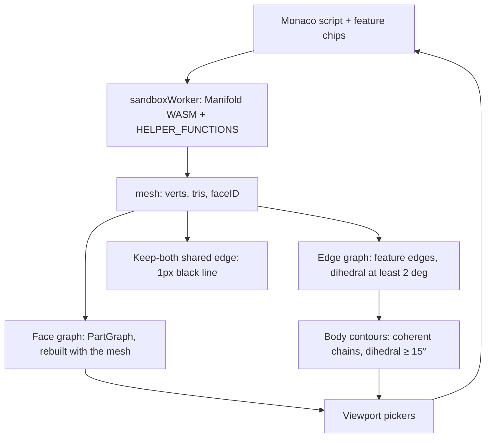

# Architecture

**Maintenance:** every PR that changes kernel helpers, face/edge/contour graphs, multi-body rules, or UI pickers must update this file in the same PR (or a tiny follow-up before the next feature). Drop stale sections when behavior changes.

Runtime map for SurfCAD. The vault format is `docs/vault-schema.md`. Screen placement is `docs/UI_MAP.md`. Popup chrome is `docs/POPUP_STYLE.md`. Blend kernels are `.claude/skills/fillets/SKILL.md`. Fillet and graph speed is `docs/performance.md`. The agent catalog contract is `docs/agent-export.md`. `EDGES.md` is an older plan; the graphs below are what the code builds.

Two different things are called contours. **Sketch contours** are `makeCrossSection` profiles (contour mode). **Body contours** are the coherent edge chains the viewport paints and that Fillet / Sweep path picks walk. This file uses those names.

## Layers

1. **Script.** Monaco holds the program. Feature chips come from `parseFeatureMarkers`. Confirm writes text into that buffer and Auto-Runs. The worker does not see picker state.
2. **Helpers.** `executeScript` prefixes the script with `"use strict";\n` and runs `new Function(...helperNames, wrappedScript)`. `HELPER_FUNCTIONS` are the parameters. Those names are bindings of the user script. See Goldens.
3. **Mesh.** A successful run replaces the three.js geometry and stores `faceID` on it. `c4MeshData` is a separate worker graph, rebuilt on each helper call that needs faces or edges. It is not the viewport PartGraph. `edge` / `edgesBetween` use `indexBoundaryEdges`, cached in a WeakMap on that Manifold object.
4. **Viewport.** Pickers and paint read the three.js mesh. They do not read `c4MeshData`.

## Viewport orbit loop

- The viewport init effect owns one `requestAnimationFrame` loop and one `TrackballControls`. Cleanup cancels that frame (`cancelAnimationFrame` on the id it stored) and calls `controls.dispose()`. The loop updates the controls instance it created, not `controlsRef`, so a later mount cannot retarget a stale loop. That includes React StrictMode in `vite` dev, which runs the effect, the cleanup, then the effect again.
- Orbit feel is `src/utils/trackballFeel.js`: `rotateSpeed` 2, `zoomSpeed` 2.4, `panSpeed` 0.6 (2× the three.js defaults) and `dynamicDampingFactor` 0.36, one step with the same per-frame decay as two default 0.2 steps. `enableDamping` is not a TrackballControls property and is not set.
- **Page zoom lock.** The viewport meta is `width=device-width, initial-scale=1, maximum-scale=1, user-scalable=no`, and still `viewport-fit=cover` plus `interactive-widget=resizes-content`. iOS Safari ignores `user-scalable`. `installPageZoomLock` (`src/utils/pageZoomLock.js`), from its own viewport effect, calls `preventDefault` on `gesturestart` / `gesturechange` / `gestureend` and on multi-touch `touchmove` whose target is outside the canvas (`{ passive: false }`). Cleanup removes those listeners, including under StrictMode. One-finger `touchmove` is not cancelled, so Parts, the Script pane, and scrolling popups still scroll. Touches on the canvas are not cancelled, so TrackballControls keeps pinch-zoom, rotate, and pan. `touch-action: none` is on the viewer shell, the canvas, and the right rail. The left rail is `pan-y` so its tool list still scrolls while a pinch there does not zoom the page. Buttons and fields use `touch-action: manipulation` (no double-tap zoom). Text fields stay at least 16px so focusing one does not zoom the page.

## Helpers

Injected names are the keys of `HELPER_FUNCTIONS` in `src/lib/surfcad/runtime.js`. Anything not in that object is not a script helper. `src/workers/sandboxWorker.js` only calls `bindWorker` on that module.

### Headless entry

- **One module.** Script helpers and `executeScript` live in `src/lib/surfcad/runtime.js`. The worker message protocol is `bindWorker` in that same file. Node imports `src/lib/surfcad/index.js` (`runScript`, `helperScope`, STL / 3MF / STEP). There is no second copy of the helpers.
- **Kernel.** Both paths load `built/manifold.js` + `built/manifold.wasm`. npm `manifold-3d` is a different build. `runScript` also accepts an injected module or a `modulePath`.
- **Evaluation.** `runScript` uses the same `"use strict"` + `new Function(...helperNames, script)` parameter scope as the worker, so a script-local `let hollow` still shadows the helper. Worker global lockdown stays on the worker entry only.
- **Script return.** `manifoldFromScriptResult` is the one check on the worker `execute` path and in `runPreparedScript` (what `runScript` calls). A Manifold passes through. A sheet wrapper — `{ solid }` plus a sheet `spec`, a `flat` pattern, or `kind: 'sheet'` — unwraps to `solid`. Any other non-Manifold still throws `Script must return a Manifold object`.
- **Catalog.** `npm run export:agent` rewrites `src/lib/surfcad/catalog/` from the helper source, `HELPER_FUNCTIONS.md`, the shipped Manifold `.d.ts`, the `.surf.json` rules, and the sheet-metal modules. Regenerate when a helper is added or its signature or docs change, and when the shipped Manifold types change. `golden:agent-catalog` fails if a `HELPER_FUNCTIONS` key has no signature and one-line description in that catalog. The assembly document is `docs/vault-schema.md`.
- **Sync.** An external agent repo copies the import graph of `src/lib/surfcad/index.js` plus `built/manifold.wasm` at a pinned commit. The file list is `src/lib/surfcad/catalog/sync-files.json`. See `docs/agent-export.md`.

| Helper | Inputs → output | Multi-body |
| --- | --- | --- |
| `makeExtrude`, `makeRevolve`, `makeLoft` | contours or sections → a new solid | No split. UI adds or subtracts onto `part` when `part` already exists. Default is add (`part.add`). Merge bodies off emits `part.add(x, { merge: false })` (separate body, below). Subtract emits `part.subtract`. An empty script is still `let part = …`. |
| `loft`, `sweep`, `sweepPoints` | profiles / path → a new solid | Same. Sweep's one-shot fallback still replaces `part` when Mode is Add. Contour Confirm adds or subtracts. |
| `makeCrossSection`, `profileCircle`, `profileRectangle`, `profilePolygon` | plane + 2D profile → a sketch contour, not a solid | — |
| `makeSweepPath` | edge list → one ordered path | Orders the edges it is given. It does not walk bodies. |
| `filletAlongPath` | solid, path, radius, opts → blend (subtract, or union for a concave run) | On a multi-body solid, fillets the body that owns the path, then `compose`s the untouched bodies. The scrap check still runs on that one result. See below. |
| `filletEdges` | solid, edges, radius → planar blend | No `decompose` scrap check. |
| `sheetMetalSolid` | sheet spec (JSON) → one sheet-metal solid | One body. Only Sheet Metal mode writes it, inside the `sheet-metal` markers; it replaces the starter cube rather than adding onto `part`. |
| `chamferEdges` | solid, edges, size → chamfer | No `decompose` scrap check. Fillet-mode Chamfer emits `filletAlongPath(..., { profile: 'chamfer' })`, not this. |
| `shell` | solid, thickness, opening → the cavity | No `decompose` / `compose`. Offsets the mesh it is given. On overlapping bodies the cavity is wrong; use `hollow`. |
| `hollow` | same → the walls (`solid − shell`) | Per body when bodies overlap (`_perBodyFaceOp`, below). |
| `draftFaces` | solid, faces, angle, `{ pull, reference, sense }` → tilted solid | Moves vertices of the selected faces only. Per body when bodies overlap, so `reference: 'min'` is that body's box. A fillet between the neutral plane and the wall hinges at the blend tangency; the blend face is not drafted. |
| `addDraft` | solid, degrees, axis → `draftFaces(..., 'sides', { reference: 'min' })` | Legacy; reference is the whole solid's box. |
| `cut` | solid, plane, `{ bodies, keep, drop }` → kept pieces | `decompose`, cut the named bodies, `compose` what remains. Default `keep` is `'both'`. |
| `booleanBodies` | solid, `{ op, bodies, drop, tools }` → one solid | `decompose`. The first `{ at }` is the target. Later bodies are tools, unioned, then difference is target − tools and intersect is target ∩ tools. Union unions every named body. Unselected bodies are composed back. Omit `bodies` to use every body in decompose order (with `tools`, omitting it names the first body only). `tools: [solid]` are extra tool solids after the named bodies, used for cross-part copies (`externalBody`). Intersect `drop: [{ at }]` deletes leftover pieces by the same centroid gate as `cut` (squared distance ≤ 1e-4). Empty intersection throws. Deleting every piece throws. |
| `externalBody` | `function () { copied script }` or a solid, `{ bodies, offset }` → solid | Runs the copied text, then `decompose` and keeps the bodies whose vertex centroid matches each `{ at }` (same 1e-4 gate as `cut`; a miss throws `externalBody:`). Omit `bodies` to keep the whole solid. Translates by `offset`. The text is a frozen copy, not a reference: nothing reads the source part at run time. |
| `move` | solid, `[dx,dy,dz]`, `{ bodies: [{ at }] }` → that body translated | Same split as `cut`. Exactly one body. Other bodies stay. `{ at }` is the vertex centroid. An exact literal uses `cut`'s 1e-4 gate. A re-run may shift that average, so the nearest body within 1% of its radius (at least 0.05) still matches when the next body is farther. A point that is not near a centroid throws. |
| `moveFace` | solid, faces, distance, `{ flip }` → those faces offset along their normals | No `decompose` unless bodies overlap (then per body). Adjacent faces extend or trim. Facets within 10° that are all held or all offset are one plane. A scrap within 10° that lies on a larger face of the same body is that face. Not `move()`. Other bodies' vertices stay. |
| `deleteFace` | solid, faces `{ center, normal }` → those faces removed and the solid healed | No `decompose` unless bodies overlap (then per body). Neighbors extend or trim until they meet. If they cannot keep a closed solid, throws. Does not return an open or non-manifold mesh. |
| `edge`, `edgesBetween`, `boundaryEdges` | current solid + ids → segments | Ids are for this mesh. A miss throws `re-pick edges`. Fillet Accept of several disjoint corners writes every lookup before the first blend, so those ids are still the pre-blend mesh. |
| `facesByNormal`, `planarFaceAt`, `edgesByOrientation`, `convexEdges`, `concaveEdges`, `signedFeatureEdges`, `workplaneFromFace`, `placeInFrame`, `transformByFrame`, `placeOnFace` | queries / frames on one solid | Worker faces do not merge across bodies (below). |
| `hole`, `holeSpan`, `cboreHole`, `cskHole`, `holePattern`, `clearanceHole`, `tapDrillHole`, fastener lookups | solid + frame → solid with holes | No body split. |
| `roundedBox`, `tube`, `rectTube`, `hexPrism`, `mirror`, `array3D`, `polarArray`, `center`, `align`, `getDimensions`, loft/sweep vector helpers | as named | No body split. |

`cut`, `move`, and `booleanBodies` are the helpers that `decompose` the input and `compose` the output. `externalBody` decomposes its copied solid to keep the named bodies. `shell` and `addDraft` do not. On disjoint bodies (a keep-both cut) `hollow`, `draftFaces`, `moveFace`, `deleteFace` also see one mesh with more triangles.

## Separate bodies (Merge bodies off)

- **Script.** `part = part.add(solid, { merge: false })` → `Manifold.compose([part, solid])`, no boolean. Bare `part.add(solid)` / `{ merge: true }` is the union it always was. Installed on the embind prototype by `installSeparateBodies` (`src/workers/separateBodies.js`) right after `setup()`.
- **Overlap guard.** Composed bodies may overlap, and Manifold's own boolean fuses them wherever the other operand reaches the overlap. So when the receiver's bodies have overlapping boxes (`overlappingBodies`: positive-volume box overlap; a touching cut plane does not count):
  - `subtract` / `intersect` run per body the tool's box meets, the rest are kept, then `compose`.
  - `add` (merge on) unions the tool with every body it actually joins (raw union of that body + tool has fewer components), keeps the others, `compose`s. Touching two bodies fuses them. Touching none → its own body.
  - One body, or bodies that do not overlap → the original method, bit-identical. Static `Manifold.union/difference/intersection` are not patched (`booleanBodies` uses them on the picked bodies).
- **Face features** (`hollow`, `draftFaces`, `moveFace`, `deleteFace`) go through `_perBodyFaceOp` on overlapping bodies: a named `{ center, normal }` goes to the body whose facing surface (normal within ~8°) is closest; unnamed selectors (`'z'`, `'all'`, `'sides'`, `'none'`) run on every body; untouched bodies are kept.
- `filletAlongPath` (fillet + chamfer), `cut`, `move`, `booleanBodies`, `externalBody` already split by body.
- **Viewer.** Compose shares no vertices, so `meshBodyComponents`, double-click `selectOwningBody`, the part graph, `buildFeatureEdges` `bodyId`, Cut / Boolean Pieces and `bodyCentroids` all see the bodies as distinct. Graphs rebuild on the run like any confirm; no new rebuild rule.
- **UI.** `SOLID_MERGE_PARAM` (bool, default on, `showWhen` combine = add) on all six Blocks and the Extrude / Revolve / Loft fallbacks; `ContourModeChip` shows the checkbox only for a solid in Add; Viewport sends `merge` in the commit payload (forced on in Subtract). The first solid is still `let part = …`.
- **Strip.** `parseFeatureMarkers` sets `separate` when the block holds `.add(…, { merge: false })`. `FeatureStrip` draws the violet two-squares marker only when that flag is set **and** the live part still has more than one body (`featureShowsSeparateBody` + `bodyCount` from the last run). A later Boolean union (or any fuse to one body) clears the marker even though the script still says `merge: false`.
- **Limits.** Reported `volume` (and so the quote) is the sum of bodies: an overlap counts twice until a Boolean union. Export writes overlapping shells. `shell()` used by hand as `part.subtract(shell(part, …))` and `addDraft` see the whole mesh. A Boolean union of overlapping bodies is the only way to fuse them besides a merge-on Add that touches both.

Worker faces (`c4MeshData`): a Manifold `faceID` is split into edge-connected components, then components on the **same plane and the same body** are merged. The 0.1° coplanar merge also skips an edge whose two triangles are in different bodies. Body id is the vertex-connected component (`_triComponentIds`): a keep-both cut does not share vertices, so each piece is its own body even when `faceID` is reused. That is what the comment means by each body keeping its own contour. Curved components are not re-merged. A same-offset re-merge also needs the components' own normals within 2° (`COPLANAR_PAIR_MIN_DEG`): `faceID` is only unique within one source mesh, and every swept fillet cutter has the same triangle numbering, so `faceID` k is a facet on each earlier fillet. Two such facets on different fillets can sit at the same offset along their averaged normal on a symmetric part; merged, that face's normal was 45° off both, and `signedFeatureEdges` handed it to the next fillet as the edge dihedral (the three-fillet corner blob). A fillet boolean can still leave two copies of a cap vertex about 0.001mm apart, so that merge keeps two faces. A named `moveFace` pick includes the other face when it is the same plane, the same body, and a vertex of each lies within 0.02mm. It also includes a larger face on that body when the pick is a scrap within 10° of it, they share a vertex, and the scrap lies within 0.012mm of the larger plane. The curved blend is degrees off that plane and stays out. `hollow`, `draftFaces`, `cut`, and `deleteFace` still resolve one face.

## When to rebuild graphs

There is no `rebuildGraphs()` and no per-op hook. Cut, Draft, Move Face, and Delete Face do not rebuild anything while the picker is open.

| Graph | Where | Built | Invalidated | Rebuilt |
| --- | --- | --- | --- | --- |
| **Face** (PartGraph) | `faceGraphFor` WeakMap on the BufferGeometry. | `warmFaceGraph` in `renderMeshData` when the mesh is shown, including after fillet. A click builds it if that paint missed. Curvature κ walks each atom's neighbor list in adjacency-record order. Manifold gives each triangle its own `faceID`, so a scan of every record once per atom was quadratic in the fillet. The planar bridge floods a flat only when another triangle lies on that plane (same 0.5° / 0.05 mm test); a fillet facet with nothing else on its plane is left as it is. Seam vertices are binned by packed integer cells, same 0.02 mm pitch. The patches are unchanged. | `renderMeshData` replaces the geometry. The WeakMap misses, then that paint fills the new mesh. | That paint. Not while Cut, Draft, Move Face, or Delete Face is still on the old mesh. |
| **Edge** | `buildFeatureEdges` inside `featureGraphFor` (`partSolidCache.js`), called by `syncFeatureEdges`. Cached in a WeakMap by geometry object + faceID array; `featureEdgesSourceRef` is the bound geometry. | Dihedral **≥ 2°**. Each edge gets `bodyId` from `meshBodyComponents` (shared vertex index = one body). | A new run is a new geometry, so it misses. An empty script clears and does not rebuild. | End of every successful run, including Cut and Draft confirm. Fillet enter, leaving Fillet in Edge, Sweep path pick, and a part switch re-sync, which is a cache hit when that solid was already built. |
| **Body contours** | `buildCoherentEdges` in that same sync. Not a third cache. | Feature edges with dihedral **≥ 15°**, traced into chains. A keep-both cut shares no vertices, so a vertex walk cannot cross pieces. `bodyId` also blocks collinear merge and the spatial / parallel-face bridges (those links do not require a shared index). | Same as the edge graph. | Same call. If `faceID` is present, `indexBoundaryEdges` also runs and annotates those edges (fillet `fN` / `eN`). |

**Face graph walls.** The face graph rebuilds only in that paint (`warmFaceGraph`, cached by geometry + `faceIDs`; a new run is a new geometry). The adjacency basis is shared vertex-index edges; planar claims also count vertices within 0.02 mm as touching (`seamTouch`). `faceID` is close to per-triangle, so it is not a wall. The wall is the **feature source** of each triangle (`geometry.userData.triSource`): the worker brackets every `filletEdges` / `filletAlongPath` / `chamferEdges` call by Manifold `originalID` and tags runs created inside it with one negative op key (`mesh.runFeature`). Other runs keep their `originalID`. Atoms of one source join under that source's gate. The curved merge also crosses from one fillet call to another when both triangles are fillet ops (a negative feature key and a recorded facet step) and the dihedral is within both gates. A loft wall, a flat, a hole, and a chamfer have no fillet step, so that walk stays off them. The dihedral gate is per source, from the tessellation stored with the feature tag (`mesh.featureTessellation`, copied onto `geometry.userData.featureTessellation`): `roundedBox` and `filletEdges` record a full-circle step (360°/segments; filletEdges is 384, its corner ball 256), and `filletAlongPath` records the right-angle wedge step (90°/segments). `chamferEdges` is a flat wedge and records none. The gate is max(facet step, corner-blend join) × 1.15, clamped to [15°, 50°]. The corner join is the widest same-source curved dihedral finer than the facet step, measured when the graph is built. A source with no tessellation falls back to 15°. A 16-segment rounded box steps 22.5° and meets its corner at about 18°, so the gate is 25.9° and one click follows the whole tangent chain; 8 segments (45°) clamp to 50°; 32 segments (11.25°) stay on the 15° floor. Flats stay locked. A facet that meets its neighbor at the recorded step is that feature's own tessellation, so the area lock does not freeze it (an 8-segment rounded edge is one large quad). The curvature test is unchanged (rate above 0.55 still splits a real radius change) and still does not run inside one fillet op, so a coarse strip of one call is one face. It does not run on a fillet-to-fillet crossing either: the gate is the angle. On the Testpart, fillet 1 (r=4) meets fillets 2 and 4 (r=4.83) at about 2°, under the 15° floor, so one tap selects that chain. The loft fillet meets the loft wall at about 0.8° and stays off it. Two fillet calls on adjacent cube edges meet near 92° and stay apart. A radius cusp inside one `filletEdges` call stays split.

`indexBoundaryEdges` (worker `edge()` and viewport labels) keeps a boundary when dihedral ≥ 15° **and** the smaller face is ≥ 5% of the largest face. That is a stricter set than the coherent chains. Shallow blend facets stay out of both.

On that rebuild, triangle edges are indexed by a packed integer (`lo * 2^26 + hi`), with a string only when a vertex index does not fit in 26 bits — the same kind of numeric key the face graph uses. The 15° / 5% gate runs before segment records are allocated; the kept boundary set is unchanged. Collinear copies in `buildCoherentEdges` are still grouped against the first unused seed, not unioned along a curve. That seed only consults numeric bins of the line's perpendicular foot (the cell is at least the 6° / 0.45 mm slack, and the neighbor cells are included). A contact seam needs two vertex-connected bodies, so one body stops after that count.

**After Cut confirm and after Draft confirm** the path is the same: Confirm writes one call, Auto-Run, `renderMeshData`, then `syncFeatureEdges` on the new geometry.

- Edge graph and body contours are rebuilt in that success path.
- The face graph is rebuilt in that same paint (`warmFaceGraph`). A new geometry is a WeakMap miss, so the graph is the new mesh, not the pre-fillet one.
- In that rebuild, coplanar pieces of one plane in the same body become one face when a fillet sits between them, even if the face ids still differ. Vertices within 0.02mm count as touching, so a duplicate-vertex seam on that plane is the same face after the needle between the copies is dropped from the drawn mesh. The curved blend stays its own patch. Coplanar walls whose path leaves the plane stay separate faces.
- Face and edge picks are cleared, except Fillet mode and Sweep contour mode, which keep the edge wire and re-stamp boundary ids.
- The live Cut preview (`previewCut` on a clone) and the Move preview (translated triangles) do not replace `resultRef.geometry`. Graphs stay on the uncut / unmoved solid. Preview meshes do not raycast.
- The Block preview (`previewBlock`) builds only the new solid. It does not read or assign `cachedManifold` and does not replace `resultRef.geometry`. Graphs stay on the host. The preview does not raycast. Add and Subtract both paint it with the shared preview recipe (`utils/previewStyle.js`, `makeBlockPreviewSkinMaterial`): unlit translucent cyan, the same as Loft. Subtract also skips the depth test, so the cutter shows through the host.
- The Boolean preview (`previewBoolean` on a clone) does the same: `cachedManifold` is not assigned. Intersect piece meshes do raycast, including a hidden piece drawn at opacity 0, so a second tap brings it back. Body picks do not. A cross-part intersect first moves the pick mesh to the target part, then the worker runs the target's script and each tool part's script (not cached), poses the tools by the assembly offset, and splits that result, the same solid Confirm will write. Pieces are drawn at the target's position.
- The cross-part subtract probe (`probeOverlap`) runs the frozen cutter and rebuilds each candidate part from its last mesh. It does not read or assign `cachedManifold` and does not rebuild any graph.
- Draft highlights do not change the mesh. Taps before Confirm still read the pre-draft graphs.
- Shell confirm uses this same run path. Nothing in the graph code special-cases shell.
- **Move Face confirm** is the same path: one `moveFace()`, Auto-Run, then the edge graph, body contours, and face graph rebuild. Fillet confirm is the same paint: the face graph is rebuilt with the filleted mesh.
- The Move Face preview runs `moveFace` on a clone. It does not replace `resultRef.geometry` and does not rebuild graphs. Dismiss writes nothing.
- **Delete Face confirm** writes one `deleteFace()` for every picked face, replaces the previous Delete Face block, Auto-Runs, then the edge graph, body contours, and face graph rebuild. A heal that cannot stay a closed solid throws on that run.
- A Delete Face tap only adds or removes the face. It does not run `deleteFace`. Leaving without Confirm writes nothing.
- **Assembly.** A face, edge, or body pick retargets the active part. Graphs then bind to that part (face graph when the mesh is shown, edge graph and contours at the end of the run, or from the switch cache below), and highlight and preview anchors move with its assembly translation. The script pane stays pinned until the user opens Script or Parts, clicks a body, or picks during a feature. A failed run, or hiding that part, clears the pick mesh and does not rebuild from a previous solid. Other visible parts raycast. Showing or hiding them does not rebuild graphs until a pick retargets onto one of them.

What the new mesh contains is the difference, not the rebuild:

- **Keep-both cut.** Two vertex-disjoint bodies. Vertex walks cannot cross them. Face and edge graphs clip to the seed body: `selectGraphFace`, legacy taps (Move Face and Delete Face included), and the part-graph merge drop triangles that belong to another body. An edge walk skips a neighbor whose `bodyId` differs. The shared edge is painted (below).
- **Draft.** One body, unless the input was already split. Vertices of the drafted faces move, so dihedrals change, so the 2° / 15° gates can drop or keep different edges. No draft flag is stored on an edge.

## One click, one face

`resolveViewportFaceClick`:

- **Default (one click).** The PartGraph patch of the hit triangle. A flat is every coplanar triangle on that plane in the body, including a cap a fillet split onto the other source body's face id. A curved face is the curvature-merged band. The blend stays its own patch. A loft wall is one face: the low-curvature part of that wall is large enough to look like a flat, but it meets the rest of the wall across a shallow edge (≤ 3°) on the same source, so it is not locked and the curved pass keeps going. A real flat still locks. It meets the next face at a crease, or a fillet of another feature, so the blend does not swallow it. One tap paints that whole wall. If the mesh has more than one body, triangles outside the seed body are removed. The hit triangle alone is not the face.
- **Default (double click).** The vertex-connected body (`selectOwningBody`), not a wider face.
- **Shell, Draft, Cut** pass `legacy`. One click on a flat is that same planar patch. Two clicks are the 3° neighbour walk, three clicks are the connected component. A double click does **not** become the body, so Confirm still writes the tapped face. A click on the blend stays the coplanar facet.
- **Move.** One click is the full face and does not change the target. Double click sets that body (`{ at }` centroid).
- **Move Face.** One click is that same planar face, not the curved fillet. A double click is still the 3° walk, not the body, so Confirm still writes the tapped faces. Triangles outside the seed body are removed. The fillet and the cap are one vertex-connected body. `moveFace` still carries a tangent blend with the offset; the click does not select that blend. The offset also includes the other coplanar face across a duplicate-vertex seam (≤ 0.02mm), and a larger face when the pick landed on a scrap of that plane. The needle between those copies is not drawn. The highlight outline drops that seam, so the click has no line between the fillet side and the main side.
- **Delete Face.** Same legacy tap as Shell and Move Face, including that seed-body clip. A double click is not the body. The tap does not delete.

Worker face picks (`{ center, normal }` passed to `hollow` / `draftFaces` / `cut` / `moveFace` / `deleteFace`) resolve in `c4MeshData`, not in PartGraph. A named pick stays on the body whose surface contains the center. It does not move to another body because that face's center is nearer. The two face graphs are not kept in sync. `moveFace` then includes the coplanar face across that 0.02mm seam, and the larger plane when the named face is a scrap of it, so the offset matches the one face the click already selected. `deleteFace` uses that same center and normal and does not take the extra face.

## Face color match

A saved face color is found again from the face graph. `faceFingerprints` (`src/utils/faceColorMatch.js`) reads the PartGraph of the mesh just shown. It does not paint. One patch is one fingerprint, the same `key` stored on `colors[surfId].faces[]`:

- `at` is the patch centroid (area-weighted, mm). `n` is the unit area-weighted normal. A closed wall whose normals cancel keeps the largest triangle's normal. `area` is the patch area.
- A fillet or chamfer patch also stores `src` and `ord`. `src` is the negative feature key (`triSource`) that owns more than half the patch's triangles. `ord` is that feature's patches sorted by center, so two blends from one call stay distinct.
- Rebuild the fingerprints when the face graph rebuilds: after a successful run (a new mesh is a new graph), and on a part switch (read that part's graph, not the previous part's).

A key matches one face when the normal is within 8°, `at` is within 1 mm, and the area is within ±25% of the saved area. A key that stores `src` or `ord` has to match those as well. Faces are binned by `at` (1 mm cells) and by normal; the search checks that cell and its neighbors, then applies the tolerances. Two or more faces in tolerance drop the key as ambiguous. None drop it as missing. There is no guess and no error. A key is compared only to the part it was saved on, so an identical solid under another surf id does not take the color.

## Face color skin

`syncFaceColorSkin` (`src/utils/faceColorSkin.js`) paints that match. It runs after a successful run, when the active part changes, and when the assembly is placed. An empty `colors` map skips it. The saved keys are not rewritten.

- The skin is a child of the part mesh, one per surf id, named `face-color-skin`. It is a lit `MeshStandardMaterial` (metalness 0, roughness 1, specular cleared) on the part's triangles, with a view-space headlight and no distance falloff. A face pointing at the camera reads as the swatch; a turned face is darker. The scene point light decays to nothing at fit distance, so it is not what lights the paint. Vertex colors stay sRGB in the buffer and the shader decodes them before lighting. `polygonOffset` (factor -1, units -2) and no depth write stay: the skin is a different shader on the same triangles, and mobile GPUs z-fight that into stripes without the offset. It does not raycast, so a pick hits the same face as before.
- `colors[surfId].part` fills every triangle. A matched face color is painted over that. Ambiguous and missing keys draw nothing.
- Draw order: solid, then the skin (render order 2), then crease lines (3) and pick highlights (6). Edge and contour lines stay above the skin. A cut, Boolean, or Move Face preview that hides the solid hides the skin too. Hiding, deleting, or dropping a part detaches the skin and disposes its geometry and material.
- `?debugFaces=1`, or `localStorage` `surfcad.debugFaces` = `1`, paints each patch its own color. Off unless that flag is set. It is not a rail button. Game mode uses the same skin and the same pick ray.

## Face color paint

The Paint button (`data-paint-chip`) sits in the right viewer bar, in the plane and contour group, with the same button style as its neighbors. It is green only while paint mode is on. It is not in the title row and it is not rendered in game mode. A per-face rainbow is `?debugFaces=1` or `localStorage` `surfcad.debugFaces` = `1`, not a rail button. Saved colors still draw in game mode. Turning the button on opens the paint popup between the rails (the same cyan glass card as Shell).

A tap paints that face immediately, on the overlay skin, in the selected swatch or the custom hex. There is no separate selection step. A second tap on the same face within 300 ms (`PAINT_DOUBLE_TAP_MS`) upgrades that one paint to every face of the body under the finger, as one `faceColorKey` per face, and does not push a second undo entry. The first tap is not delayed. A tap on a different face is a new action. Phone and desktop share this path: one `mouseup` per tap, so a synthesized click is not counted again. The canvas keeps `touch-action: none`, and `dblclick` is cancelled, so a double tap does not zoom the page. A saved contour or a construction plane under the cursor does not take that tap while Paint is on. A blend and a coplanar seam still resolve to the same face they already do. Nothing is written onto another surf id.

Part paints `colors[surfId].part` for every body of the part. A double-tap paints only the body that was hit. On a single-body solid they look the same, so Part stays. Part is an action, not a mode: a single tap still paints one face. Pressing Part when the part is already that color does nothing.

Nothing is written to the assembly until Confirm. The session is viewport state, and the skin reads it while the popup is open. Confirm writes that session once through `rememberAssembly` and, in Git mode, one outbox op, then closes. That is one assembly undo step. Local and signed-out save the local assembly. Part `isSynced` is unchanged, same as a group rename. Face colors are `faceColorKey` entries in `faces[]`. A saved key that uniquely matches that face is replaced, so a repaint does not duplicate it. X, Cancel, and Esc drop the session, repaint the colors from when the popup opened, and write nothing. Undo steps back one paint action. Clear restores those pre-session colors and can itself be undone. Remove unmatched colors edits the session only. Ambiguous and missing keys are left in place until that button. The swatch grid is padded so each circle and its selection ring stay inside the scroller, including the wrapped row on a phone. A bad custom hex does not paint and does not confirm.

## Contour paint

What you see as an edge is not one list.

1. **Crease.** The solid uses flat `MeshNormalMaterial`. A crease is wherever two adjacent triangles have different view-space normals. The shader has no angle cutoff. A coplanar diagonal (same normal) does not show. This is not stored. A needle left between two copies of a cap vertex is dropped before the mesh is shown (`dropPlanarFins`), so it is not a crease and not an edge of the face graph. A thin fillet facet is the only cover of its own surface and stays.
2. **Pick contour.** `paintEdgeLines` draws `edgePolyline` of the **selected** or hovered coherent chain (and saved sketch-contour wires). It does not draw every coherent edge. Fillet and Sweep path consume those selected chains (`assembleSweepPath` / `makeSweepPath`). An edge enters that chain only through the gates above: dihedral ≥ 2° to exist, ≥ 15° to join a contour, and the chain must survive the simplify / spine tests. Collinear pieces of one straight side join across a hole of up to 1.1 mm when both pieces are at least 0.25 mm; a shorter sliver does not stretch the crease across that hole. Gaps up to 0.75 mm still collapse coincident copies. A 64-segment circle-to-rectangle loft leaves a measured 1.00 mm hole on the long side (x = 7.50 → 8.50: the cap and the wall do not share a vertex), and the old 0.75 mm gap left that side as a 17.5 mm pick, 2.5 mm short of the corner. The last crease on that side ends at x = 9.50; the corner vertex 0.5 mm further is the start of the perpendicular side, not another piece of this line. A 90° corner is still a different edge (a cube edge stays one edge; turn ≥ 85° is rejected). Pieces of a keep-both cut do not share vertices, and `bodyId` blocks the bridges that would join them anyway. The tangent walk stops when the next edge's tangents diverge by more than 28°.
3. **Shared cut.** Only `contactSeamSegments`. See below.
4. **Face highlight.** `highlightFace` paints the picked triangles (polygon offset toward the camera, no depth write, so the fill does not z-fight the part) and a line on each boundary edge (`highlightBoundaryPositions`). Picked vertices are welded at 0.02mm before edges are counted. A welded key can be a duplicate-vertex seam, or a paper-thin triangle whose real edge and a neighbour's diagonal collapse together: on a 64-segment circle-to-rectangle loft the cap corner sits 0.006 mm off the long side, inside that weld, and a second triangle owns the diagonal. The line is drawn when any raw edge of that key still clears the side test. Requiring the key to belong to exactly one triangle hid the real edge, so the rectangle outline stopped mid-side (about 38 mm of line instead of the 64 mm loop). When only one end of that sliver welds, the sliver and the real side stay two keys and can both draw, a few thousandths of a millimetre apart; on the Testpart cap that adds about 2 mm to the measured length. An edge is drawn only if the point 0.02mm past its midpoint, on the far side from its owner, is not on another picked triangle. A neighbour that shares an endpoint counts. The old check skipped such neighbours and drew the diagonal left by a dropped needle (a T-junction) and every strip seam of a fillet. An edge is also not drawn when its midpoint lies within 0.02mm of a picked triangle that has neither endpoint and reaches past the edge: that is a duplicate-vertex seam. The curved fillet is a separate pick. A click on the cap does not trace the line between the fillet side and the main side, and the fillet's own outline stays.

**Edges that end on a drafted face.** No painter checks "drafted", and there is no draft flag. After Draft confirm the mesh is new and the same gates run on the new dihedrals. An edge under 15° is absent from the coherent contour. The 28° tangent walk stops when the next tangent diverges. A 12° draft leaves the wall edges well above 15° (about 78–102° on the playtest cube), and that 28° walk already stopped at the 90° corner before the draft. Those gates were not why the wrap stopped short. The documented guess that they were is wrong.

The varying-profile cutter swept one tube through that 90° corner. The easy path already splits a run at a turn sharper than `FRAME_DENSIFY_MAX_TURN_DEG` (5°). The varying-profile path now does the same: one tube per straight leg, then union. A smooth loft (turns ≤ 5°) stays one run. The shredded mesh was what broke the drafted-face contours into short fragments.

The easy dihedral cutter is one ring per path knot (`_s23SweepKnotRings`), the frame at that knot, the cross-section left as `FILLET_ARC_SEGMENTS`, ends capped. Knots stay at `FRAME_DENSIFY_MAX_TURN_DEG` (5°). A uniform extrude along the run length is not used: slices spaced by arc length miss a short arc chord that shares a run with a long straight. A closed loop is still one lap plus an 8% overlap, capped, so the joint is not a seam. The hard path is unchanged (one ring per knot already). A span longer than 29 mm gets one or more linearly interpolated rings on that same ruled quad (`_S23_LONG_CHORD_MM`). That is what makes a full-height fillet meet the cap as one loop; the path knots are not moved, and a 28 mm wrap straight stays one quad. A measurement flag, `__FILLET_REF_STATION_MM`, replaces the 29 mm step with a finer grid. Those vertices lie on the ruled quad, so the cutter solid is the same polyhedron.

After the boolean, `_s23WeldFilletResult` snaps vertices within 0.001 mm and drops the collapsed triangles. A long wrap fin is a triangle whose short edge is a duplicated vertex on a ruling; the rounded top rim comes back as several chains for the same reason. The rebuild is kept only when it is a strict solid and the volume moves by less than 0.001 mm³.

An open fillet end extends in two cases. Neither is a sphere cap, and neither is the concave open-end pad. The knot stays where it is: the pad is a new station past it, same frame, so that knot still has a ring.

- The end lands on a tilted face. The distance is how far the end profile must travel to clear that plane, capped, plus the sweep expand pad. Clearance about 0 means the end is already on the face. Alignment tighter than cos(2°) is not that test. A rounded run samples the back end only.
- The end is not an original path end, and the turn there is about 20° or less (a same-radius joint, or a shallow kink the 5° split cut). A new station is inserted along the outward tangent by the sweep expand pad. A hard corner, about 90°, is not.

Variable-profile knots closer than 0.05 mm to the previous kept knot are dropped after densify (`_s23DropMicroKnots`). The 5° max-turn densify bisects both segments at a turn for up to 8 passes, and bisecting cannot reduce the turn at a true corner vertex, so each corner grew a cluster of 0.001–0.05 mm segments, each with its own probe, frame and ring. Path ends and any knot that turns more than 20° stay, so a corner is not chamfered.

Path thinning (the 1.2 mm floor) can drop the vertex where a circular run meets a long straight. That joint is put back when the thinned shortcut turns more than 5° and the span is a circle running into a long straight. The 18° gate that rebuilds a whole collapsed quarter stays.

## Keep-both cut and the shared edge

`cut` defaults to `keep: 'both'`. Each selected body is `splitByPlane`. Kept pieces are `Manifold.compose`d when more than one remains. `decompose()` splits them apart again. They do not share vertices, so each piece is its own body. A body that does not cross the plane is returned unchanged. `faceID` may still be reused across the cut; worker face merge will not join those faces (body id is part of the plane key).

The new faces on the cut are real 90° edges on each piece, but the two side faces have the same normal, so the material crease never changes and the cut disappears. `contactSeamSegments` lists only that pair: a feature edge (not a coplanar diagonal) that two different bodies occupy, side normals agreeing (dot ≥ 0.85) and cap normals opposing (dot ≤ −0.85). Which triangle was stored first does not matter. A drafted side is tilted off the cap and still draws this same line when the sides agree and the caps oppose. One body, or a cut that keeps one side, produces no segments.

`attachContactSeam` draws those segments as `gl.LINES` in black (`vec4(0, 0, 0, 1)`), on the edge itself. There is no side-face lift (`CONTACT_SEAM_LIFT` is gone). `mvPosition.z += 0.5` is a depth bias so the line is not lost against the face (far plane is 2000). It is not a second, offset edge.

## filletAlongPath on a multi-body solid

When the input `decompose()`s into two or more bodies, the helper fillets only the body that owns the path, then `Manifold.compose`s the untouched bodies back. Ownership is the smallest worst-point distance of up to 48 path samples to that body's triangles. A tie (the shared cut edge, both ~0) keeps the first decompose index. A bad path throws before the split. One body does not split.

The fillet piece is unioned into that owning body. The blend is one solid with the owner, not a leftover wedge beside it. Keep-both siblings are not part of that union (union would weld the cut). The boolean and the scrap check then see that one body. If decompose still sees separate scrap after the join, the gate below fails loud. Thresholds are unchanged.

The fillet and the cap are already one body (one `decompose` component, one vertex component). The face graph is rebuilt when that mesh is shown (`warmFaceGraph` in `renderMeshData`). Coplanar triangles on one plane in that body become one face even when a fillet sits between them and the face ids still differ. Vertices within 0.02mm count as touching. The curved blend stays its own patch. A click on the cap includes both former bodies and does not include the fillet. `moveFace` on that cap offsets both copies. The drawn mesh drops the needle between them.

| Result of `decompose` | What it does |
| --- | --- |
| 1 component | Keep it. |
| Closed path, 2+ | Throw `decompose found N components on closed path`. No keep-largest. The message has no "scrap vol". |
| Open path, 2+ | Keep the largest, unless scrap volume `> 5%` of that largest **and** `> 0.01`. Then throw `decompose found N components with scrap vol …`. |
| Semi-arc batch (`plan.mode === 'runs'`, a wrap split at corners) | Same 5% / 0.01 test. The message is `semi-arc batch decompose found N components with scrap vol …`. |

Scrap volume is `(sum of component volumes) − largest`. That still means disconnected cutter scraps (thin sheets), not a second designed body. The other keep-both piece is composed back after the check, so it is not scored as scrap.

`golden:fillet-after-cut` is keep-both plus `filletAlongPath`. `golden:fillet-join-body` is an internal fillet whose wedge is in that one body, and a face pick that cannot select another body. `golden:fillet-move-seam` moves the face next to that fillet and checks the body-split line on a drafted face. `golden:fillet-face-pick` is one click on the coplanar cap: both former bodies, not the curved fillet. `golden:fillet-cap-move` offsets that whole cap, both sides of the duplicate-vertex seam. The highlight of that click does not draw the seam. `golden:fillet-wrap-draft` is a wrap that finishes onto a drafted face. Fillet after hollow is a different path: a concave segment forces the variable-profile builder. `golden:draft-fillet-tangency` covers draft hinge vs a fillet.

### Sweep frames on a chain that turns several times

A chain like Artur's three-corner wrap (up a vertical edge, round the top perimeter through prior R = 2 fillet arcs, down another vertical edge) turns 360° in total in 90° steps about three axes. Each straight leg then starts at a knot from the resampled corner arc before it, not on the mesh edge itself. Three rules keep the section right on such a chain:

| Where | Rule | What broke without it |
| --- | --- | --- |
| In-face rays (`_s23ProbeSegments`, `_s23ProbeFrame`, `_c6EdgeGeom`) | Read against the matched mesh edge (`_s23EdgeDirAlong`, only within 2° of the segment). When a triangle's third vertex is within sin 0.02 of the edge line, the ray is that triangle's normal × the edge (`_c6InFaceDirSafe`). Well-conditioned triangles give exactly the old ray. | A 0.015° tilt of the path segment against a sliver triangle (third vertex 0.004 mm off a 16 mm edge) swung the ray 45°. The chamfer section on the y = −10 top leg was rotated 45°: the front face was left uncut (lip), and the top was cut too deep (step). A solo pick of the same edge was fine. |
| Face-group normal (`c4MeshData`) | A group with ≥ 90% of its area within 2° of the area-weighted normal is planar. Its normal is the average of only those triangles (`_c4PlanarGroupNormal`). Curved groups and clean planes keep the plain sum. | `faceID` reuse across cutters put a 1.3 mm² facet of an earlier fillet into the +y wall's group. The normal was 4° off, and the variable-profile fillet cut a 94° section. |
| Arc split (`planFilletSweepPath`, `splitTighterArcs`) | On an all-convex fillet path, corner arcs tighter than the cutter (R < r) split into semi-arc runs, as same-R arcs (and every chamfer corner) already did. Concave or mixed paths keep one tube. | A r = 3.73 tube swept round an R = 2 arc rotates each ring about a center inside the section. Rings cross on the inside of the bend: fins and bow-tie notches on the top face (6.8 mm² of downward-facing facets at z = 10). |

`golden:fillet-chamfer-multi-rotation` runs both profiles on that chain. The chamfer is r = 2 (fixture `artur_playtest_chamfer_multi_rotation.txt`). The fillet is B's r = 3.73 variable-profile case (`artur_playtest_fillet_three_corner_wrap.txt`).

## UI confirm

Sticky pickers (Shell, Draft, Cut, Boolean, Move, Move Face, Delete Face) write **one** call and **replace** the previous marked block of that kind. A second confirm does not append. Grey X writes nothing. Chip behaviour is `docs/POPUP_STYLE.md`.

**Feature edit** reopens the dialog that created the block (`FEATURE_EDIT_DIALOGS` in `featureEdit.js`): contour chip for profile / extrude / revolve / loft / sweep / workplane, fillet chip for fillet and chamfer, the helper sheet for blocks, holes, and transforms, and the same Shell / Draft / Cut / Boolean / Move / Move Face / Delete Face / sheet-metal chips. The strip and the feature list share `beginFeatureEdit`. Confirm calls `confirmFeatureEdit`, which rewrites that one block. Cancel never writes, so the script stays byte-identical. An unchanged Confirm also skips `applyBuffer`, so it is not an undo step. A real change is one `applyBuffer` — one undo step on that part.

**Delete** sits on that same dialog, opposite Confirm (`data-feature-edit-delete`, the feature sheet's red danger button). It removes the feature immediately. `featureDependents` lists later features that reference this one: a fillet, chamfer, or sweep that calls `edgesBetween` / `edge` / `filletAlongPath` on a body this block writes; a cut, Move Face, Delete Face, shell, or draft that stores a face (`center:`) on that body; or a name this block declares (other than `part`) that later code uses. The mesh feature graph does not record which block created an edge, so the check is the script. When that list is non-empty, a non-blocking toast names those features and offers Undo (`data-feature-edit-delete-toast`). No dependents means no toast. Delete calls `deleteFeatureEdit`, which finds the block with `liveSheetFeature` (the same span Confirm rewrites) and removes only that span. Every other marked block stays byte-identical. One `applyBuffer` rebuilds the part and is one undo step on that part. Toast Undo uses that step and restores the previous script and model. A failed rebuild shows the normal error popup with Undo. The script is the block removed or the block untouched — not half a block — and the edit dialog closes.

**Selection.** Fillet, chamfer, and any feature that stored an edge or a face resolve those refs with `openFeatureEdit` / `resolveStoredEdges` against the graphs rebuilt on the prefix mesh (`editPreviewScript` drops this feature and everything after it, then `executeScript({ editPreview })` runs `syncFeatureEdges` / the face graph). Graphs rebuild on that successful preview run, not between dialog keystrokes. The resolved edges use the normal edge highlight; the user can add or remove them before Confirm.

**Missing refs.** A stored edge or face the prefix graph cannot resolve stays in the dialog (`2 edges not found`) until the user clears it. Confirm without that clear keeps the original line. It is never dropped on open.

**Assembly open.** While `assemblyOpenLockRef` is set, a prefix preview does not post, and Confirm and Delete do not call `applyBuffer` or refresh. Cancel and an unchanged Confirm also skip the restore run. Feature edit never sets or clears that lock, and it does not call `preemptInflight`. The dialog stays up until the open finishes.

Single-body ops (Draft, Shell, Cut, Move, Move Face, Delete Face) write only the touched part. Fillet and Chamfer write every part that has picks, each into its own script (below). Subtract-mode Block / Shape and Boolean can write more than the part in the editor, by the cross-part rules below.

**Write target.** A face or edge pick moves the CAD part (`cadPartId`, the title, the strip and every preview anchor) but leaves the editor on `activeId`, and every writer writes the editor buffer. So before anything that writes, opens a feature sheet, or undoes, App runs `focusWritePart`. That covers:
- palette Block / Shape / helper Confirm (`handleInsertHelper`)
- every `handleCommit*` (Contour / Extrude / Revolve / Loft / Sweep / Workplane, Fillet / Chamfer, Shell, Draft, Cut, Move, Move Face, Delete Face)
- feature sheet open, Accept and Delete, and strip jumps
- Undo and Redo
- a palette tap (`onOpen`) and the start of a feature session, so the buffer snapshot, commit mode and Undo stack match the picked part from the start

`featureWriteTarget(doc, { pickedId, payloadPartId })` picks the part (`golden:multi-part-block-drop`):
- the viewport's own part for that commit (`partId: activePartIdRef.current` on every commit payload), when it is a row
- else the picked part
- else the editor's part

When that is not the editor's part, it is loaded with `handleSelectPart(id, { keepPicks: true })`. That stashes the editor's script on its own stack, loads the target's script, and focuses the target's own Undo stack. Then the write happens.

Boolean keeps its own rule (the first pick's part, loaded the same way). Multi-part Fillet / Chamfer still write the other parts' blocks into their own scripts. Sheet Accept / Delete find the block in the loaded buffer (`liveSheetFeature`: same id and kind, else same kind and index) and refuse when it is not there. They never fall back to the chip's own offsets, which came from another part's script and gave "invalid range" or cut the wrong text.

Block solids (cube, rounded box, cylinder, sphere, tube, hex prism) and Shape solids (Extrude, Revolve, Sweep, Loft) share one Mode: Add or Subtract. It is the same feature, not a second tool. Profile and Workplane do not create a solid, so they have no mode. Polish (fillet, chamfer, move face, delete face) mutates. Default Mode is Add, so an existing script that does not set it still unions. Subtract cuts the new solid out of `part` only when `part` already exists. The first solid is always `let part = …`. Sweep's one-shot fallback stays a replace when Mode is Add; contour Confirm for Sweep adds or subtracts.

Opening a Block pop shows that solid in the viewport before Confirm: the Manifold mesh, painted like Loft's preview: unlit translucent cyan skin (`PREVIEW_COLORS.skin`, opacity 0.38, both sides, no depth write) plus a brighter cyan outline on its 20° creases, so it never reads as committed CAD. Position and rotation on the sheet move it live (rotate about the origin, then translate, degrees). Confirm writes the size, that pose, and Add or Subtract. An identity pose is left off the line. Cancel drops the preview and writes nothing. Subtract looks the same, with the depth test off on the skin, so a cutter inside the host stays visible.

| Mode | Tap | Confirm emits | Next confirm |
| --- | --- | --- | --- |
| Shell | add / remove opening faces. Closed → `'none'`. | one `hollow()` | replace |
| Draft | first tap = neutral (pull). Later taps toggle drafted faces. Undo drops the last drafted face. | one `draftFaces()` | replace |
| Cut | plane, then bodies (tap add/remove), then pieces (tap hides). | one `cut()`. `keep` omitted means both. | replace |
| Boolean | bodies on any part (tap add/remove). First tap, across parts, is the target. Intersect then pieces on the target (tap hides a leftover). | one `booleanBodies()` in the target's part. Tools on other parts are `tools: [externalBody(…)]`. | replace |
| Block / Shape Mode | Add or Subtract on that feature's sheet or contour chip. | `part.add` or `part.subtract` inside the same marked block. Subtract also writes a frozen copy of the cutter into each other visible part it overlaps. | replace that block (and that copy) |
| Move | double-click one body. XYZ, or a distance along the previous cut normal or a face normal. | one `move()` | replace |
| Move Face | tap add / remove. Undo drops the last face. Clear drops the faces. Flip reverses each normal. | one `moveFace()` | replace |
| Delete Face | tap add / remove only. The tap does not run `deleteFace`. Undo drops the last face. Clear drops the faces. | one `deleteFace()` for every picked face | replace |
| Fillet / Chamfer | edge pick, on one part or several. Tangent on by default. | `makeSweepPath` + `filletAlongPath`, one marked block per part with picks | **append** if that part already has that kind's markers, else replace |
| Sketch contour (Extrude, Revolve, Loft, Sweep, Profile) | profile on a plane | profile, and a solid for the four tools | replace that marked block |

Fillet's marker comment still says the second Accept replaces. The call site passes `commitMode: 'append'` when `hasFilletModeBlock` (Chamfer the same). `composeFilletCommit` keeps the old block only in that append case.

Multi-part Fillet / Chamfer Accept: picks are grouped by part and every group is validated first (`planMultiPartEdgeAccept`); one bad chain fails the Accept and names that part. Then every part is composed before anything is written (`composeMultiPartEdgeCommit`): the editor part on the live buffer, each other part on its saved script, append when that part already has the block. A part with no script, or whose last run failed, refuses the whole Accept. The editor part is written through the editor; the others go through `writeOtherPartScripts`, one feature step on each part's own stack, then every visible part runs once. Picks only on another part leave the editor alone. These are that part's own blocks with its own edge ids, not external copies: no `externalBody`, no yellow chip. Undo is per part, as for any cross-part write.

Several disjoint corners are separate `filletAlongPath` calls in that one block. Accept writes every `edgesBetween` / `edge` first, then the blends. The first blend can drop the face ids of the corner it cut: on a plain box, faces 2 and 5 meet at a vertical corner, and that pair is gone after the corner that used face 2. The next corner is not looked up on that mesh. Graphs are not rebuilt between those corners. They rebuild once, on the success path after Auto-Run, the same as a single fillet.

**Failed feature chip.** A feature whose run failed gets a red border on its strip chip and on its feature sheet: `border-2 border-red-400` (the error popup's red), plus the plain-CSS twin `feature-failed-ring` in `src/index.css` (2px solid `#f87171`, `!important`, outside any layer), so WebKit keeps the red over `border` utilities and native button styling. Red wins over the external yellow. Successful chips are unchanged.

The failing block is found two ways. The tracked block comes first:

1. **Tracked block (every engine).** Before the worker compiles the script, `instrumentFeatureBlocks` adds `;__featureEnter(i);` in front of each begin marker and `;__featureLeave(i);` in front of its end marker, on the marker lines themselves. No line moves.
   - A tracker (`createFeatureTracker`) keeps the stack of open blocks.
   - A throw while a block is open adds that block's `featureId` and `featureBlock` (its text) to the error.
   - A marker that is not at the start of its line is not tracked. If the instrumented body does not compile (a marker inside an expression), the original script runs untracked.
2. **Stack line (V8 / Firefox fallback).** A throw from a helper still leaves one frame in the `new Function` body. The worker calibrates the engine's header lines once (`calibrateScriptLineOffset`) and maps a V8 `<anonymous>:L:C` or Firefox `> Function:L:C` frame to a 1-based `scriptLine`.
   - **Safari:** WebKit frames for that body match neither pattern, so `scriptLine` is null there. That is why iPhone Safari showed the part's red glow but no red chip until the tracked block was added.

`ManifoldWorker` keeps `featureId`, `featureBlock` and `scriptLine` on the rejected error. The viewport reports every run it makes (`onRunOutcome`: success, cleared, failure). App maps the failure with `failedFeatureFromOutcome`:
- The tracked id comes first (`failedFeatureForId`). It must still hold the same block text; if the id moved, an identical unique block is used.
- Otherwise the line is used (`failedFeatureFor`).

The strip (both layouts) marks that chip with `data-feature-failed`, `aria-invalid` and the title "failed on the last run", for as long as the block's text is unchanged in the script it shows (`failedFeatureIds`). The feature sheet reads `failedFeatureIds` on the editor's script and marks:
- the identity badge: `data-feature-sheet-failed`, red, with the subtitle "Failed on the last run"
- the picker row: `data-feature-sheet-failed`, red

Editing that block, or the next good run, clears it. Only a throw inside an open block marks anything. A syntax error (no block ran), a non-Manifold return after every block has closed, or a throw outside every block marks nothing. Only the run shown in the viewport, which is the part the strip shows, is tracked. Background parts' failures stay on the Parts feed.

## Cross-part copies

Accept writes each affected part's script. A part that is not in the editor is written in the background: its script is replaced, saved, and pushed as one feature step on that part's own undo stack, then every visible part runs again. The active part's graphs rebuild on that success path. Another part's graphs rebuild when a pick retargets onto it, as before.

- **Boolean.** Picks are stored per part (hiding a part still leaves its slot alone) and each carries a tap counter, so the first tap across every part is the target. Its part is written. If that is not the part in the editor, it is loaded first (`handleSelectPart(target, { keepPicks: true })`), so the Boolean is one feature step on the target's stack. Tools on the target's own part are named by centroid as before. A tool on another part is frozen into the target: that part's whole script as it is at Confirm (the live buffer if it is the editor part) goes inside `externalBody(function () { … }, { bodies: [{ at }], offset })`. `at` is the centroid in the source frame. `offset` is source position − target position (placement is a translation). A hidden tool part keeps its pick and is still copied. A tool part whose last run failed is refused (`… failed its last run`). Picks on a part that is not the pick mesh are drawn from triangles stored with the pick, at that part's position.
- **Subtract Block / Shape.** The editor part gets its block as before. Then the cutter is frozen: the block's own lines, with `part = part.subtract(EXPR);` turned into `return EXPR;`. When those lines read `part` or a name declared earlier in the source script, that earlier script is copied in front of them. The worker probe (`probeOverlap`) intersects the cutter, posed into each other part's frame, with that part's last mesh. Every visible, non-failed part with overlap volume above 1e-6 gets a block of the same kind (`Cube`, `Extrude`, …) holding `part = part.subtract(externalBody(function () { … }, { offset }));`. Hidden and failed parts are not cut. A part the cutter does not touch is not written.
- **Tag.** The first line inside the block is `// external copy from "Name" · src <id> · ref <hash> · frozen at Accept, not linked`. `ref` is a hash of the source block text. Re-confirming that source feature (same kind, replaced in place) finds the copy whose `ref` matches the block it replaced and replaces it, so a part is not cut twice. If the moved cutter no longer overlaps that part, its copy is removed (one step there too).
- **Copied text.** Marker comments inside the copy become `// (copy) --- … ---`, so the copy adds no chips and marker scans (`stripBooleanBlock`, `scriptWithFeatureCount`, fillet append) only see the target's own blocks. `parseFeatureMarkers` flags a block that calls `externalBody(` as `external`. The strip chip gets a yellow border and the feature sheet says External copy. `golden:cross-part-clone`.
- **Not associative.** Nothing links the copy to the source part. Editing, moving, or deleting the source later does not change the target. Deleting the feature, or undoing that step, deletes the copy with it.
- **Undo.** Each Confirm is one step on each written part, and only on those parts. There is no linked multi-part undo: Undo on the target removes its Boolean or its copy; the source part's stack is untouched.

## Interaction matrix

| | Face graph | Edge + body contours | Shared-edge line | Notes |
| --- | --- | --- | --- | --- |
| Cut confirm (keep both) | rebuilt, then clipped to the seed body | rebuilt; pieces share no vertices | 1px black, on the edge | `filletAlongPath` fillets the body that owns the path, then composes the rest |
| Cut confirm (one side) | rebuilt | rebuilt; one body | none | |
| Draft confirm | rebuilt | rebuilt from new dihedrals | recomputed; one body still has none; a drafted face that still meets the other body keeps the 1px line | wrap splits at a corner sharper than 5°; an open end extends when clearance is not already ~0, and a shallow internal split (≤ ~20°) takes the sweep expand pad; 15° / 28° unchanged |
| Fillet / Chamfer confirm | rebuilt with the new mesh; coplanar caps join across the fillet; the blend stays its own patch | rebuilt; picked wire kept | recomputed from the new mesh | one click on that cap is one face. Disjoint corners look up every edge before the first blend |
| Fillet / Chamfer confirm, picks on several parts | rebuilt on the editor part | rebuilt on the editor part; picked wire cleared | recomputed from the editor mesh | each other part with picks gets its own block as one step on its stack and runs again; no external copy |
| Shell / hollow confirm | rebuilt | rebuilt; no shell-specific rule | recomputed from the new mesh | |
| Move confirm | rebuilt | rebuilt | recomputed from the new mesh | preview does not rebuild graphs |
| Move Face confirm | rebuilt with the new mesh; one click is the planar face, still clipped to the seed body; a ≤0.02mm duplicate-vertex seam stays in that face | rebuilt | recomputed from the new mesh | the click does not include the curved fillet; the offset carries a tangent blend and the other coplanar face across that seam; the needle is not drawn; the highlight outline does not trace that seam; preview does not rebuild graphs |
| Delete Face confirm | rebuilt | rebuilt | recomputed from the new mesh | a heal that cannot close throws on Confirm, not on the tap |
| Boolean confirm | rebuilt | rebuilt | recomputed from the new mesh | one `booleanBodies()`. Bodies that were not named are composed back |
| Add with Merge bodies off | rebuilt; patches stay per body | rebuilt; edges carry the new `bodyId` | recomputed (overlapping bodies have no contact seam) | `part.add(x, { merge: false })`; later booleans and face features run per body while bodies overlap |
| Boolean confirm, cross-part | rebuilt on the target (it becomes the editor part) | rebuilt on the target | recomputed from the target mesh | tools from other parts are `externalBody` copies; the source parts are not written |
| Subtract Block / Shape confirm, cross-part | rebuilt on the editor part | rebuilt on the editor part | recomputed from the editor mesh | each other part the cutter overlaps gets one external-copy step and runs again; its graphs rebuild when a pick retargets onto it |
| Enter Boolean | unchanged | unchanged | unchanged | highlights, and an intersect piece clone. The cross-section panel stays reachable (chip is `z-20`, the panel is `z-40`, and the chip is not a scrim). A section hit is matched to the unsectioned body |
| Enter Cut / Draft / Move / Move Face | unchanged | unchanged | unchanged | highlights and clones only |
| Enter Delete Face | unchanged | unchanged | unchanged | highlight only; the tap does not run `deleteFace` |
| Assembly, active part succeeds | rebuilt when that mesh is shown | rebuilt on the active mesh | recomputed from the active mesh | other visible parts raycast. A hit retargets this mesh, including its assembly translation. A graph still keyed to another part is not painted; Fillet / Chamfer picks kept on another part are drawn at that part's position. A close seam keeps the nearest hit and shows a which-part chip |
| Assembly, active part fails or is hidden | cleared, not rebuilt from a previous solid | cleared, not rebuilt | none for that part | pick mesh omitted; no shadow solid. Leftover triangles from the last success stay pickable. A hidden part does not |

## Parts feed

The viewport can show more than the script in Monaco. An assembly is a list of parts. The editor still holds one part at a time.

- **Desktop.** The CAD view is the primary pane. A feed pane sits to its left. Monaco is not in that layout: it stays mounted, hidden, and opens as a right-hand drawer (`data-script-drawer`, under the feature ribbon, clear of the left rail) from the pencil on a part row (`data-part-edit-script`). Closing it returns to the CAD view and runs the existing assembly build only when that buffer is not already built or queued. Each row is a thumbnail and the part name, in feed order. A blue bar and a blue tint mark the CAD-selected row. Red is only a failed script. Clicking the row loads that part's script into Monaco, and the viewport body highlight follows. A face or edge pick highlights the row and retargets overlays without loading Monaco. An eye on the row shows or hides that part. Double-click the row's name (or F2 on the focused row) to rename that row's part; a single click still selects it. Delete on the row asks first, then removes that part.
- **Script editor closed.** Monaco stays mounted (`visibility` hidden, not unmounted) so feature writes, helper insert, and `getContent` still hit the live model. A fresh mount would auto-run and could autosave a stale buffer. The 600ms draft autosave still waits for `editorLiveRef` and the part-save epoch. `assemblyOpenLockRef` still drops the editor's own auto-run. Boot still does not paint `DEFAULT_SCRIPT` (`assemblyBoot.js`).
- **Temporary model buttons.** Upload, Download, Order, and the puzzle entry leave the hidden editor ribbon and sit in `data-cad-io-tray` at the top-left of the CAD view until a later PR moves them. Run and Select all stay in the editor. Undo and Redo stay on the feature bar.
- **Thumbnails.** Each row shows a mini snapshot of that part's solid (`data-part-preview="manifold"`). It uses the viewer material (flat normal shading), the camera point light, and the `#1e1e1e` background. The bitmap is cached by the mesh and redrawn only when that solid changes. An idle row is not drawn again. No solid: an empty tile (`data-part-preview="empty"`).
- **Mobile.** The home-indicator pill uses Lucide icons. The order is CAD (box), then Parts (layout-list), then Script (square-text). The Parts stage is the same feed. Its top bar uses the script editor ribbon. The assembly name stays in the middle. Local or Git is right-justified. Load lives in the feed pane.
- **Chrome.** The CAD title is the part name, then the word in, then the assembly name (part1 in Assembly, or Bracket in Gearbox). Both names rename in place. The part chip renames the part the title shows (`renameTargetId(doc, cadPartId)`, `golden:part-rename-target`): a face, edge or body pick on another part moves the title there while the editor's `activeId` stays put, so the rename follows the pick, not `activeId`. Clicking the active row brings the title back to that part. A new assembly is named Assembly, then Assembly (1), Assembly (2), when that folder is already in the repo or among local names (`nextAssemblyName`). A copy, import, or rename that collides uses the same parenthesis rule as parts (`Name` when free, otherwise `Name (2)`, `Name (3)`, …) and blocks when the folder is still taken. The repo folder is that name (`assemblies/Assembly (1)/`). A blank or whitespace name is saved as Assembly, including when an older document is loaded. A custom name already saved is left as written. A loaded file name is used only when the document has none. Game mode keeps its puzzle chip. The parts ribbon (desktop feed and mobile Parts stage) gives the assembly name a real flex middle (`flex-1 min-w-0`, `max-w-full` truncate) between left actions and right chrome, and that name renames the assembly too. The **+** control is a slim **Part** / **Assembly** create menu (no open/Existing). The **folder** control opens the same **Part** / **Assembly** choices for existing items: **Part** adds a vault script (git only); **Assembly** opens/loads. Creating or opening an **assembly** asks **Save** or **Discard** (Discard danger/red) when the working copy is not blank/default/known-saved; Save flushes IndexedDB locally or opens Commit in Git mode, then continues.
- **Document.** The saved assembly is the vault document in `docs/vault-schema.md` (git) or the same part list in IndexedDB (local). The document `name` is the assembly name. A blank name is stored as Assembly. An optional `position` `[x, y, z]` is a translation the viewport applies. There are no mates. The script source is not in the JSON.
- **Part groups.** A group is a Parts-list folder for parts inserted from another assembly. It is not a multi-body solid and not a mate. Multi-body means several bodies inside one part (`merge: false` on that part's script). A group is several parts: each keeps its own script, undo stack, selection, and viewport solid. Fillet, pick, and cross-part rules stay per part. The feed draws a block where the group's first member sits (`layoutPartFeed`); collapse is local UI state and is not saved. Field rules, insert, copy, and delete are `docs/vault-schema.md`.
- **Row id.** An id never carries a sync prefix. Sync is only `isSynced` on the local part record, and that flag is not written to `.surf.json`. The stable identity is `surfId`, minted once and never rewritten on push. In git mode a part that is already in the repo uses its repo path as the row id. A part that is not in the repo yet keeps a bare IndexedDB id. The Parts list subtitle (`data-part-subtitle`) is that repo path, or the path Add to Repo would write (`parts/<Name>.js`, same `sharedPathForMove` rule), or nothing when no path can be derived. It is never `local:`. Add to Repo shows when `isSynced` is false, and when the flag is unset and the row id is not a repo path. A load-time migration strips a legacy `local:` prefix from row ids and rewrites assembly part refs, `.surf.json` color keys and part paths, undo/history keys, and selection. A repo path and a surf id are left alone. A second pass is a no-op. A missing local key offers Upload. See `docs/vault-schema.md`.
- **Failed parts in the viewer.** A visible part whose latest run failed gets a red outline and glow on the solid the viewport still shows for it, which is its leftover (the last successful mesh). Outside an assembly it is the restored last good mesh. This uses the same red as the strip's failed chip and the error popup (Tailwind red-400, `0xf87171`). The rule for which parts are failed is the same as the Parts feed's red row, `failedPartIdsFor`: not blank, missing, skipped or hidden. App passes those ids on every `placeAssembly`, falling back to the leftover ids. The viewport syncs the overlay on every assembly extra and on the pick mesh: after each placement, each new solid geometry (`renderMeshData`) and each part switch. `setFailedPartOutline` adds one child group to the part mesh, made of crease edges (`EdgesGeometry`, 20°), a translucent tint, and a back-face glow rim scaled about 0.6 mm (1–6 %) around the solid's center. None of them raycast, so picks still hit the solid. The overlay is rebuilt when the geometry changes and disposed when it turns off, and the solid's own geometry is never disposed. Successful parts carry no overlay. A part that failed without ever succeeding has no solid to mark; the Parts feed row is its only signal.
- **Visibility and failure.** The viewport draws every visible part whose latest run returned a solid. A hidden row is left out and is not pickable until it is shown again. A failed script highlights that row and contributes no solid to the composed viewport. There is no shadow solid on the pick mesh. Leftover triangles from the last success stay in the viewport and can be picked. Hiding a part mid-feature does not clear that part's picks. Boolean picks are stored per part id. Hiding a row calls `noteBooleanPartHidden` and does not add, remove, or rewrite that part's bodies or drop list. A part that was never picked stays unpicked. Switching to the part manager does not exit Boolean mode: the CAD pane stays mounted. Confirm writes the part of the first pick; picks on other parts are copied into it (see Cross-part copies).
- **Delete.** The trash control opens a confirm window first. Cancel leaves the part. **Delete from assembly** drops the row, its script cache, and its solid; other parts stay; the active id stays on a remaining part (or empty). In git mode a vault path also offers **Delete from assembly & repo**, which does the same locally and commits a file delete plus the updated assembly `.surf.json`. A row whose id is not a repo path only shows assembly delete (wipes IndexedDB for that id).
- **Undo.** Each part keeps its own undo stack. Switching parts swaps stacks. Undo and Redo are feature-wise on that part only: each Confirm is one feature step, and there is no linked multi-part undo. Fresh load seeds the stack from that part's feature markers so strip Undo can walk those steps; Redo is session-only and drops across reloads. Undo restores the previous script of the part that was edited, and runs that part. It does not write another part's script into the editor. A cross-part Accept pushes one step onto each part it writes, and onto no other.
- **Graphs.** Face, edge, and body-contour graphs follow the CAD part, which a pick retarget can change without opening the script pane. They rebuild when that part's script succeeds, on the same path as a single script (edge graph and contours at the end of the run; face graph when the new mesh is shown). Selecting another row, or picking that part, rebinds all three to that solid before the next pick, and rebinds the highlight and preview anchors with them. Edge highlights, fillet id labels, the sweep-blend preview, and contour previews are drawn in that part's local frame and then translated with the part. A selection or graph still tagged with another part is not painted, so it cannot sit on the part that occupies the origin. A shared vertex-index key does not copy boundary ids onto a segment that is not the same edge. A failed or hidden active part clears its pick mesh and does not rebuild those graphs from a previous solid. The other visible parts are drawn beside it and do not rebuild graphs until a pick retargets onto one of them. An empty CAD click clears the geometric selection. Entering a feature hides the feature strip. Picks during that feature still retarget. Single-body ops write only the touched part; Fillet and Chamfer write each part that has picks (below); Boolean and Subtract can write more (Cross-part copies).
- **Part switch cache.** Built solids are cached by mesh data (`partSolidCache.js`). The pick mesh and the other parts use the same build (`buildSolidGeometry`: needle dropped, faceID kept), so a switch hands the geometry over: the part being left goes to the assembly layer, the part being touched comes off it, nothing is rebuilt. The face graph (WeakMap on the geometry), the edge graph and body contours (`featureGraphFor`, by geometry + faceIDs), and the contact seam (by mesh data) are hits on a solid already built. After each placement the other visible parts are pre-built in idle time, one graph per slice, not while dragging (skipped above 40k triangles, cancelled by the next placement), so the first switch onto a part is a hit too. A new run is new mesh data and always misses. Entries nothing shows (not the pick mesh, not another part) are pruned and disposed.
- **Contours and work planes stick to their part.** Saved sketch contours (`makeCrossSection`) and construction / work planes are listed per part from that part's own script: the editor part from the live buffer, every other visible part from its saved script (`partOverlaySources`). Each part paints under its own group, in its local frame, at that part's live translation (`partOverlayAnchor`). For the pick mesh that is the active part; for any other part it is its assembly mesh, falling back to the row position. `syncAnchoredOverlays` and every assembly placement move them, so a part switch leaves them alone and a moved part carries them. A hidden part's overlays are not drawn. A host-face contour (no literal plane) uses that part's own top face. Only the editor part's overlays take picks: a plane hit is filtered by its group's part, and the contour pick ray is moved into the editor part's frame (`toPartLocal`). Before this, both overlays were listed from the editor script alone and anchored to the active pick part. A pick on B with the script still pinned on A drew A's planes and contours on B, and B's own planes were not shown.
- **Fillet / Chamfer chip.** Tangent / Clear / Undo / Accept. **Undo** undoes the last edge pick only (`popLastEdgeSelection`); it is not the CAD script Undo. **Clear** drops every pick. **X**, Escape, mode switch, or any dismiss without Accept exits and clears all edge picks (no sticky selection). The chip does not show a hard-edge warning. Strategy helper text is not shown on the chip. The standalone Edge-pick chip (`data-edge-selector="standalone"`) is Tangent / Undo / Clear. Its **Undo** removes the last selected edge only (same `popLastEdgeSelection`).
- **Multi-part edge picks.** Fillet and Chamfer picks accumulate across parts. A pick on another part still retargets (graphs, strip, Monaco), but the session keeps the edges already picked; every other mode still clears on a switch. Each pick carries its `partId`, and its points and face / boundary ids stay in that part's frame and mesh. Selection identity is part + vertex key (`sameSelectedEdge`), so B's `0-1` never toggles A's. Picks on the active part draw on the pick mesh; picks on another part draw at that part's position (a hidden part's are kept, not drawn). The live blend and the seeded radius shown in the chip read the active part's picks; easy / hard class is computed on Accept and is not shown; the chip counts parts and checks each part's chain. The untouched radius is a fixed 2 mm (`FILLET_DEFAULT_RADIUS`); picking more edges, on one part or several, never grows it (it used to be 0.1 × the picked path length, clamped 1–6). The only exception is a part too thin for 2 mm: `defaultFilletRadius({ minExtent })` clamps it to 0.45 × the part's thinnest bounding-box extent (`solidMinExtent`), so parts at least 4.45 mm thick keep 2 (`golden:fillet-default-radius`). The chip's seed reads the active part's solid; on Accept every untouched part reseeds against its own solid (`partEdgeParams`, `defaultFilletParams(picks, { minExtent })`), so a thin part beside a thick one gets its clamped radius, exactly what a solo Fillet of that part would give. A typed radius (`radiusTouched`) applies to every part, unclamped. The helper-modal Fillet opens at the same fixed 2 mm.

## Git vault (G1–G13: adapter, open/save, commit, pull, branches, Local→Git, real GitHub, Sign in, session identity, Parts chrome, Script Upload/Download, vault create + conflict popup)

Git mode talks to GitHub only through an adapter object (`src/utils/git/`). G1 ships the interface, an in-memory mock, the layout helpers, the `.surf.json` schema and find-or-create. G2 wires Open/save in Git mode against the mock: list/open assemblies, new part name, add existing, dirty badges. G3 adds Commit/push with the moved-tip branch + force-merge ask (and rename-on-Commit moves). G4 adds pull/conflicts: check remote on open and on focus, yellow behind toast, markers, and Reload / Keep mine / Check in mine to a branch. G5 adds branch switch (title chip → pane; list + switch reload). G6 adds **Move to Git** (Local→Git). G7 adds the **real GitHub App adapter**, a **stateless** code→token exchange on the Express backend, and wires **Connect GitHub**. G8 makes **Sign in with GitHub** the primary auth option (subtitle *Enables free part revision control*), reuses the same OAuth helpers / `/git/callback` / soft-nav, and upserts the app `User` with `githubId` after a successful token exchange. Goldens and offline still use the mock; with a browser token the real adapter drops in behind the same interface. The Parts ribbon Connect control (`data-git-connect`) is enabled when a Client ID is configured; without it it stays disabled with a setup hint.

- **Adapter interface** (`githubAdapterInterface.js`). All async, `repo = { owner, name }`, repo-relative paths. Text is a UTF-8 string; a mesh is a `Uint8Array` or `ArrayBuffer`. `getViewer`, `getRepo`, `createRepo({ name, private })`, `listBranches`, `getBranch`, `createBranch(repo, name, fromSha)`, `deleteBranch(repo, branch)`, `listTree(repo, ref, { prefix })`, `readFile(repo, path, ref)`, `readBlob(repo, sha)`, `commitFiles(repo, { branch, message, files, baseSha })`, `compare(repo, base, head)`, `squashMerge(repo, { base, head, message })`. `commitFiles` writes and deletes (`{ path, delete: true }`) as **one** commit; with `baseSha` it refuses with `GitAdapterError('non_fast_forward')` when the branch moved (G3 uses this to branch off). `compare` returns `identical | ahead | behind | diverged`, ahead/behind counts, `mergeBaseSha`, and the merge-base→head file list. `squashMerge` writes one new commit on `base` whose tree is `head`'s tip and whose parent is the current `base` tip (caller must ensure head is ahead-only). Errors are `GitAdapterError` with `not_found | name_exists | non_fast_forward | invalid | unauthorized | not_a_vault`. `assertGithubAdapter` checks the surface; a real App adapter must pass it. Nothing outside an adapter may call the GitHub API, and the user token will only ever live in the browser.
- **Mock** (`mockGithubAdapter.js`). Repos, commits (parent + full tree) and branches in memory; deterministic 40-hex shas. A new repo is empty (no branch) until the first commit creates `main`. Repo names are GitHub-like and case-insensitive unique. `_seedRepo` and `_log` are test hooks, not interface. Goldens G1–G6 and offline Git mode use this.
- **Real adapter** (`githubAdapter.js`, `createGithubAdapter`). Same interface via GitHub REST / Git Data API with `Authorization: Bearer <user token>`, `Accept: application/vnd.github+json`, `X-GitHub-Api-Version: 2022-11-28`. `createRepo` is `POST /user/repos` (private, `auto_init: false`). **Empty-repo first commit:** Git Data `POST /git/blobs` returns 409 on a repo with no refs; `commitFiles` detects no branch head and bootstraps via Contents API (`PUT …/contents/{path}`), which creates `main`. Contents paths are encoded per segment (`encodeGitHubContentsPath`): a space is `%20`, and parentheses stay (`assemblies/Assembly%20(1)/.surf.json`). A single-file first write stops there; a multi-file write then builds the full tree with Git Data and force-updates the ref to one root commit (`parents: []`) with the intended message — same contract as the mock and as findOrCreateVault / Move to Git seed. On 401/403 it throws `unauthorized` with GitHub's message and `X-Accepted-GitHub-Permissions` when present. Inject `fetchImpl` in tests. `kind: 'real'`. No secrets in the module — the token is passed in from the browser.
- **OAuth / token** (`githubAuth.js` + `backend/routes/github.js`). Connect builds `https://github.com/login/oauth/authorize?client_id=&redirect_uri=&state=` (App registration has "Request user authorization during installation" on). `redirect_uri` is always **`window.location.origin + '/git/callback'`** (no hardcoded host). Callback SPA page `/git/callback` (`GitCallback.jsx`, mounted from `main.jsx` **outside** `StrictMode`) validates `state` (sessionStorage key `surfcad.github.oauth.state`, origin-scoped), POSTs `{ code, redirect_uri }` to **`POST /api/github/oauth/token`**, which proxies to GitHub's access_token endpoint and returns `{ access_token }` — **stores nothing** server-side and never logs the token or secret. The browser keeps the token in **sessionStorage** (`surfcad.github.token`, tab-scoped). `completeGithubCallback` dedupes by OAuth `code` so a remount cannot clear state then fail. On success, `main.jsx` **soft-navigates** to App via `history.replaceState` + `onComplete` — it does **not** `location.replace('/')`, so the already-loaded module graph (including the sandbox worker) is not downloaded a second time. A full reload after Connect was sticking on the Manifold `Loading...` gate on mobile / Tailscale. App selects real vs mock from `loadGithubToken()`; Disconnect clears it. If state is missing (Connect started on another origin), the callback shows a same-origin hint.
- **Env / setup.** Server: `GITHUB_APP_CLIENT_ID`, `GITHUB_APP_CLIENT_SECRET` (via `backend/config`). Frontend: `VITE_GITHUB_APP_CLIENT_ID` and/or runtime `/api/config`.githubAppClientId (Client ID only — never the secret). **Callback URLs to register on the GitHub App** (each exact URL you will use): `https://surfcad.com/git/callback`, `http://localhost:5173/git/callback` (Vite default), and any Tailscale / LAN origin such as `http://100.106.101.1:5173/git/callback`. Homepage `https://surfcad.com`. Webhook: none. No `GITHUB_APP_PRIVATE_KEY` / App ID for user-to-server OAuth. If Client ID is missing, Connect stays disabled with a setup hint — the app does not crash.
- **GitHub App permissions (vault create).** Creating the private vault is `POST https://api.github.com/user/repos` with a **user-to-server** token (`Authorization: Bearer`, `Accept: application/vnd.github+json`, `X-GitHub-Api-Version: 2022-11-28`). That endpoint requires repository permission **Administration: Read and write**. Seeding the vault needs **Contents: Read and write**. **Metadata: Read-only** is always present. Checklist for the App owner (Settings → Developer settings → GitHub Apps → your App):
  1. **Permissions & events → Repository permissions:** Administration = Read and write; Contents = Read and write; Metadata = Read-only. Save.
  2. **Install App** on the **user account that will own the vault** (e.g. Artur's personal account — "Only select repositories" is fine once a vault exists; for first create, install on the account so Administration applies to new repos). Prefer "Only this account" / personal install, not an org, unless the vault should live under an org.
  3. After changing permissions on an **already-installed** App: open **Installed GitHub Apps** for that account and **Approve** the updated permissions (GitHub emails owners; until approved, UATs keep the old grant and `POST /user/repos` returns **403** `Resource not accessible by integration`). Then **Disconnect** in SurfCAD and **Connect** again so a fresh user-to-server token is issued.
  4. Confirm OAuth: "Request user authorization during installation" on; callback URLs listed above. A 404 on `GET /repos/<login>/surfcad-vault` before create is normal (vault missing); only the subsequent create **403** is the failure.
  5. On 401/403 the real adapter surfaces GitHub's `message` and `X-Accepted-GitHub-Permissions` (often `administration=write`) in the UI error — use that to verify the App grant.
- **Same-origin rule (Tailscale / IP).** sessionStorage `state` is per-origin. Open the app at the host you registered as callback — e.g. start at `http://100.106.101.1:5173/…`, Connect, and GitHub must redirect to `http://100.106.101.1:5173/git/callback`. Mixing localhost, `surfcad.com`, and a Tailscale IP in one flow fails with a missing/invalid OAuth state. `npm run dev` already uses `vite --host` so the Tailscale IP is reachable. After Connect, the callback soft-mounts App (no second full reload) so the phone does not re-fetch the worker and wedge on `Loading...`.
- **Layout and `.surf.json`.** The on-disk contract is `docs/vault-schema.md`: flat `assemblies/<Name>/.surf.json`, part scripts in `parts/`, assembly-folder copies, surf ids, groups, legacy read, the layout migration, delete, and the outbox. `vaultLayout.js` and `surfJson.js` implement it. Open still accepts the old nested paths and rewrites them on the next Save. Graphs rebuild rules are unchanged by this layout (see *When to rebuild graphs*).
- **Find-or-create** (`vault.js`, `vaultNames.js`). Default name is `surfcad-vault` (`LEGACY_VAULT_NAME` is `surfcad`). With no custom rename, candidates are the stored `user.vaultName` (when set), then `surfcad-vault`, then legacy `surfcad`. A candidate counts only when `surfcad.json` is `{kind:'surfcad-vault', version:int}`. A marked legacy repo is adopted and `surfcad-vault` is not created. An unmarked or empty legacy repo is `not-a-vault`: it is not seeded and nothing is created. An unmarked or missing stored name falls through. An unmarked `surfcad-vault` is never seeded; a later marked legacy repo can still be adopted, and create is refused because the default name is taken. Create + seed runs only when no marked vault and no unmarked legacy/`surfcad-vault` occupant exists, and only the empty repo this call just created is seeded (`seed: true` on that commit). The handle is GitHub's `name` (`infoFromRepo`), not the string we asked for. Emptiness is **default branch has no commit** (`getBranch`), never `size === 0` alone. A custom rename-field name looks up that repo only, with the same seed rules. `create: false` only looks. A `name_exists` race re-looks instead of seeding a repo we did not just create.
- **Marker guard.** Every real-adapter write re-reads `surfcad.json` first: `commitFiles` (contents PUT and ref PATCH), `createBranch` (ref POST), `deleteBranch` (ref DELETE), `squashMerge` (ref PATCH). A stale open-tab handle whose repo is no longer marked throws `not_a_vault` and writes nothing. `flushSyncQueue` checks again on every flush, before `commitFiles`. On refusal the outbox ops stay `queued` (not dropped, not marked failed) and the error is surfaced (`Upload Error` when the flush result carries `code: 'not_a_vault'`). The in-memory mock stays a general git double for goldens; it does not speak contents PUT / ref PATCH.
- **Vault name on the user.** Mongo `User.vaultName` (string). The schema default (`backend/db/vaultNameDefaults.js`, no mongoose) returns `surfcad-vault` only while the document is new; on hydrate it returns nothing, so existing documents stay unset. Sessions use connect-mongo. There is no settings UI and no migration script. `storedVaultNameFromUser` reads the raw field (not the mongoose getter), so an old account is not handed an empty `surfcad-vault` before the legacy repo is considered. Resolution writes the adopted name back. After resolve, the client `PUT /api/auth/vault-name` with the GitHub token; the server checks the marker and stores GitHub's name. `GET /api/auth/me` returns `user.vaultName` or `null`. No SurfCAD session (GitHub token only) uses client resolution without a stored name. Delete account ignores `vault_name` in the body and resolves stored name → `surfcad-vault` → marked legacy. It DELETEs only a marker match. Lookup 404 is already gone. An unmarked repo is skipped (`vault.skipped`, `reason: 'not-a-vault'`) and the SurfCAD user is still deleted — that repo may be the app or an unrelated project, and blocking account deletion would trap the user. A GitHub error does not delete the user.
- **Outbox rekey.** When the resolved repo name is not `surfcad`, `surfcad-sync` rows keyed `owner/surfcad` (outbox `repoKey`, plus `sha:`, `tree:`, `part:`, `asm:`, `alias:`, `path:`, `state:`) move to `owner/<resolved>` once. A second call moves nothing. Queued ops still flush.
- **IndexedDB and the outbox.** Local mode autosaves in `surfcad-assembly`. Git mode writes that store and appends to `surfcad-sync` before a push. **Clear local cache** empties both, plus the editor draft, the SurfDB model cache, and the `surfcad-assets` mesh cache, then reloads. It does not push or delete the remote repo. Kept: the sessionStorage GitHub token, the auth session, the `surfcad-scs` catalog, and checkout / game-wins settings. See `docs/vault-schema.md`.
- **Mesh assets.** A part may have `<Part>.mesh` beside its script (`assemblies/<Name>/<Part>.mesh`, or `parts/<Part>.mesh`). `parseVaultPath` classifies that file as an `asset` of that part. Save, rename, and delete carry the mesh with the script (`buildCommitFiles`, `readRenameEntries`, `planDeleteAssembly`, `deletePartFromRepo`). `commitFiles` posts binary content as a Git blob with `encoding: 'base64'` (text stays `utf-8`, including the empty-repo Contents bootstrap). Assets are read with `readBlob` (`GET /git/blobs/:sha` after the tree resolves the sha), never Contents GET. A write over 40 MiB throws `VaultFileTooLargeError`. A file over 20 MiB sets `large` on the file and `largeFiles` on the commit (`onLargeFile` when passed). Pull stores the bytes in IndexedDB `surfcad-assets`, keyed by the git blob sha `sha1("blob " + len + NUL + bytes)`. `putAsset(bytes)` returns that sha; `getAssetBytes(sha)` returns a `Uint8Array`. The `surfcad-sync` outbox stores those bytes as a `Uint8Array`, not a string. The next import PR reads the cache; this layer does not add `importMesh` or upload UI.
- **Editor draft ↔ part binding.** `saveEditorDraft` stores the active **part id** with the buffer. Startup hydrate (`resolveActiveRestore`) applies that draft to the active row **only** when `draft.partId` matches the active id — a stale draft from another part (e.g. FilletKilla) must never overwrite a newly created part's saved cube script after leave/return. Per-part scripts in the `parts` store remain keyed by row id. Switching / New part bumps `partSaveEpoch` and rebinds the draft immediately so a pending 600ms autosave cannot land the previous buffer on the new id. `golden:part-script-restore`.
- **Reload** (`assemblyBoot.js`, App, `authPhase.js`). Signed in and GitHub-connected, a reload reopens the last assembly. The pointer is localStorage `surfcad.lastAssembly`, per user id: `{ name, activeId, source, savedAt }`. `activeId` may still be a legacy `local:` row id; comparisons use the bare id. The working copy is global IndexedDB `surfcad-assembly` / store `assembly` / key `current`. A slow `/api/auth/me`, a slow vault resolve (stored `User.vaultName`, then `surfcad-vault`, then a marked legacy `surfcad`), or an IndexedDB timeout does not install or save the stock demo (`Part (1)` in `Assembly`) and does not enqueue `surfcad-sync`. Git mode waits until that open finishes (`bootGateRef`). Signed out, or a session refresh that truly fails while `/me` is unauthenticated, clears the part and assembly chips and writes nothing. Signed in with no usable GitHub token (**reauth**: missing, expired, or `POST /api/github/oauth/refresh` returning 404/405) reopens a real cached assembly read-only and does not write it back. The stock demo is not that cache: the title stays empty and a reconnect prompt is shown. Nothing is seeded. The Express cookie rolls (`SESSION_ROLLING`, 30 days); connect-mongo `touchAfter` is one hour. An expiring GitHub App user token refreshes quietly at `POST /api/github/oauth/refresh` before a vault call. A missing route is unsupported, not a sign-out. The chip, Open, and this boot share one phase (`useGithubSession`).
- **Opening an assembly** stays on the spinner until that open's own part build finishes. The seed editor auto-run is not that build: a generation bump only drops its result, so an in-flight worker script is preempted (`preemptInflight`) before the open posts, and the editor's 100ms auto-run stays locked out until the overlay hides. A failed build clears the overlay and toasts. `golden:assembly-open-clears`.
- **Open/save (G2)** (`gitWorkspace.js` + Parts ribbon). Internally the document still has `source: 'local' | 'git'`. **G10** removed the user-facing Local|Git toggle: a GitHub OAuth token (`githubConnected`) flips the working copy into git mode (find-or-create vault); without a token, IndexedDB is the silent autosave and vault chrome stays hidden. Open lists `.surf.json` assemblies and loads each part script by path into IndexedDB, capturing a **baseline**. Parts ribbon **+** (`data-part-add-menu`) is **Part** | **Assembly** create only: **Part** asks for a **part name only** (git and local; default suggestion `Part (n)` — app places `parts/<Name>.js` in git, or a bare id locally (no `local:` prefix)); **Assembly** seeds a blank assembly named Assembly, or Assembly (1) / Assembly (2) when that folder already exists. Creates are **optimistic**: the part/assembly row appears immediately and the row Save icon shows a spinner (`data-part-pending`) while IndexedDB persist or Add-to-Repo is in flight; failure rolls back the ghost row (or returns branch create to the form). Branch create likewise inserts a pending row, then reconciles. The **folder** control (`data-part-open-menu`) is **Part** | **Assembly** open. **Part** (git only) lists every part in the repo — each assembly's scripts plus loose `parts/` — grouped by source assembly so same-name parts stay distinct. A part from this assembly opens by reference (same path). A part from another assembly's folder links in (`planOpenVaultPart` mode `link`). A `parts/` file opens by reference. Copy is explicit. See `docs/vault-schema.md`. **Assembly** lists assemblies only. Leaving a non-blank / non-default / non-known-saved assembly for New or open-Assembly shows Save|Discard (`data-assembly-leave-ask`); Save = IndexedDB flush (local) or Commit (git). The separate Add strip button is gone so the centered assembly name can use more width (`max-w-[70%]`). Add to Repo instantly commits the local part (and assembly file) into the vault when the path is not yet in the repo. **Dirty** = working copy ≠ baseline (tip content after Open / Commit / reload reseed): amber badge on the assembly Save floppy (`data-git-dirty-badge`) and on each part-row Save icon (`data-part-save` + `data-part-dirty`). Row Save is always shown in git mode (disabled when clean); yellow dot means that part’s script differs from the branch tip, or the id is still `local:` / missing from the vault — not merely “no in-memory baseline” after reload. After sign-in with `local:` rows and no Open yet, App uses `firstCommitBaseline` so those rows (and the floppy) show dirty until the first commit; in-repo assemblies reseed baseline from the current branch tip on load so in-sync content stays clean. G2 helpers still treat a null baseline as not dirty. G2 never calls `commitFiles`.
- **Commit/push (G3)** (`gitCommit.js` + Parts ribbon). The git-only **Save** button (`data-git-save` / `data-git-commit`) is enabled when the workspace is dirty (`sourceDirty`: content ≠ tip baseline, or `local:` first-commit chrome via `firstCommitBaseline`); it opens a message dialog (`data-git-commit-message`, default `Update <assembly>`). `assembleCommitFiles` / `buildCommitFiles` takes every dirty part still in the document (live editor text folded in) plus the assembly `.surf.json` and the Save button enqueues that list. The sync worker sends them as **one** `commitFiles` to the **current working branch** with `baseSha` = that branch's `lastSyncedSha`. Success advances the baseline (badges clear) and the vault head. A part dropped from the document is not deleted from git. A row whose id is not a repo path for this assembly (a local part carried over by the Local→Git toggle) refuses the commit with `No repo path for <part>`. **Assembly rename** commits on its own when the name is confirmed: one `commitFiles` moves `assemblies/<Old>/` to `assemblies/<New>/` and rewrites that `.surf.json` (name and paths). The message is `Rename assembly <Old> to <New>`. A collision uses the part rule (`Name (2)`, `Name (3)`); Contents paths encode a space as `%20` and keep parentheses. Rows show the git-create spinner (`data-part-pending`) while the push is in flight. If the push fails or the browser is offline, the op stays queued in `surfcad-sync` and the yellow unsynced dot stays; the next flush sends it. Success clears that dirty state. `part` / `asm` / `alias` / `path` rows move with the folder so a reload shows the new name and does not bring the old folder back. An unsynced or local-only assembly renames locally and does not commit. The write goes through `flushSyncQueue`, which re-checks the vault marker first. `parts/` paths and surf ids stay. An assembly-local copy moves with the folder (`remapAssemblyPaths`). A Save that still sees an old baseline name moves the folder in that Save commit. On `non_fast_forward` the sync worker (and `commitWorkspace`) returns `conflict` and writes nothing — no side branch, no force merge. **G13** shows that as a conflict **popup** (`data-git-conflict-popup` / `data-git-force-merge-ask`): *Stay on branch* (`data-git-conflict-stay` / `data-git-keep-branch`; the queue stays), *Open on GitHub* (`data-git-conflict-open-github`), or *Overwrite main* (`data-git-conflict-overwrite`). Overwrite is refused (`Sync will not overwrite the remote repo`). No yellow toast for this conflict flow.
- **G3 limits.** Works on mock or real adapter. A moved tip is never overwritten; the local Save stays queued until the user reloads or the SHAs match again. No rebase / three-way merge. A part rename and an assembly rename rewrite `path` in every `.surf.json` that references that surf id, then the old path. See `docs/vault-schema.md`.
- **Pull/conflicts (G4)** (`gitPull.js` + Parts ribbon + App toast). After a vault Open, and again on window `focus` / `visibilitychange`, `checkRemoteBehind` compares the baseline head to main (`compare`; `behindBy` = commits main gained). When behind, a yellow toast (`data-git-behind-toast`, `ErrorPopup` tone `warn`) offers a **Parts** button (`data-git-behind-toast-parts` → mobile Parts stage). Parts main changed that are in the document get an amber marker (`data-part-behind`); the assembly file the same (`data-assembly-behind` on the ribbon name). Clicking a marker opens the choice dialog (`data-git-behind-ask`): **Reload** reads that path from main into the working copy and refreshes it in the baseline (assembly reload also re-parses `.surf.json`); **Keep mine** only clears the marker; **Check in mine to a branch** parks my version on `surfcad/<assembly>-YYYY-MM-DD` cut from the auto-detected base (`detectCommitBase`, same naming as G3) and clears the marker — main and the working copy are untouched. Resolved paths are remembered for the current remote tip so a focus recheck does not resurrect them; when every marker was Reloaded, the baseline head advances to main so the next check is clean. Keep mine / check-in leave the head alone so G3 still sees a moved main on Commit.
- **G4 limits.** Works on mock or real adapter. No three-way merge of script text: Reload replaces the whole file. Keep mine does not record a local "ours" commit. Check-in writes only the clicked path (not the rest of the dirty set). A remote change to a vault file not in this assembly is invisible except for the behind-by count on the toast.
- **Branch view (G5)** (`gitBranch.js` + Parts title). The assembly title shows `AssemblyName on <branch>` (`data-assembly-branch`, `data-git-branches`); tapping the branch opens a pane (`data-git-branch-pane`) that lists vault branches (`listVaultBranches`) with the current marked (`data-git-branch-current`, `data-git-branch-marker`). **Switch** calls `switchVaultBranch` → `openVaultAssembly`, then the same adopt path as Open (backfill ids, recapture baseline so that is not dirty, overlay this branch's pending renames). The outbox for the branch you left stays queued until you switch back; it is not applied to the branch you opened. If the named `.surf.json` is missing (e.g. default `Assembly` never committed), it opens another vault assembly on that tip or seeds an empty working copy (`seedEmptyVaultAssembly`) instead of hard-erroring. When the workspace is dirty, a confirm dialog warns that uncommitted changes will be lost (`data-git-branch-dirty-warn`). **Create** refreshes the in-pane list immediately (`refreshBranchPane` + ensure-branch merge; GitHub adapter GETs use `cache: 'no-store'` so Safari does not serve a stale `/branches` list). Closing the pane strips any leaked IndexedDB `local:` rows from a vault-backed document (`onBranchUiClose`) while keeping repo-path parts. Startup IDB hydrate skips when `refreshGenRef` advanced or a vault baseline is already set, so a slow IndexedDB restore cannot clobber an Open/switch. The old side **Branches** section and G11 ribbon Branch dropdown are gone.
- **G5 limits.** Works on mock or real adapter. Switching reloads the same-named assembly when present (no cherry-pick of dirty edits). If that path is missing on the tip, it falls back to another assembly on the branch or seeds an empty git working copy — Create+Switch on an uncommitted default Assembly must not show `Assembly not found`. Create / delete / squash-merge live in G11. A Bitbucket-style vertical commit hierarchy graph (~last 10 commits) on the left of the pane is a follow-up — needs a list-commits adapter surface not in this PR.
- **Local→Git (G6)** (`gitMoveToGit.js` + Parts ribbon). Helpers remain for vault seeding; **G10** no longer opens the dialog from a Local|Git strip toggle. **G13** slims the UI to a **Create repo** popup (`data-git-dialog="move-to-git"`, `data-git-vault-create`): vault **name** field (`data-git-move-vault-name` / `data-git-vault-name`, default current vault or `surfcad-vault`, cleaned by `sanitizeVaultName`) plus **Save** / **Cancel** only — no path plan list, Shared checkboxes, or Switch only. **Save** (`data-git-vault-save` / `data-git-move-confirm`) still calls `moveToGit` (sharedIds empty → every new part under `parts/`): find-or-create the vault, write every part script plus `assemblies/<asm>/.surf.json` as **one** `commitFiles` on the vault head, remap row ids, set a clean baseline, Git mode on `main`. Path rules and refusal statuses (`conflict`, `not-a-vault`, `invalid-name`, `empty`) unchanged in the helpers.
- **G6 limits.** On the mock, the vault lives in page memory so a reload loses it (IndexedDB keeps the scripts under their new repo-path ids). With the real adapter (G7) the vault is the GitHub repo. Moving the same assembly into a vault that already has it is refused — rename the assembly or pick another vault (no merge into an existing assembly). A part with no script text gets a `.surf.json` row but no file (Add to Repo in Git mode). Old `local:` IndexedDB keys are deleted after the move. Only the current assembly moves (Local mode has one document).

- **Connect + real GitHub (G7).** `createGithubAdapter({ token })` implements every G1 method against `api.github.com`. `ensureGitAdapter` in App uses the real adapter when sessionStorage has a token, otherwise the mock. Connect (`data-git-connect`, `data-git-adapter`, `data-git-connected`) starts OAuth when `githubConnectReady`; Disconnect clears the token. Exchange is on the existing Express app (`backend-proxy`): Vite proxies `/api` → `:3000`.
- **G7 limits.** No GitHub App JWT / installation-token path (user-to-server OAuth only). The access token is still mirrored into sessionStorage for the adapter. The refresh bundle in `githubTokenRefresh.js` also keeps that access token so an iOS tab eviction (sessionStorage dropped) can restore it until it expires. That is the same origin-wide exposure the refresh token already had: any script on this origin can read it. It is not put in a cookie and the server still does not store it. Exchange requires the backend with both env vars; a static-only frontend can still show Connect if `VITE_GITHUB_APP_CLIENT_ID` is set, but the callback exchange will 503 until the secret is configured. Each host needs its callback URL listed on the GitHub App; an unlisted Tailscale IP makes GitHub refuse `redirect_uri` at authorize time. Goldens mock `fetch` — no real secrets needed to run the suite.

- **Sign in with GitHub (G8).** Login / checkout (`AuthStep`) lists **Sign in with GitHub** first, with the exact subtitle `Enables free part revision control` (`data-auth-github-signin`, `data-auth-github-subtitle`). Apple and Google stay below it. The button starts the same OAuth as Connect (`startGithubOAuth` → `githubAuth` authorize URL + state → `/git/callback` → token exchange → soft-nav from #191). After a successful exchange, `GitCallback` **soft-navs to App first** (same as Connect / #191), then best-effort `establishGithubSession` → **`POST /api/auth/github`** (8s timeout). Awaiting upsert before soft-nav left Tailscale Sign-in stuck on Loading while Manifold never started; App still bridges session from the vault token. After soft-nav, App waits for `/api/auth/me` (and a quiet GitHub token refresh if the cookie is gone) before choosing an assembly. It does not paint `DEFAULT_SCRIPT` while that is in flight. IndexedDB reads still time out at 3s and a timeout does not write a new document. OAuth `localStorage` editor hand-off (even on `/` without `?auth=success`) still restores into the opened part (Safari can hang `indexedDB.open` after OAuth). The server fetches the GitHub profile (`fetchGithubUserProfile`), runs `User.findOrCreateOAuth(profile, 'github')` (sets `authProvider`, `providerId`, and **`githubId`**), creates the Express session via `req.login`, and **does not store the token** (browser keeps it in sessionStorage for git). Upsert is best-effort: if the app DB is down, Connect still soft-navs with the git token; Sign-in simply has no session until a later successful upsert. LoginModal / OrderModal route `github` through `startGithubOAuth`, not passport `/api/auth/google|apple`.
- **Safari page lifecycle (minimize / restore).** There is **no** `location.reload` on `pagehide` / `visibilitychange` / `pageshow`. Draft flush on hide is IDB-only and does **not** terminate the Manifold Worker. On `pageshow` (incl. `persisted` bfcache) and when the tab becomes visible again, App pings the worker (`ping`) and **soft-restarts** it in place if Safari killed the Worker while the JS world survived (`ensureAlive`) — no full document remount. **Honest limit:** an open dedicated Worker + ~2MB WASM typically makes the page **ineligible for bfcache** on WebKit; iOS may also **discard** the tab / standalone WebView under memory pressure (esp. Tailscale / home-screen). That is a real navigation: the bundle and WASM must cold-init again. We cannot fake surviving tab discard; soft-restart only helps when the document context is still alive.
- **G8 limits.** Parts Save=Commit chrome is G11. No vault or conflict UI rewrite here. Email may fall back to `login@users.noreply.github.com` when GitHub returns no public email. A refresh bundle lets a later reload mint a new access token at `POST /api/github/oauth/refresh` without another OAuth redirect. HTTP 404 or 405 means that route is not on this backend yet; the app stays signed in and asks to reconnect GitHub. It does not open the local file browser and it does not seed `Part (1)`.

- **Profile chip (G9).** Circular initials chip (`ProfileChip`, `data-profile-chip`): **green** only when `/api/auth/me` is in and the GitHub token is usable (`data-profile-auth="signed-in"`). **Grey with an exclamation badge** (`data-profile-badge="reauth"`) when the session is in but GitHub needs a reconnect — never the green signed-in look. A tap spins the chip (`data-profile-spinner`) and tries a quiet refresh, then a silent OAuth popup (GitHub has no `prompt=none`; an already-authorized App redirects back without consent, and a popup keeps the CAD page alive). If that fails, the chip stays grey and the panel shows **Reconnect** (`data-profile-reconnect`), which is the full-page OAuth flow. **Grey user icon** when `/me` is unauthenticated. Initials from `profileInitials` (first+last → name → email; guest → `G`; empty → User icon). Desktop shows only the chip at the top-right of the CAD viewport (`variant="viewport"`, absolute). Mobile (`matchMedia("(max-width: 768px)")`) also mounts Parts and Script chips (`variant="inline"`, `data-parts-profile-chip`, `data-script-profile-chip`). Every chip opens the account panel (`ProfilePanel`, `data-profile-panel`) when connected or signed out. **Signed out:** **Sign in** (`onAccount`) and **Clear local cache**. **Signed in and connected:** name/email, **Sign out**, **Clear local cache**, Danger zone → **Delete account** (confirm deletes SurfCAD user + GitHub repo via `DELETE /api/auth/account`). **Reauth:** name/email, **Reconnect**, **Sign out**, **Clear local cache**. Open uses this same phase (`data-parts-open-target`: `vault`, `reconnect`, or `local`). Other features import `useAuthState` from `src/hooks/useAuthState.js`: `signedIn` is the live `/me` session (green or grey reauth), `githubConnected` is the vault, `needsReconnect` is the grey chip. The pure twin is `authStateFromPhase` in `authPhase.js`. **Clear local cache** opens a confirm popup (`data-clear-cache-dialog`). It warns when the outbox has an unpushed entry or a part has `isSynced === false`. **Push first** is offered in git mode when the current branch has a queued outbox op: it runs the normal flush, then clears. A failed, offline, or conflict flush keeps the cache. The wipe (`clearLocalCadData`) empties IndexedDB `surfcad` editorDraft (+ `surfcad_editor_draft` fallback), `surfcad-assembly` (document and parts), `surfcad-sync` (outbox and kv), and the SurfDB model cache, plus the OAuth editor hand-off key. It does **not** delete the GitHub account or the remote repo and does not call the GitHub API. Kept: the sessionStorage GitHub token, the auth session, the `surfcad-scs` catalog, and checkout / game-wins settings. A reload after the wipe loads the repo again when that token is still present; Local mode or signed out starts from an empty local workspace. GitHub OAuth upsert (`POST /api/auth/github` → `findOrCreateOAuth`) stores first/last from GitHub `name` (split; login fallback). Vault delete needs Administration / `delete_repo`; missing permission returns a clear error. Runtime `/api/config` Client ID is cached so Sign in with GitHub works without VITE_*. Desktop feature chips live as a **horizontal** bar on the CAD viewer (`viewer-under-title-horizontal`), not a vertical seam between editor and viewer.

- **Session identity strip (G10) → profile unify.** Originally Guest|Apple|Google|GitHub on the Parts ribbon. Playtest UX replaces that strip and the visible GitHub Connect button with the **same ProfileChip** as the CAD viewer (inline). Device **IndexedDB stays silent autosave**. A GitHub OAuth **token** (`githubConnected`) still enables vault/git source and Save/Branch chrome; Sign in with GitHub (via the profile chip) is the visible path to a token. Connect remains available as an sr-only control when a Client ID is configured.

- **Parts vault chrome (G11).** When GitHub is connected (`source === 'git'`), the Parts ribbon owns vault **Save / Open**; branch management lives on the title chip → pane (Script keeps file Upload/Download for G12). **Save** (`data-git-save`, still `data-git-commit`) commits the working copy to the vault (same G3 flow; dialog title *Save to repo*). The title branch chip opens the pane: **Create** (`+`, from current tip), **Delete** (trash per row + confirm; cannot delete `main` or the current branch), **Merge** (shown when not on `main`) runs `squashMergeVaultBranch` → adapter `squashMerge` when the side branch is strictly ahead of `main`; dirty workspace blocks merge; if `behindBy > 0` (diverged), the pane shows **Resolve on Git** / Cancel (`data-git-branch-merge-conflict` → `githubCompareUrl` / `window.open`). **Open Part** and **Open Assembly** each load `listVaultBrowseItems` once into a client-side index. **Open Part** lists every part (all assemblies + loose `parts/`), grouped by source assembly; **Open Assembly** lists assemblies only. A live **search** bar (`data-git-open-search`, `filterVaultOpenIndex`) filters that list by name, path, or source assembly (no per-keystroke remote calls; empty query = full list; no hits → *No matches*). Opening a part from this assembly, or from `parts/`, is by reference. A part from another assembly's folder links in (`planOpenVaultPart`). Picking an assembly asks **Open assembly** vs **Insert parts into current**. Insert adds those parts as links and files the new rows under one group. See `docs/vault-schema.md`. Adapter gains `deleteBranch` + `squashMerge`. Script strip trim is G12; vault-create modal / conflict popup rewrite is G13. Parts/git text fields share `PARTS_TEXT_INPUT_CLASS` / `PARTS_TEXT_INPUT_STYLE` from `partsChrome.js` (≥16px) so iOS Safari never auto-zooms (new part, rename, search, commit, branch, create-repo).

- **Script Upload/Download (G12).** The Script (CAD) strip keeps **model import/export only**: **Upload** (`data-script-upload`, STEP/STL/OBJ/3MF) and **Download** (`data-script-download`). File Open (`.js`/`.txt`) and file Save were removed — vault Save / Branch / Open live on Parts (G11). Editor actions stay on the strip (Run, Select all, Undo/Redo, Quote, Puzzle). No vault Commit/Branch/Move-to-Git chrome on Script. Vault-create modal + conflict popup are G13.

- **Vault create + conflict popup (G13).** **Create repo** is name + Save/Cancel only (see G6 slim UI). When Save hits a moved `main`, the conflict **popup** offers Stay on branch / Open on GitHub / Overwrite main (same force-merge warning as G3; no yellow toast for this flow). Light vocab: UI says **Repo** (internal helpers may still say vault); **+** = Part|Assembly create; folder = Part|Assembly open. Closes the G8→G13 chrome chain.

- **Cache-first sync, ids, delete, and links.** The outbox, permanent surf ids, rename rewrite, delete-assembly commit, and the Caution / Copy row are `docs/vault-schema.md`. Delete without parts leaves `parts/` bytes alone and moves an assembly-local copy into `parts/`. Delete with parts removes a script only when no other assembly references it; a referenced copy moves instead. The commit refuses to drop a referenced part file. The surf-id migration strips a `local-` group id in IndexedDB and in the repo, and it keeps the bytes after the `@surf-id` header line. App wiring that stays here: the queue is per branch, so a switch back to `main` runs the open path (backfill, this branch's pending renames, then the worker) and does not push the other branch's ops. A remote SHA that differs from `lastSyncedSha` opens the G13 conflict popup (`syncHold`; Overwrite is refused). Save enqueues `assembleCommitFiles` (`op: 'save'`). `commitWorkspace` returns `conflict` on `non_fast_forward` and writes nothing. `forceMergeCommit` throws. A failed rename or delete shows `data-rename-toast` with Retry and Revert. Offline, a rename stays queued and the cache keeps the old-path → id alias so a reload does not fork a second part.

## SendCutSend sheet metal

Touch-first sheet-metal mode that designs against live SendCutSend (SCS) stock. SCS has no quote/cart API; the public catalog + specs JSON is the contract.

- **Data source.** `src/utils/scs/scsCatalog.js`. `https://sendcutsend.com/llm-search-specs/` links `https://cdn.sendcutsend.com/specs/sendcutsend-catalog-v1.2.json` and `…/sendcutsend-specs-v1.2.json`. The CDN sends `Access-Control-Allow-Origin: *`, so the browser fetches directly (no proxy, no credentials). `schema_version` is soft: unknown keys are ignored, missing ones become `null`.
- **Join.** `joinScsCatalog` joins on `sku`; specs-only SKUs are dropped, catalog rows without specs still load (DFM `null`). Per-SKU record: `{ sku, name, category, thicknessIn, thicknessMm, gauge, inStock, services[], bendable, cuttingProcess, minPartIn, maxPartIn, bend: { radiusIn, kFactor, bendDeductionIn, minFlangeIn, maxAngleDeg, reliefDepthIn, minCornerReliefIn, maxBendLengthIn, minFlatIn, maxFlatIn, … } | null, dfm: { minHoleIn, minBridgeIn, minHoleToEdgeIn, minHoleToBendIn } }`. SCS lengths stay inches; only `thicknessMm` is mm.
- **Cache.** `loadScsCatalog` + `scsCatalogStore.js` (IndexedDB `surfcad-scs`, one entry, separate from CAD data). Fresh (< 24 h) → cache only. Older → refetch; on failure (offline / CORS / 5xx / timeout) the stale cache is used and the picker says so with Retry. No cache and no network → empty list + Retry. IDB errors never block the network path.
- **In stock.** Material = distinct `name` (bendable first; a name with no in-stock SKU is still listed). Gauge = every SKU of that material, thinnest first; out-of-stock gauges stay visible, disabled, labeled “out of stock”. Start designing still requires an in-stock SKU.
- **SKU on the part.** Start designing binds `part.sheetMetal = { sku, name, thicknessIn, gauge }` on the assembly row (`setPartSheetMetal`). It rides `serializeAssembly` (local IndexedDB doc) and `.surf.json` (git; optional key, validated), so reload and Commit keep it and binding marks the assembly dirty.
- **Mode entry.** Left rail **Shape** → Sheet Metal button (`data-sheet-metal-button`, a blue plate with a bend line and a bent flange, same blue as the other Shape tools; same row as Profile / Extrude; there is no separate Sheet section and no second copy on the right rail) → `SheetMetalPicker` (≥16px selects, 44px targets). Start designing is disabled until an in-stock SKU is picked. `sheetStarterScript(record)` is the default base flange (Top, SKU thickness, 100×60 mm raised to the SKU minimums). Start writes that script into the editor part only when the part is fresh — empty, comments-only, or the auto-dropped 20 mm starter cube (`sheetMetalFresh`, and no sheet block yet) — and a `refreshGen` bump drops a pending cube auto-run so the flange is what paints. A part that already has features (the demo script, a box plus a fillet, anything else) stays the open part: Start binds the SKU and does not rewrite the script, and it does not create a `Sheet (n)` part. Plane-step Accept appends one sheet block after the existing blocks (`part = part.add(sheetMetalSolid(sheetSpec))`, chosen plane, SKU thickness) so every earlier block stays byte-identical and the solid keeps that geometry. ✕ before Accept writes nothing. A `Sheet (n)` part is created only when no part is open (`handleAddPart(name, { script })`). An existing sheet block is left in place so Viewport can re-thickness it, keeping the `part.add` form when other features sit outside the block. Spec stays null until Accept when the part does not already have a sheet block. Then Viewport enters `sheetMetalMode` (`{ stage, sku, partId }`); the rail swaps to `SheetMetalRail`, which lists Tab / Bend / Hole / Tap under **Shape**. ✕ on a fresh flange leaves that flange and writes no bends.
- **Sheet model.** `src/utils/sheetMetal/sheetModel.js` is the one source of geometry: the spec (`{ sku, t, r, k, limits, plane, width, height, bends[], tabs[], holes[] }`, mm, limits copied from the SKU so DFM works offline) solves to panel frames (`o, U, V, N`, u/v extents). The same solve feeds the sandbox solid (`sheetSolid.js` → `sheetMetalSolid`), the three.js preview + pick handles (`sheetOverlay.js`) and, unrolled (`solveSheet(spec, { flat: true })`), the flat pattern (`sheetFlat.js`).
- **Sheet material.** Sheet faces (the solid and the overlay panels) are light gray brushed metal (`#c8ccd2`, `MeshStandardMaterial`, metalness 0.35, roughness 0.45, both sides) with a camera headlight in the shader. The scene point light decays to nothing at fit distance, which turned the old Lambert overlay near-black. Other parts stay flat `MeshNormalMaterial`. Bend and tab edges are unlit screen-space lines on top of that (see Bends).
- **Script.** One block between `// --- sheet-metal begin/end ---`: a comment, `const sheetSpec = {…one JSON line…};`, then either `let part = sheetMetalSolid(sheetSpec);` (the flange is the whole part) or `part = part.add(sheetMetalSolid(sheetSpec));` (the flange is appended onto earlier features). `composeSheetMetalCommit` rewrites an existing block (keeping the add form when the script has other solids), replaces a fresh buffer, or appends before the trailing `return part;`. The return stays outside the block so a later edit keeps it. Without that return the worker throws `Script must return a Manifold object` — that was the S2 commit (#228); the check itself was already strict before the #236 runtime split. Re-entering reads the spec back (`readSheetMetalSpec`). Feature strip chip: **Sheet**, drawn with the same bent-plate glyph as the Shape button (`SheetMetalPlate`).
- **Base flange (S2).** Start → stage `plane`: Top / Front / Right quads (and same-named buttons) are the only pick targets; the part's own mesh hides while the flow is open and the overlay is the draft. Tap → popup X / Y (≥16px sliders + numbers). Defaults are 100 × 60 mm, each sorted side raised to the SKU minimum flat (`min_flat_part_size`) and minimum part size. An **mm | in** toggle (`data-sm-unit-toggle`, `localStorage` key `surfcad.sheetMetal.displayUnit`) changes inputs, sliders, readouts, and DFM text; stored values stay mm. **Back** = plane pick again in one tap (dims kept), **✕** = exit leaving the starter flange and writing no bends, **Accept** = base flange centered on that plane at SKU thickness (sheet grows along +N) → stage `edit`. On a fresh part this rewrites the starter block. On a part with earlier features this is the first write: the block is appended and unioned. A part that already has a block skips to `edit` and is re-thicknessed to the newly bound SKU.
- **Bends (S3).** In `edit` with the Bend tool, every bendable free edge (base edges, flange tips) is a screen-space line (`SHEET_EDGE_LINE` in `sheetOverlay.js`): 2.5 CSS px core at opacity 0.65 (hovered 0.82), 5px halo at 0.16. `LineMaterial` resolution is the canvas CSS size, so the core stays about 5–8 device pixels on a 390px phone at DPR 2–3. An undrawn pick box (≥ 5% of the base, the old fat-handle footprint) still catches a fingertip. Tab uses the same line on tabbable edges. Tap → Bend popup over a live cyan preview (`draftPreviewSpec`): **Angle** (SKU min … `max_bend_angle`, default 90°), **Flange length** (SKU `min_flange_length_after_bend` … the base's longest side, default ¼ of the side it leaves), **Flip** (up = +N / down), and a read-only R · K · BD line (BD at the current angle; equals SCS's 90° value). Back drops the draft, ✕ exits, Accept rewrites the block; tapping a bend edits it (Delete removes it and its child flanges). Taps are ignored while a popup is open. SKUs without `bending` never open a bend.
- **Bend geometry.** Inner radius `r` and `k` from the SKU. Up bends roll about `E0 + (t+r)N`, flips about `E0 − rN`; the bend zone is an annular sector (r … r+t) swept along the edge, the flange a box in the rolled frame. Flat: child panels shift by `BA = θ(r + k·t)`.
- **Reliefs (automatic).** Where two bent base edges meet, both flanges stop `g = max(t, SCS min corner relief) + r` short of the corner and a `g × g` notch is cut from the base corner, so bend lines end in free space (no tearing, no flange collision). Full-width flanges need no bend relief; chained tip bends inherit the parent's width.
- **Sidebar (S4).** After the base flange the left rail (`SheetMetalRail`) lists only what SCS makes on the bound SKU under **Shape**, **Tab first**: Tab (always), Bend (`bending`), Hole (always), Csk (`countersinking`), Tap (`tapping`) — `sheetToolsFor(spec)` reads `spec.limits.services`, so gating works offline. Same translucent popups (Accept / Back / Delete, ✕ exits):
  - **Tab** — tap a free edge (base edges, flange tips and sides; not a bent or tabbed edge). Width (default 40% of the edge, ≤ 25 mm), Depth (10 mm), **Centered on by default**; off shows Offset from the edge start. In-plane box, no relief needed.
  - **Hole / Csk / Tap** — tap a panel face; the hole lands at the tap (`panelLocal`), U / V sliders refine it. Hole Ø defaults to ≥ 2× SKU min hole (≥ 5 mm). Csk adds an 82° cone (Ø defaults 2× hole) on the +N face. Tap picks a thread (M2.5–M8, #4-40–1/4-20) and cuts its tap drill Ø; threads are SCS's job.

| Tool | Pick | Gate | Writes |
| --- | --- | --- | --- |
| Tab | free edge handle | — | `tabs[]` |
| Bend | bendable edge handle | `bending` + bend specs | `bends[]` |
| Hole | panel face | — | `holes[]` (`type: 'hole'`) |
| Csk | panel face | `countersinking` | `holes[]` (`type: 'countersink'`, `cskDia`, `cskAngle`) |
| Tap | panel face | `tapping` | `holes[]` (`type: 'tapped'`, `thread`) |

- **DFM + export (S5).** The edit-stage chip (**Check & Export**, bound SKU, step hint; taps and tool switches are ignored while the export popup is open) sits in the gap between the measured left and right rails (`sheetChipBetweenRails`: rail boxes plus the rail's own 8px inset, centered; desktop stays capped at 22rem). The material line truncates; the hint wraps. It must not cover either toolbar. Opening it shows DFM fails (red), warnings (amber), flat size, **Download DXF**, **Download STEP**, **Order on SendCutSend** (`window.open('https://app.sendcutsend.com/', '_blank', 'noopener,noreferrer')` — SCS has no cart API, the user uploads the file there). Any hard fail disables all three. `buildSheetExport(spec, { mesh, script, partName })` in `sheetExport.js` is the single entry point.
  - **DFM** (`sheetDfm.js`, limits stored in mm, works offline). Messages use the display unit; the spec stays mm:

| Rule | Level | Check |
| --- | --- | --- |
| `min-hole` | fail | hole Ø < SCS `min_hole_size` |
| `bridge` | fail | web between two holes on one panel < `min_bridge_size` (or overlap) |
| `hole-edge` | fail | hole edge to a free panel edge < `min_hole_to_edge` (not where a tab covers the hole's span); hole outside its face |
| `hole-bend` | fail | **tapped** hole centre → bend line < SCS `min_hole_cl_to_bend_line` (tapping / hardware specs) |
| `hole-bend` | warn | any hole edge within `2.5·t + r` of a bend (may distort) |
| `flange` | fail | flange length < `min_flange_length_after_bend` |
| `angle` | fail | angle outside SCS min … `max_bend_angle` |
| `bend-length` | fail | bend line > `max_bend_length` |
| `no-bending` | fail | bends on a SKU without `bending` |
| `flat-size` | fail | flat bbox outside `min/max_flat_part_size` (bent) or `min/max_part_size` (flat) |
| `tab-small` | warn | tab width or depth < max(t, min bridge) |
| `script-extras` | warn | the part script has code outside the sheet block (other than comments / `return part;`): the 3D part has edits the DXF and STEP do not |
| `step-faceted` | warn | the exact B-rep could not be built; STEP falls back to the faceted mesh |
| `mesh-stale` | warn | **fallback only:** with `step-faceted`, built mesh volume ≠ spec volume by > 5% (run pending / script edited) |

  - **Flat + DXF** (`sheetFlat.js`). All flat frames are ± the base axes, so panels, bend strips (`E0 … E0 + BA·d`) and tabs are axis-aligned rectangles in base (u, v); relief notches subtract. A grid sweep returns the union's boundary loops (CCW outer); holes are circles. DXF is R12 ASCII, mm (`$INSUNITS 4`), layer `CUT`, `LINE` + `CIRCLE`, moved to the origin. **Bend lines are not written** (SCS cuts every line in a DXF); they are returned as `bendLines` for later use.
  - **STEP: export pipeline** (`sheetBrep.js` → `brepToStep` in `stepExport.js`). Built from the sheet spec, not from the mesh, so it needs no run and is never stale.
    - The solid is the flat pattern × [0, t], pushed through the fold. Topology comes from the flat grid. Each cell belongs to a piece: a panel with its tabs, or a bend strip `E0 … E0 + BA·d`. A grid edge between two pieces is a bend tangent line (shared, no wall). An outline edge gets a wall. Vertices are keyed by flat point and level, so faces share edges exactly.
    - Geometry: panel → `PLANE`; bend strip → two `CYLINDRICAL_SURFACE`s about the bend axis (inner = SKU bend radius `r`, outer = `r + t`, `same_sense` from which side faces the axis); a strip's side wall → a planar annular sector bounded by two `CIRCLE` edges.
    - Holes are two half cylinders. A countersink adds two half `CONICAL_SURFACE`s (82° default) on the +N face, plus a cylinder below them when the cone stops short of the back face.
    - One `MANIFOLD_SOLID_BREP` / `CLOSED_SHELL`, AP214, mm. The builder throws unless every edge is used once in each direction. A spec whose flat pieces touch where the fold does not would throw too; that case falls back to the mesh writer (`meshToStep`: welded, coplanar-merged, faceted bends) with `step-faceted`, and only that path checks `mesh-stale`.
    - Volume: `sheetExpectedVolume` (flat area·t − holes − countersink cones + bend sector corrections) equals the B-rep.
    - Files: `<part>-<sku>-flat.dxf`, `<part>-<sku>.step`. The popup says where STEP came from (`data-sm-step-source`).
  - **Mesh-stale, decided.** The DXF and the spec STEP never read the mesh, so a pending run cannot make them wrong; the old volume warning is gone from the spec path. What can still differ is a hand-edited script: code after the sheet block (an extra `subtract`, a `translate`) changes the 3D part but not the files. `script-extras` warns from the script text (`sheetScriptHasExtras`; Viewport passes `getHelperBuffer()` while export is open).
- **Goldens.** `golden:sheet-start-designing` Start designing writes a sheet flange (script + thin plate), not a cube, on a fresh part, at 390px and on desktop, and leaves a busy part's script in place · `golden:sheet-insert-append` inserting into a box-plus-fillet part appends the flange (earlier blocks byte-identical, body still contains the box) at 390px and on desktop · `golden:scs-s1` catalog/cache/binding · `golden:scs-s2` base flange + real sandbox solid · `golden:scs-s3` bends, reliefs, BD · `golden:scs-s4` gated sidebar, tab / hole / csk / tap · `golden:scs-s5` DFM rules, flat area and DXF, mesh STEP fallback topology (Euler–Poincaré, each edge used twice), export gating · `golden:scs-step-brep` exact STEP: 4-bend tray and tab + countersink part. It checks face types and counts, bend cylinders r / r + t on each axis, cones, closed oriented shell, Euler–Poincaré, and B-rep volume = spec volume. It also covers 30 plane / angle / flip variants and `script-extras`. OCCT read-back (one valid solid, no free edges, volume) is checked outside the repo. Fixtures: `scripts/golden/fixtures/scs/`.

## Cart and order quantity

Signed-in cart is `User.cart` (not a new collection, not the vault). `GET /api/cart` and `PUT /api/cart` require a session. `mergeCart` (`backend/services/cartMerge.js`, no mongoose) merges by `lineId`: later `updatedAt` wins, a tie keeps the server line, and a line left out of a PUT stays. Only a tombstone deletes, when `deletedAt` is at least that copy's `updatedAt`. Tombstones older than 30 days are dropped and the list is capped at 200. A PUT body is at most 100 lines. A thumbnail data URL over 24,000 characters is stored as null. The response is `{ version, lines, tombstones, merged }` and is never 409. `cartVersion` increments on every PUT. `User` `toJSON` strips the cart so `/api/auth/me` does not ship thumbnails. Old users with no cart field read as `[]`. A 404 from `/api/cart` (`src/utils/cartApi.js`) means local-only: no error and no retry until the next sign-in. This slice has no cart UI.

One order is still one part. `model-data.quantity` is how many copies (integer 1–999, default 1). Old orders omit it; every reader uses `Number(quantity) || 1`. `quoteFromGeometry` (`src/utils/quoteMath.js`) is the shared unit math. `calculateQuote` still runs the script in the browser, then calls it. Quantity multiplies subtotal, material, machine, grams, and print time once. The bounding box stays one part. UPS weight is those extended grams (packaging +100 g once). The box stacks the copies along the shortest side in millimetres, then converts to inches.

`POST /api/orders/create` ignores client prices. It measures the exported 3MF and runs `quoteFromGeometry`, then asks UPS for the selected method. Stripe is one PaymentIntent for server unit × quantity + server shipping + tax, with `metadata.quantity` and `×N` in the description. If the server unit price or the server shipping differs from the client by more than one cent, the response sets `priceUpdated` and the payment step shows “Price updated to $X” with Pay disabled until the user confirms. The client still sends the extended subtotal so an old server that ignores `quantity` charges that amount once.

If the exported 3MF cannot be measured (not a zip, empty, no model part, or no positive volume), `POST /api/orders/create` responds 400 with "We couldn't measure this part. Please re-export and try again", logs the reason, and does not price from the client volume. The payment step and the order modal show that error. A missing file is still "Model file is required". A mesh over 400,000 vertices is rejected with its own error ("Model is too large to price"). The admin mail, the shipping mail, the dispute mail, the customer confirmation, and `backend/download-model.js` all show the copy count. The 3MF is still one file.
