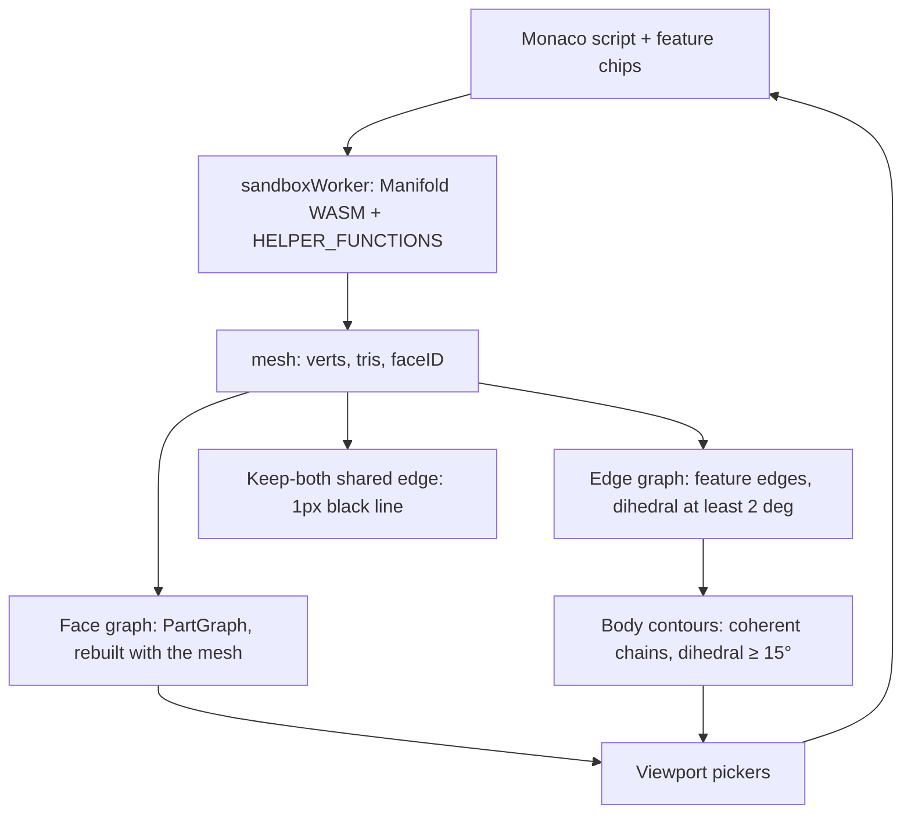

# Architecture

**Maintenance:** every PR that changes kernel helpers, face/edge/contour graphs, multi-body rules, or UI pickers must update this file in the same PR (or a tiny follow-up before the next feature). Drop stale sections when behavior changes.

Runtime map for SurfCAD. Screen placement is `docs/UI_MAP.md`. Popup chrome is `docs/POPUP_STYLE.md`. Blend kernels are `.claude/skills/fillets/SKILL.md`. Fillet and graph speed is `docs/performance.md`. `EDGES.md` is an older plan; the graphs below are what the code builds.

Two different things are called contours. **Sketch contours** are `makeCrossSection` profiles (contour mode). **Body contours** are the coherent edge chains the viewport paints and that Fillet / Sweep path picks walk. This file uses those names.

## Layers



1. **Script.** Monaco holds the program. Feature chips come from `parseFeatureMarkers`. Confirm writes text into that buffer and Auto-Runs. The worker does not see picker state.
2. **Helpers.** `executeScript` prefixes the script with `"use strict";\n` and runs `new Function(...helperNames, wrappedScript)`. `HELPER_FUNCTIONS` are the parameters. Those names are bindings of the user script. See Goldens.
3. **Mesh.** A successful run replaces the three.js geometry and stores `faceID` on it. `c4MeshData` is a separate worker graph, rebuilt on each helper call that needs faces or edges. It is not the viewport PartGraph. `edge` / `edgesBetween` use `indexBoundaryEdges`, cached in a WeakMap on that Manifold object.
4. **Viewport.** Pickers and paint read the three.js mesh. They do not read `c4MeshData`.

## Helpers

Injected names are the keys of `HELPER_FUNCTIONS` in `src/workers/sandboxWorker.js`. Anything not in that object is not a script helper.

| Helper | Inputs → output | Multi-body |
| --- | --- | --- |
| `makeExtrude`, `makeRevolve`, `makeLoft` | contours or sections → a new solid | No split. UI adds or subtracts onto `part` when `part` already exists. Default is add (`part.add`). Merge bodies off emits `part.add(x, { merge: false })` (separate body, below). Subtract emits `part.subtract`. An empty script is still `let part = …`. |
| `loft`, `sweep`, `sweepPoints` | profiles / path → a new solid | Same. Sweep's one-shot fallback still replaces `part` when Mode is Add. Contour Confirm adds or subtracts. |
| `makeCrossSection`, `profileCircle`, `profileRectangle`, `profilePolygon` | plane + 2D profile → a sketch contour, not a solid | — |
| `makeSweepPath` | edge list → one ordered path | Orders the edges it is given. It does not walk bodies. |
| `filletAlongPath` | solid, path, radius, opts → blend (subtract, or union for a concave run) | On a multi-body solid, fillets the body that owns the path, then `compose`s the untouched bodies. The scrap check still runs on that one result. See below. |
| `filletEdges` | solid, edges, radius → planar blend | No `decompose` scrap check. |
| `chamferEdges` | solid, edges, size → chamfer | No `decompose` scrap check. Fillet-mode Chamfer emits `filletAlongPath(..., { profile: 'chamfer' })`, not this. |
| `shell` | solid, thickness, opening → the cavity | No `decompose` / `compose`. Offsets the mesh it is given. On overlapping bodies the cavity is wrong; use `hollow`. |
| `hollow` | same → the walls (`solid − shell`) | Per body when bodies overlap (`_perBodyFaceOp`, below). |
| `draftFaces` | solid, faces, angle, `{ pull, reference, sense }` → tilted solid | Moves vertices of the selected faces only. Per body when bodies overlap, so `reference: 'min'` is that body's box. A fillet between the neutral plane and the wall hinges at the blend tangency; the blend face is not drafted. |
| `addDraft` | solid, degrees, axis → `draftFaces(..., 'sides', { reference: 'min' })` | Legacy; reference is the whole solid's box. |
| `cut` | solid, plane, `{ bodies, keep, drop }` → kept pieces | `decompose`, cut the named bodies, `compose` what remains. Default `keep` is `'both'`. |
| `booleanBodies` | solid, `{ op, bodies, drop, tools }` → one solid | `decompose`. The first `{ at }` is the target. Later bodies are tools, unioned, then difference is target − tools and intersect is target ∩ tools. Union unions every named body. Unselected bodies are composed back. Omit `bodies` to use every body in decompose order (with `tools`, omitting it names the first body only). `tools: [solid]` are extra tool solids after the named bodies, used for cross-part copies (`externalBody`). Intersect `drop: [{ at }]` deletes leftover pieces by the same centroid gate as `cut` (squared distance ≤ 1e-4). Empty intersection throws. Deleting every piece throws. |
| `externalBody` | `function () { copied script }` or a solid, `{ bodies, offset }` → solid | Runs the copied text, then `decompose` and keeps the bodies whose vertex centroid matches each `{ at }` (same 1e-4 gate as `cut`; a miss throws `externalBody:`). Omit `bodies` to keep the whole solid. Translates by `offset`. The text is a frozen copy, not a reference: nothing reads the source part at run time. |
| `move` | solid, `[dx,dy,dz]`, `{ bodies: [{ at }] }` → that body translated | Same split as `cut`. Exactly one body. Other bodies stay. `{ at }` is the vertex centroid. An exact literal uses `cut`'s 1e-4 gate. A re-run may shift that average, so the nearest body within 1% of its radius (at least 0.05) still matches when the next body is farther. A point that is not near a centroid throws. |
| `moveFace` | solid, faces, distance, `{ flip }` → those faces offset along their normals | No `decompose` unless bodies overlap (then per body). Adjacent faces extend or trim. Facets within 10° that are all held or all offset are one plane. A scrap within 10° that lies on a larger face of the same body is that face. Not `move()`. Other bodies' vertices stay. |
| `deleteFace` | solid, faces `{ center, normal }` → those faces removed and the solid healed | No `decompose` unless bodies overlap (then per body). Neighbors extend or trim until they meet. If they cannot keep a closed solid, throws. Does not return an open or non-manifold mesh. |
| `edge`, `edgesBetween`, `boundaryEdges` | current solid + ids → segments | Ids are for this mesh. A miss throws `re-pick edges`. Fillet Accept of several disjoint corners writes every lookup before the first blend, so those ids are still the pre-blend mesh. |
| `facesByNormal`, `planarFaceAt`, `edgesByOrientation`, `convexEdges`, `concaveEdges`, `signedFeatureEdges`, `workplaneFromFace`, `placeInFrame`, `transformByFrame`, `placeOnFace` | queries / frames on one solid | Worker faces do not merge across bodies (below). |
| `hole`, `holeSpan`, `cboreHole`, `cskHole`, `holePattern`, `clearanceHole`, `tapDrillHole`, fastener lookups | solid + frame → solid with holes | No body split. |
| `roundedBox`, `tube`, `rectTube`, `hexPrism`, `mirror`, `array3D`, `polarArray`, `center`, `align`, `getDimensions`, loft/sweep vector helpers | as named | No body split. |

`cut`, `move`, and `booleanBodies` are the helpers that `decompose` the input and `compose` the output. `externalBody` decomposes its copied solid to keep the named bodies. `shell` and `addDraft` do not. On disjoint bodies (a keep-both cut) `hollow`, `draftFaces`, `moveFace`, `deleteFace` also see one mesh with more triangles.

## Separate bodies (Merge bodies off)

- **Script.** `part = part.add(solid, { merge: false })` → `Manifold.compose([part, solid])`, no boolean. Bare `part.add(solid)` / `{ merge: true }` is the union it always was. Installed on the embind prototype by `installSeparateBodies` (`src/workers/separateBodies.js`) right after `setup()`.
- **Overlap guard.** Composed bodies may overlap, and Manifold's own boolean fuses them wherever the other operand reaches the overlap. So when the receiver's bodies have overlapping boxes (`overlappingBodies`: positive-volume box overlap; a touching cut plane does not count):
  - `subtract` / `intersect` run per body the tool's box meets, the rest are kept, then `compose`.
  - `add` (merge on) unions the tool with every body it actually joins (raw union of that body + tool has fewer components), keeps the others, `compose`s. Touching two bodies fuses them. Touching none → its own body.
  - One body, or bodies that do not overlap → the original method, bit-identical. Static `Manifold.union/difference/intersection` are not patched (`booleanBodies` uses them on the picked bodies).
- **Face features** (`hollow`, `draftFaces`, `moveFace`, `deleteFace`) go through `_perBodyFaceOp` on overlapping bodies: a named `{ center, normal }` goes to the body whose facing surface (normal within ~8°) is closest; unnamed selectors (`'z'`, `'all'`, `'sides'`, `'none'`) run on every body; untouched bodies are kept.
- `filletAlongPath` (fillet + chamfer), `cut`, `move`, `booleanBodies`, `externalBody` already split by body.
- **Viewer.** Compose shares no vertices, so `meshBodyComponents`, double-click `selectOwningBody`, the part graph, `buildFeatureEdges` `bodyId`, Cut / Boolean Pieces and `bodyCentroids` all see the bodies as distinct. Graphs rebuild on the run like any confirm; no new rebuild rule.
- **UI.** `SOLID_MERGE_PARAM` (bool, default on, `showWhen` combine = add) on all six Blocks and the Extrude / Revolve / Loft fallbacks; `ContourModeChip` shows the checkbox only for a solid in Add; Viewport sends `merge` in the commit payload (forced on in Subtract). The first solid is still `let part = …`.
- **Strip.** `parseFeatureMarkers` sets `separate` when the block holds `.add(…, { merge: false })`. `FeatureStrip` draws the violet two-squares marker only when that flag is set **and** the live part still has more than one body (`featureShowsSeparateBody` + `bodyCount` from the last run). A later Boolean union (or any fuse to one body) clears the marker even though the script still says `merge: false`.
- **Limits.** Reported `volume` (and so the quote) is the sum of bodies: an overlap counts twice until a Boolean union. Export writes overlapping shells. `shell()` used by hand as `part.subtract(shell(part, …))` and `addDraft` see the whole mesh. A Boolean union of overlapping bodies is the only way to fuse them besides a merge-on Add that touches both.

Worker faces (`c4MeshData`): a Manifold `faceID` is split into edge-connected components, then components on the **same plane and the same body** are merged. The 0.1° coplanar merge also skips an edge whose two triangles are in different bodies. Body id is the vertex-connected component (`_triComponentIds`): a keep-both cut does not share vertices, so each piece is its own body even when `faceID` is reused. That is what the comment means by each body keeping its own contour. Curved components are not re-merged. A same-offset re-merge also needs the components' own normals within 2° (`COPLANAR_PAIR_MIN_DEG`): `faceID` is only unique within one source mesh, and every swept fillet cutter has the same triangle numbering, so `faceID` k is a facet on each earlier fillet. Two such facets on different fillets can sit at the same offset along their averaged normal on a symmetric part; merged, that face's normal was 45° off both, and `signedFeatureEdges` handed it to the next fillet as the edge dihedral (the three-fillet corner blob). A fillet boolean can still leave two copies of a cap vertex about 0.001mm apart, so that merge keeps two faces. A named `moveFace` pick includes the other face when it is the same plane, the same body, and a vertex of each lies within 0.02mm. It also includes a larger face on that body when the pick is a scrap within 10° of it, they share a vertex, and the scrap lies within 0.012mm of the larger plane. The curved blend is degrees off that plane and stays out. `hollow`, `draftFaces`, `cut`, and `deleteFace` still resolve one face.

## When to rebuild graphs

There is no `rebuildGraphs()` and no per-op hook. Cut, Draft, Move Face, and Delete Face do not rebuild anything while the picker is open.

| Graph | Where | Built | Invalidated | Rebuilt |
| --- | --- | --- | --- | --- |
| **Face** (PartGraph) | `faceGraphFor` WeakMap on the BufferGeometry. Overlay copy in `partGraphRef`. | `warmFaceGraph` in `renderMeshData` when the mesh is shown, including after fillet. A click builds it if that paint missed. The overlay builds its own copy when patch colours are on. The 250k-tri cap applies to the **overlay only**. Curvature κ walks each atom's neighbor list in adjacency-record order. Manifold gives each triangle its own `faceID`, so a scan of every record once per atom was quadratic in the fillet. The planar bridge floods a flat only when another triangle lies on that plane (same 0.5° / 0.05 mm test); a fillet facet with nothing else on its plane is left as it is. Seam vertices are binned by packed integer cells, same 0.02 mm pitch. The patches are unchanged. | `renderMeshData` drops `partGraphRef` and replaces the geometry. The WeakMap misses, then that paint fills the new mesh. | That paint. Not while Cut, Draft, Move Face, or Delete Face is still on the old mesh. |
| **Edge** | `buildFeatureEdges` inside `featureGraphFor` (`partSolidCache.js`), called by `syncFeatureEdges`. Cached in a WeakMap by geometry object + faceID array; `featureEdgesSourceRef` is the bound geometry. | Dihedral **≥ 2°**. Each edge gets `bodyId` from `meshBodyComponents` (shared vertex index = one body). | A new run is a new geometry, so it misses. An empty script clears and does not rebuild. | End of every successful run, including Cut and Draft confirm. Fillet enter, leaving Fillet in Edge, Sweep path pick, and a part switch re-sync, which is a cache hit when that solid was already built. |
| **Body contours** | `buildCoherentEdges` in that same sync. Not a third cache. | Feature edges with dihedral **≥ 15°**, traced into chains. A keep-both cut shares no vertices, so a vertex walk cannot cross pieces. `bodyId` also blocks collinear merge and the spatial / parallel-face bridges (those links do not require a shared index). | Same as the edge graph. | Same call. If `faceID` is present, `indexBoundaryEdges` also runs and annotates those edges (fillet `fN` / `eN`). |

`indexBoundaryEdges` (worker `edge()` and viewport labels) keeps a boundary when dihedral ≥ 15° **and** the smaller face is ≥ 5% of the largest face. That is a stricter set than the coherent chains. Shallow blend facets stay out of both.

On that rebuild, triangle edges are indexed by a packed integer (`lo * 2^26 + hi`), with a string only when a vertex index does not fit in 26 bits — the same kind of numeric key the face graph uses. The 15° / 5% gate runs before segment records are allocated; the kept boundary set is unchanged. Collinear copies in `buildCoherentEdges` are still grouped against the first unused seed, not unioned along a curve. That seed only consults numeric bins of the line's perpendicular foot (the cell is at least the 6° / 0.45 mm slack, and the neighbor cells are included). A contact seam needs two vertex-connected bodies, so one body stops after that count.

**After Cut confirm and after Draft confirm** the path is the same: Confirm writes one call, Auto-Run, `renderMeshData`, then `syncFeatureEdges` on the new geometry.

- Edge graph and body contours are rebuilt in that success path.
- The face graph is rebuilt in that same paint (`warmFaceGraph`). A new geometry is a WeakMap miss, so the graph is the new mesh, not the pre-fillet one.
- In that rebuild, coplanar pieces of one plane in the same body become one face when a fillet sits between them, even if the face ids still differ. Vertices within 0.02mm count as touching, so a duplicate-vertex seam on that plane is the same face after the needle between the copies is dropped from the drawn mesh. The curved blend stays its own patch. Coplanar walls whose path leaves the plane stay separate faces.
- Face and edge picks are cleared, except Fillet mode and Sweep contour mode, which keep the edge wire and re-stamp boundary ids.
- The live Cut preview (`previewCut` on a clone) and the Move preview (translated triangles) do not replace `resultRef.geometry`. Graphs stay on the uncut / unmoved solid. Preview meshes do not raycast.
- The Block preview (`previewBlock`) builds only the new solid. It does not read or assign `cachedManifold` and does not replace `resultRef.geometry`. Graphs stay on the host. The preview does not raycast. Add and Subtract both paint it with the shared preview recipe (`utils/previewStyle.js`, `makeBlockPreviewSkinMaterial`): unlit translucent cyan, the same as Loft. Subtract also skips the depth test, so the cutter shows through the host.
- The Boolean preview (`previewBoolean` on a clone) does the same: `cachedManifold` is not assigned. Intersect piece meshes do raycast, including a hidden piece drawn at opacity 0, so a second tap brings it back. Body picks do not. A cross-part intersect first moves the pick mesh to the target part, then the worker runs the target's script and each tool part's script (not cached), poses the tools by the assembly offset, and splits that result, the same solid Confirm will write. Pieces are drawn at the target's position.
- The cross-part subtract probe (`probeOverlap`) runs the frozen cutter and rebuilds each candidate part from its last mesh. It does not read or assign `cachedManifold` and does not rebuild any graph.
- Draft highlights do not change the mesh. Taps before Confirm still read the pre-draft graphs.
- Shell confirm uses this same run path. Nothing in the graph code special-cases shell.
- **Move Face confirm** is the same path: one `moveFace()`, Auto-Run, then the edge graph, body contours, and face graph rebuild. Fillet confirm is the same paint: the face graph is rebuilt with the filleted mesh.
- The Move Face preview runs `moveFace` on a clone. It does not replace `resultRef.geometry` and does not rebuild graphs. Dismiss writes nothing.
- **Delete Face confirm** writes one `deleteFace()` for every picked face, replaces the previous Delete Face block, Auto-Runs, then the edge graph, body contours, and face graph rebuild. A heal that cannot stay a closed solid throws on that run.
- A Delete Face tap only adds or removes the face. It does not run `deleteFace`. Leaving without Confirm writes nothing.
- **Assembly.** A face, edge, or body pick retargets the active part. Graphs then bind to that part (face graph when the mesh is shown, edge graph and contours at the end of the run, or from the switch cache below), and highlight and preview anchors move with its assembly translation. The script pane stays pinned until the user opens Script or Parts, clicks a body, or picks during a feature. A failed run, or hiding that part, clears the pick mesh and does not rebuild from a previous solid. Other visible parts raycast. Showing or hiding them does not rebuild graphs until a pick retargets onto one of them.

What the new mesh contains is the difference, not the rebuild:

- **Keep-both cut.** Two vertex-disjoint bodies. Vertex walks cannot cross them. Face and edge graphs clip to the seed body: `selectGraphFace`, legacy taps (Move Face and Delete Face included), and the part-graph merge drop triangles that belong to another body. An edge walk skips a neighbor whose `bodyId` differs. The shared edge is painted (below).
- **Draft.** One body, unless the input was already split. Vertices of the drafted faces move, so dihedrals change, so the 2° / 15° gates can drop or keep different edges. No draft flag is stored on an edge.

## One click, one face

`resolveViewportFaceClick`:

- **Default (one click).** The PartGraph patch of the hit triangle. A flat is every coplanar triangle on that plane in the body, including a cap a fillet split onto the other source body's face id. A curved face is the curvature-merged band. The blend stays its own patch. If the mesh has more than one body, triangles outside the seed body are removed. The hit triangle alone is not the face.
- **Default (double click).** The vertex-connected body (`selectOwningBody`), not a wider face.
- **Shell, Draft, Cut** pass `legacy`. One click on a flat is that same planar patch. Two clicks are the 3° neighbour walk, three clicks are the connected component. A double click does **not** become the body, so Confirm still writes the tapped face. A click on the blend stays the coplanar facet.
- **Move.** One click is the full face and does not change the target. Double click sets that body (`{ at }` centroid).
- **Move Face.** One click is that same planar face, not the curved fillet. A double click is still the 3° walk, not the body, so Confirm still writes the tapped faces. Triangles outside the seed body are removed. The fillet and the cap are one vertex-connected body. `moveFace` still carries a tangent blend with the offset; the click does not select that blend. The offset also includes the other coplanar face across a duplicate-vertex seam (≤ 0.02mm), and a larger face when the pick landed on a scrap of that plane. The needle between those copies is not drawn. The highlight outline drops that seam, so the click has no line between the fillet side and the main side.
- **Delete Face.** Same legacy tap as Shell and Move Face, including that seed-body clip. A double click is not the body. The tap does not delete.

Worker face picks (`{ center, normal }` passed to `hollow` / `draftFaces` / `cut` / `moveFace` / `deleteFace`) resolve in `c4MeshData`, not in PartGraph. A named pick stays on the body whose surface contains the center. It does not move to another body because that face's center is nearer. The two face graphs are not kept in sync. `moveFace` then includes the coplanar face across that 0.02mm seam, and the larger plane when the named face is a scrap of it, so the offset matches the one face the click already selected. `deleteFace` uses that same center and normal and does not take the extra face.

## Contour paint

What you see as an edge is not one list.

1. **Crease.** The solid uses flat `MeshNormalMaterial`. A crease is wherever two adjacent triangles have different view-space normals. The shader has no angle cutoff. A coplanar diagonal (same normal) does not show. This is not stored. A needle left between two copies of a cap vertex is dropped before the mesh is shown (`dropPlanarFins`), so it is not a crease and not an edge of the face graph. A thin fillet facet is the only cover of its own surface and stays.
2. **Pick contour.** `paintEdgeLines` draws `edgePolyline` of the **selected** or hovered coherent chain (and saved sketch-contour wires). It does not draw every coherent edge. Fillet and Sweep path consume those selected chains (`assembleSweepPath` / `makeSweepPath`). An edge enters that chain only through the gates above: dihedral ≥ 2° to exist, ≥ 15° to join a contour, and the chain must survive the simplify / spine tests. Pieces of a keep-both cut do not share vertices, and `bodyId` blocks the bridges that would join them anyway. The tangent walk stops when the next edge's tangents diverge by more than 28°.
3. **Shared cut.** Only `contactSeamSegments`. See below.
4. **Face highlight.** `highlightFace` paints the picked triangles and a line on each boundary edge. An edge two of those triangles share by index is not a boundary. An edge whose midpoint already lies on another triangle of that same pick, within 0.02mm, is a duplicate-vertex seam and is not drawn. The curved fillet is a separate pick. A click on the cap does not trace the line between the fillet side and the main side, and the fillet's own outline stays.

**Edges that end on a drafted face.** No painter checks "drafted", and there is no draft flag. After Draft confirm the mesh is new and the same gates run on the new dihedrals. An edge under 15° is absent from the coherent contour. The 28° tangent walk stops when the next tangent diverges. A 12° draft leaves the wall edges well above 15° (about 78–102° on the playtest cube), and that 28° walk already stopped at the 90° corner before the draft. Those gates were not why the wrap stopped short. The documented guess that they were is wrong.

The varying-profile cutter swept one tube through that 90° corner. The easy path already splits a run at a turn sharper than `FRAME_DENSIFY_MAX_TURN_DEG` (5°). The varying-profile path now does the same: one tube per straight leg, then union. A smooth loft (turns ≤ 5°) stays one run. The shredded mesh was what broke the drafted-face contours into short fragments.

The easy dihedral cutter is one ring per path knot (`_s23SweepKnotRings`), the frame at that knot, the cross-section left as `FILLET_ARC_SEGMENTS`, ends capped. Knots stay at `FRAME_DENSIFY_MAX_TURN_DEG` (5°). A uniform extrude along the run length is not used: slices spaced by arc length miss a short arc chord that shares a run with a long straight. A closed loop is still one lap plus an 8% overlap, capped, so the joint is not a seam. The hard path is unchanged (one ring per knot already). A span longer than 29 mm gets one or more linearly interpolated rings on that same ruled quad (`_S23_LONG_CHORD_MM`). That is what makes a full-height fillet meet the cap as one loop; the path knots are not moved, and a 28 mm wrap straight stays one quad. A measurement flag, `__FILLET_REF_STATION_MM`, replaces the 29 mm step with a finer grid. Those vertices lie on the ruled quad, so the cutter solid is the same polyhedron.

After the boolean, `_s23WeldFilletResult` snaps vertices within 0.001 mm and drops the collapsed triangles. A long wrap fin is a triangle whose short edge is a duplicated vertex on a ruling; the rounded top rim comes back as several chains for the same reason. The rebuild is kept only when it is a strict solid and the volume moves by less than 0.001 mm³.

An open fillet end extends in two cases. Neither is a sphere cap, and neither is the concave open-end pad. The knot stays where it is: the pad is a new station past it, same frame, so that knot still has a ring.

- The end lands on a tilted face. The distance is how far the end profile must travel to clear that plane, capped, plus the sweep expand pad. Clearance about 0 means the end is already on the face. Alignment tighter than cos(2°) is not that test. A rounded run samples the back end only.
- The end is not an original path end, and the turn there is about 20° or less (a same-radius joint, or a shallow kink the 5° split cut). A new station is inserted along the outward tangent by the sweep expand pad. A hard corner, about 90°, is not.


Variable-profile knots closer than 0.05 mm to the previous kept knot are dropped after densify (`_s23DropMicroKnots`). The 5° max-turn densify bisects both segments at a turn for up to 8 passes, and bisecting cannot reduce the turn at a true corner vertex, so each corner grew a cluster of 0.001–0.05 mm segments, each with its own probe, frame and ring. Path ends and any knot that turns more than 20° stay, so a corner is not chamfered.

Path thinning (the 1.2 mm floor) can drop the vertex where a circular run meets a long straight. That joint is put back when the thinned shortcut turns more than 5° and the span is a circle running into a long straight. The 18° gate that rebuilds a whole collapsed quarter stays.

## Keep-both cut and the shared edge

`cut` defaults to `keep: 'both'`. Each selected body is `splitByPlane`. Kept pieces are `Manifold.compose`d when more than one remains. `decompose()` splits them apart again. They do not share vertices, so each piece is its own body. A body that does not cross the plane is returned unchanged. `faceID` may still be reused across the cut; worker face merge will not join those faces (body id is part of the plane key).

The new faces on the cut are real 90° edges on each piece, but the two side faces have the same normal, so the material crease never changes and the cut disappears. `contactSeamSegments` lists only that pair: a feature edge (not a coplanar diagonal) that two different bodies occupy, side normals agreeing (dot ≥ 0.85) and cap normals opposing (dot ≤ −0.85). Which triangle was stored first does not matter. A drafted side is tilted off the cap and still draws this same line when the sides agree and the caps oppose. One body, or a cut that keeps one side, produces no segments.

`attachContactSeam` draws those segments as `gl.LINES` in black (`vec4(0, 0, 0, 1)`), on the edge itself. There is no side-face lift (`CONTACT_SEAM_LIFT` is gone). `mvPosition.z += 0.5` is a depth bias so the line is not lost against the face (far plane is 2000). It is not a second, offset edge.

## filletAlongPath on a multi-body solid

When the input `decompose()`s into two or more bodies, the helper fillets only the body that owns the path, then `Manifold.compose`s the untouched bodies back. Ownership is the smallest worst-point distance of up to 48 path samples to that body's triangles. A tie (the shared cut edge, both ~0) keeps the first decompose index. A bad path throws before the split. One body does not split.

The fillet piece is unioned into that owning body. The blend is one solid with the owner, not a leftover wedge beside it. Keep-both siblings are not part of that union (union would weld the cut). The boolean and the scrap check then see that one body. If decompose still sees separate scrap after the join, the gate below fails loud. Thresholds are unchanged.

The fillet and the cap are already one body (one `decompose` component, one vertex component). The face graph is rebuilt when that mesh is shown (`warmFaceGraph` in `renderMeshData`). Coplanar triangles on one plane in that body become one face even when a fillet sits between them and the face ids still differ. Vertices within 0.02mm count as touching. The curved blend stays its own patch. A click on the cap includes both former bodies and does not include the fillet. `moveFace` on that cap offsets both copies. The drawn mesh drops the needle between them.

| Result of `decompose` | What it does |
| --- | --- |
| 1 component | Keep it. |
| Closed path, 2+ | Throw `decompose found N components on closed path`. No keep-largest. The message has no "scrap vol". |
| Open path, 2+ | Keep the largest, unless scrap volume `> 5%` of that largest **and** `> 0.01`. Then throw `decompose found N components with scrap vol …`. |
| Semi-arc batch (`plan.mode === 'runs'`, a wrap split at corners) | Same 5% / 0.01 test. The message is `semi-arc batch decompose found N components with scrap vol …`. |

Scrap volume is `(sum of component volumes) − largest`. That still means disconnected cutter scraps (thin sheets), not a second designed body. The other keep-both piece is composed back after the check, so it is not scored as scrap.

`golden:fillet-after-cut` is keep-both plus `filletAlongPath`. `golden:fillet-join-body` is an internal fillet whose wedge is in that one body, and a face pick that cannot select another body. `golden:fillet-move-seam` moves the face next to that fillet and checks the body-split line on a drafted face. `golden:fillet-face-pick` is one click on the coplanar cap: both former bodies, not the curved fillet. `golden:fillet-cap-move` offsets that whole cap, both sides of the duplicate-vertex seam. The highlight of that click does not draw the seam. `golden:fillet-wrap-draft` is a wrap that finishes onto a drafted face. Fillet after hollow is a different path: a concave segment forces the variable-profile builder. `golden:draft-fillet-tangency` covers draft hinge vs a fillet.

### Sweep frames on a chain that turns several times

A chain like Artur's three-corner wrap (up a vertical edge, round the top perimeter through prior R = 2 fillet arcs, down another vertical edge) turns 360° in total in 90° steps about three axes. Each straight leg then starts at a knot from the resampled corner arc before it, not on the mesh edge itself. Three rules keep the section right on such a chain:

| Where | Rule | What broke without it |
| --- | --- | --- |
| In-face rays (`_s23ProbeSegments`, `_s23ProbeFrame`, `_c6EdgeGeom`) | Read against the matched mesh edge (`_s23EdgeDirAlong`, only within 2° of the segment). When a triangle's third vertex is within sin 0.02 of the edge line, the ray is that triangle's normal × the edge (`_c6InFaceDirSafe`). Well-conditioned triangles give exactly the old ray. | A 0.015° tilt of the path segment against a sliver triangle (third vertex 0.004 mm off a 16 mm edge) swung the ray 45°. The chamfer section on the y = −10 top leg was rotated 45°: the front face was left uncut (lip), and the top was cut too deep (step). A solo pick of the same edge was fine. |
| Face-group normal (`c4MeshData`) | A group with ≥ 90% of its area within 2° of the area-weighted normal is planar. Its normal is the average of only those triangles (`_c4PlanarGroupNormal`). Curved groups and clean planes keep the plain sum. | `faceID` reuse across cutters put a 1.3 mm² facet of an earlier fillet into the +y wall's group. The normal was 4° off, and the variable-profile fillet cut a 94° section. |
| Arc split (`planFilletSweepPath`, `splitTighterArcs`) | On an all-convex fillet path, corner arcs tighter than the cutter (R < r) split into semi-arc runs, as same-R arcs (and every chamfer corner) already did. Concave or mixed paths keep one tube. | A r = 3.73 tube swept round an R = 2 arc rotates each ring about a center inside the section. Rings cross on the inside of the bend: fins and bow-tie notches on the top face (6.8 mm² of downward-facing facets at z = 10). |

`golden:fillet-chamfer-multi-rotation` runs both profiles on that chain. The chamfer is r = 2 (fixture `artur_playtest_chamfer_multi_rotation.txt`). The fillet is B's r = 3.73 variable-profile case (`artur_playtest_fillet_three_corner_wrap.txt`).

## UI confirm

Sticky pickers (Shell, Draft, Cut, Boolean, Move, Move Face, Delete Face) write **one** call and **replace** the previous marked block of that kind. A second confirm does not append. Grey X writes nothing. Chip behaviour is `docs/POPUP_STYLE.md`.

Single-body ops (Draft, Shell, Cut, Move, Move Face, Delete Face) write only the touched part. Fillet and Chamfer write every part that has picks, each into its own script (below). Subtract-mode Block / Shape and Boolean can write more than the part in the editor, by the cross-part rules below.

**Write target.** A face or edge pick moves the CAD part (`cadPartId`, the title, the strip and every preview anchor) but leaves the editor on `activeId`, and every writer writes the editor buffer. So before anything that writes, opens a feature sheet, or undoes, App runs `focusWritePart`. That covers:
- palette Block / Shape / helper Confirm (`handleInsertHelper`)
- every `handleCommit*` (Contour / Extrude / Revolve / Loft / Sweep / Workplane, Fillet / Chamfer, Shell, Draft, Cut, Move, Move Face, Delete Face)
- feature sheet open, Accept and Delete, and strip jumps
- Undo and Redo
- a palette tap (`onOpen`) and the start of a feature session, so the buffer snapshot, commit mode and Undo stack match the picked part from the start

`featureWriteTarget(doc, { pickedId, payloadPartId })` picks the part:
- the viewport's own part for that commit (`partId: activePartIdRef.current` on every commit payload), when it is a row
- else the picked part
- else the editor's part

When that is not the editor's part, it is loaded with `handleSelectPart(id, { keepPicks: true })`. That stashes the editor's script on its own stack, loads the target's script, and focuses the target's own Undo stack. Then the write happens.

Boolean keeps its own rule (the first pick's part, loaded the same way). Multi-part Fillet / Chamfer still write the other parts' blocks into their own scripts. Sheet Accept / Delete find the block in the loaded buffer (`liveSheetFeature`: same id and kind, else same kind and index) and refuse when it is not there. They never fall back to the chip's own offsets, which came from another part's script and gave "invalid range" or cut the wrong text.

Block solids (cube, rounded box, cylinder, sphere, tube, hex prism) and Shape solids (Extrude, Revolve, Sweep, Loft) share one Mode: Add or Subtract. It is the same feature, not a second tool. Profile and Workplane do not create a solid, so they have no mode. Polish (fillet, chamfer, move face, delete face) mutates. Default Mode is Add, so an existing script that does not set it still unions. Subtract cuts the new solid out of `part` only when `part` already exists. The first solid is always `let part = …`. Sweep's one-shot fallback stays a replace when Mode is Add; contour Confirm for Sweep adds or subtracts.

Opening a Block pop shows that solid in the viewport before Confirm: the Manifold mesh, painted like Loft's preview: unlit translucent cyan skin (`PREVIEW_COLORS.skin`, opacity 0.38, both sides, no depth write) plus a brighter cyan outline on its 20° creases, so it never reads as committed CAD. Position and rotation on the sheet move it live (rotate about the origin, then translate, degrees). Confirm writes the size, that pose, and Add or Subtract. An identity pose is left off the line. Cancel drops the preview and writes nothing. Subtract looks the same, with the depth test off on the skin, so a cutter inside the host stays visible.

| Mode | Tap | Confirm emits | Next confirm |
| --- | --- | --- | --- |
| Shell | add / remove opening faces. Closed → `'none'`. | one `hollow()` | replace |
| Draft | first tap = neutral (pull). Later taps toggle drafted faces. Undo drops the last drafted face. | one `draftFaces()` | replace |
| Cut | plane, then bodies (tap add/remove), then pieces (tap hides). | one `cut()`. `keep` omitted means both. | replace |
| Boolean | bodies on any part (tap add/remove). First tap, across parts, is the target. Intersect then pieces on the target (tap hides a leftover). | one `booleanBodies()` in the target's part. Tools on other parts are `tools: [externalBody(…)]`. | replace |
| Block / Shape Mode | Add or Subtract on that feature's sheet or contour chip. | `part.add` or `part.subtract` inside the same marked block. Subtract also writes a frozen copy of the cutter into each other visible part it overlaps. | replace that block (and that copy) |
| Move | double-click one body. XYZ, or a distance along the previous cut normal or a face normal. | one `move()` | replace |
| Move Face | tap add / remove. Undo drops the last face. Clear drops the faces. Flip reverses each normal. | one `moveFace()` | replace |
| Delete Face | tap add / remove only. The tap does not run `deleteFace`. Undo drops the last face. Clear drops the faces. | one `deleteFace()` for every picked face | replace |
| Fillet / Chamfer | edge pick, on one part or several. Tangent on by default. | `makeSweepPath` + `filletAlongPath`, one marked block per part with picks | **append** if that part already has that kind's markers, else replace |
| Sketch contour (Extrude, Revolve, Loft, Sweep, Profile) | profile on a plane | profile, and a solid for the four tools | replace that marked block |

Fillet's marker comment still says the second Accept replaces. The call site passes `commitMode: 'append'` when `hasFilletModeBlock` (Chamfer the same). `composeFilletCommit` keeps the old block only in that append case.

Multi-part Fillet / Chamfer Accept: picks are grouped by part and every group is validated first (`planMultiPartEdgeAccept`); one bad chain fails the Accept and names that part. Then every part is composed before anything is written (`composeMultiPartEdgeCommit`): the editor part on the live buffer, each other part on its saved script, append when that part already has the block. A part with no script, or whose last run failed, refuses the whole Accept. The editor part is written through the editor; the others go through `writeOtherPartScripts`, one feature step on each part's own stack, then every visible part runs once. Picks only on another part leave the editor alone. These are that part's own blocks with its own edge ids, not external copies: no `externalBody`, no yellow chip. Undo is per part, as for any cross-part write.

Several disjoint corners are separate `filletAlongPath` calls in that one block. Accept writes every `edgesBetween` / `edge` first, then the blends. The first blend can drop the face ids of the corner it cut: on a plain box, faces 2 and 5 meet at a vertical corner, and that pair is gone after the corner that used face 2. The next corner is not looked up on that mesh. Graphs are not rebuilt between those corners. They rebuild once, on the success path after Auto-Run, the same as a single fillet.

**Failed feature chip.** A feature whose run failed gets a red border on its strip chip and on its feature sheet: `border-2 border-red-400` (the error popup's red), plus the plain-CSS twin `feature-failed-ring` in `src/index.css` (2px solid `#f87171`, `!important`, outside any layer), so WebKit keeps the red over `border` utilities and native button styling. Red wins over the external yellow. Successful chips are unchanged.

The failing block is found two ways. The tracked block comes first:

1. **Tracked block (every engine).** Before the worker compiles the script, `instrumentFeatureBlocks` adds `;__featureEnter(i);` in front of each begin marker and `;__featureLeave(i);` in front of its end marker, on the marker lines themselves. No line moves.
   - A tracker (`createFeatureTracker`) keeps the stack of open blocks.
   - A throw while a block is open adds that block's `featureId` and `featureBlock` (its text) to the error.
   - A marker that is not at the start of its line is not tracked. If the instrumented body does not compile (a marker inside an expression), the original script runs untracked.
2. **Stack line (V8 / Firefox fallback).** A throw from a helper still leaves one frame in the `new Function` body. The worker calibrates the engine's header lines once (`calibrateScriptLineOffset`) and maps a V8 `<anonymous>:L:C` or Firefox `> Function:L:C` frame to a 1-based `scriptLine`.
   - **Safari:** WebKit frames for that body match neither pattern, so `scriptLine` is null there. That is why iPhone Safari showed the part's red glow but no red chip until the tracked block was added.

`ManifoldWorker` keeps `featureId`, `featureBlock` and `scriptLine` on the rejected error. The viewport reports every run it makes (`onRunOutcome`: success, cleared, failure). App maps the failure with `failedFeatureFromOutcome`:
- The tracked id comes first (`failedFeatureForId`). It must still hold the same block text; if the id moved, an identical unique block is used.
- Otherwise the line is used (`failedFeatureFor`).

The strip (both layouts) marks that chip with `data-feature-failed`, `aria-invalid` and the title "failed on the last run", for as long as the block's text is unchanged in the script it shows (`failedFeatureIds`). The feature sheet reads `failedFeatureIds` on the editor's script and marks:
- the identity badge: `data-feature-sheet-failed`, red, with the subtitle "Failed on the last run"
- the picker row: `data-feature-sheet-failed`, red

Editing that block, or the next good run, clears it. Only a throw inside an open block marks anything. A syntax error (no block ran), a non-Manifold return after every block has closed, or a throw outside every block marks nothing. Only the run shown in the viewport, which is the part the strip shows, is tracked. Background parts' failures stay on the Parts feed.

## Cross-part copies

Accept writes each affected part's script. A part that is not in the editor is written in the background: its script is replaced, saved, and pushed as one feature step on that part's own undo stack, then every visible part runs again. The active part's graphs rebuild on that success path. Another part's graphs rebuild when a pick retargets onto it, as before.

- **Boolean.** Picks are stored per part (hiding a part still leaves its slot alone) and each carries a tap counter, so the first tap across every part is the target. Its part is written. If that is not the part in the editor, it is loaded first (`handleSelectPart(target, { keepPicks: true })`), so the Boolean is one feature step on the target's stack. Tools on the target's own part are named by centroid as before. A tool on another part is frozen into the target: that part's whole script as it is at Confirm (the live buffer if it is the editor part) goes inside `externalBody(function () { … }, { bodies: [{ at }], offset })`. `at` is the centroid in the source frame. `offset` is source position − target position (placement is a translation). A hidden tool part keeps its pick and is still copied. A tool part whose last run failed is refused (`… failed its last run`). Picks on a part that is not the pick mesh are drawn from triangles stored with the pick, at that part's position.
- **Subtract Block / Shape.** The editor part gets its block as before. Then the cutter is frozen: the block's own lines, with `part = part.subtract(EXPR);` turned into `return EXPR;`. When those lines read `part` or a name declared earlier in the source script, that earlier script is copied in front of them. The worker probe (`probeOverlap`) intersects the cutter, posed into each other part's frame, with that part's last mesh. Every visible, non-failed part with overlap volume above 1e-6 gets a block of the same kind (`Cube`, `Extrude`, …) holding `part = part.subtract(externalBody(function () { … }, { offset }));`. Hidden and failed parts are not cut. A part the cutter does not touch is not written.
- **Tag.** The first line inside the block is `// external copy from "Name" · src <id> · ref <hash> · frozen at Accept, not linked`. `ref` is a hash of the source block text. Re-confirming that source feature (same kind, replaced in place) finds the copy whose `ref` matches the block it replaced and replaces it, so a part is not cut twice. If the moved cutter no longer overlaps that part, its copy is removed (one step there too).
- **Copied text.** Marker comments inside the copy become `// (copy) --- … ---`, so the copy adds no chips and marker scans (`stripBooleanBlock`, `scriptWithFeatureCount`, fillet append) only see the target's own blocks. `parseFeatureMarkers` flags a block that calls `externalBody(` as `external`. The strip chip gets a yellow border and the feature sheet says External copy.
- **Not associative.** Nothing links the copy to the source part. Editing, moving, or deleting the source later does not change the target. Deleting the feature, or undoing that step, deletes the copy with it.
- **Undo.** Each Confirm is one step on each written part, and only on those parts. There is no linked multi-part undo: Undo on the target removes its Boolean or its copy; the source part's stack is untouched.

## Interaction matrix

| | Face graph | Edge + body contours | Shared-edge line | Notes |
| --- | --- | --- | --- | --- |
| Cut confirm (keep both) | rebuilt, then clipped to the seed body | rebuilt; pieces share no vertices | 1px black, on the edge | `filletAlongPath` fillets the body that owns the path, then composes the rest |
| Cut confirm (one side) | rebuilt | rebuilt; one body | none | |
| Draft confirm | rebuilt | rebuilt from new dihedrals | recomputed; one body still has none; a drafted face that still meets the other body keeps the 1px line | wrap splits at a corner sharper than 5°; an open end extends when clearance is not already ~0, and a shallow internal split (≤ ~20°) takes the sweep expand pad; 15° / 28° unchanged |
| Fillet / Chamfer confirm | rebuilt with the new mesh; coplanar caps join across the fillet; the blend stays its own patch | rebuilt; picked wire kept | recomputed from the new mesh | one click on that cap is one face. Disjoint corners look up every edge before the first blend |
| Fillet / Chamfer confirm, picks on several parts | rebuilt on the editor part | rebuilt on the editor part; picked wire cleared | recomputed from the editor mesh | each other part with picks gets its own block as one step on its stack and runs again; no external copy |
| Shell / hollow confirm | rebuilt | rebuilt; no shell-specific rule | recomputed from the new mesh | |
| Move confirm | rebuilt | rebuilt | recomputed from the new mesh | preview does not rebuild graphs |
| Move Face confirm | rebuilt with the new mesh; one click is the planar face, still clipped to the seed body; a ≤0.02mm duplicate-vertex seam stays in that face | rebuilt | recomputed from the new mesh | the click does not include the curved fillet; the offset carries a tangent blend and the other coplanar face across that seam; the needle is not drawn; the highlight outline does not trace that seam; preview does not rebuild graphs |
| Delete Face confirm | rebuilt | rebuilt | recomputed from the new mesh | a heal that cannot close throws on Confirm, not on the tap |
| Boolean confirm | rebuilt | rebuilt | recomputed from the new mesh | one `booleanBodies()`. Bodies that were not named are composed back |
| Add with Merge bodies off | rebuilt; patches stay per body | rebuilt; edges carry the new `bodyId` | recomputed (overlapping bodies have no contact seam) | `part.add(x, { merge: false })`; later booleans and face features run per body while bodies overlap |
| Boolean confirm, cross-part | rebuilt on the target (it becomes the editor part) | rebuilt on the target | recomputed from the target mesh | tools from other parts are `externalBody` copies; the source parts are not written |
| Subtract Block / Shape confirm, cross-part | rebuilt on the editor part | rebuilt on the editor part | recomputed from the editor mesh | each other part the cutter overlaps gets one external-copy step and runs again; its graphs rebuild when a pick retargets onto it |
| Enter Boolean | unchanged | unchanged | unchanged | highlights, and an intersect piece clone. The cross-section panel stays reachable (chip is `z-20`, the panel is `z-40`, and the chip is not a scrim). A section hit is matched to the unsectioned body |
| Enter Cut / Draft / Move / Move Face | unchanged | unchanged | unchanged | highlights and clones only |
| Enter Delete Face | unchanged | unchanged | unchanged | highlight only; the tap does not run `deleteFace` |
| Assembly, active part succeeds | rebuilt when that mesh is shown | rebuilt on the active mesh | recomputed from the active mesh | other visible parts raycast. A hit retargets this mesh, including its assembly translation. A graph still keyed to another part is not painted; Fillet / Chamfer picks kept on another part are drawn at that part's position. A close seam keeps the nearest hit and shows a which-part chip |
| Assembly, active part fails or is hidden | cleared, not rebuilt from a previous solid | cleared, not rebuilt | none for that part | pick mesh omitted; no shadow solid. Leftover triangles from the last success stay pickable. A hidden part does not |

## Parts feed

The viewport can show more than the script in Monaco. An assembly is a list of parts. The editor still holds one part at a time.

- **Desktop.** A feed pane sits to the left of the editor. Each row is a thumbnail and the part name, in feed order. A blue bar and a blue tint mark the CAD-selected row. Red is only a failed script. Clicking the row loads that part's script into Monaco, and the viewport body highlight follows. A face or edge pick highlights the row and retargets overlays without loading Monaco. An eye on the row shows or hides that part. Double-click the row's name (or F2 on the focused row) to rename that row's part; a single click still selects it. Delete on the row asks first, then removes that part.
- **Thumbnails.** Each row shows a mini snapshot of that part's solid (`data-part-preview="manifold"`). It uses the viewer material (flat normal shading), the camera point light, and the `#1e1e1e` background. The bitmap is cached by the mesh and redrawn only when that solid changes. An idle row is not drawn again. No solid: an empty tile (`data-part-preview="empty"`).
- **Mobile.** The home-indicator pill uses Lucide icons. The order is CAD (box), then Parts (layout-list), then Script (square-text). The Parts stage is the same feed. Its top bar uses the script editor ribbon. The assembly name stays in the middle. Local or Git is right-justified. Load lives in the feed pane.
- **Chrome.** The CAD title is the part name, then the word in, then the assembly name (part1 in Assembly, or Bracket in Gearbox). Both names rename in place. The part chip renames the part the title shows (`renameTargetId(doc, cadPartId)`): a face, edge or body pick on another part moves the title there while the editor's `activeId` stays put, so the rename follows the pick, not `activeId`. Clicking the active row brings the title back to that part. A new assembly is named Assembly. A blank or whitespace name is saved as Assembly, including when an older document is loaded. A custom name is left as written. A loaded file name is used only when the document has none. Game mode keeps its puzzle chip. The parts ribbon (desktop feed and mobile Parts stage) centers the assembly name, and that name renames the assembly too.
- **Document.** The saved assembly lists `id`, `name`, `visible`, and `order` on each part. The document `name` is the assembly name. A blank name is stored as Assembly. An optional `position` `[x, y, z]` is a translation the viewport applies. There are no mates. The script source is not in the JSON.
- **Row id.** In git mode the id is a repo path and the part is that file. A path with no file yet offers Find in repo. In local mode the id is an IndexedDB key. A missing key offers Upload. Nothing else talks to git.
- **Failed parts in the viewer.** A visible part whose latest run failed gets a red outline and glow on the solid the viewport still shows for it, which is its leftover (the last successful mesh). Outside an assembly it is the restored last good mesh. This uses the same red as the strip's failed chip and the error popup (Tailwind red-400, `0xf87171`). The rule for which parts are failed is the same as the Parts feed's red row, `failedPartIdsFor`: not blank, missing, skipped or hidden. App passes those ids on every `placeAssembly`, falling back to the leftover ids. The viewport syncs the overlay on every assembly extra and on the pick mesh: after each placement, each new solid geometry (`renderMeshData`) and each part switch. `setFailedPartOutline` adds one child group to the part mesh, made of crease edges (`EdgesGeometry`, 20°), a translucent tint, and a back-face glow rim scaled about 0.6 mm (1–6 %) around the solid's center. None of them raycast, so picks still hit the solid. The overlay is rebuilt when the geometry changes and disposed when it turns off, and the solid's own geometry is never disposed. Successful parts carry no overlay. A part that failed without ever succeeding has no solid to mark; the Parts feed row is its only signal.
- **Visibility and failure.** The viewport draws every visible part whose latest run returned a solid. A hidden row is left out and is not pickable until it is shown again. A failed script highlights that row and contributes no solid to the composed viewport. There is no shadow solid on the pick mesh. Leftover triangles from the last success stay in the viewport and can be picked. Hiding a part mid-feature does not clear that part's picks. Boolean picks are stored per part id. Hiding a row calls `noteBooleanPartHidden` and does not add, remove, or rewrite that part's bodies or drop list. A part that was never picked stays unpicked. Switching to the part manager does not exit Boolean mode: the CAD pane stays mounted. Confirm writes the part of the first pick; picks on other parts are copied into it (see Cross-part copies).
- **Delete.** The trash control opens a confirm window first. Cancel leaves the part. Confirm drops that part: its row, its script, and its solid. The other parts stay. The active id stays on a remaining part, or is empty when none remain. A git file is left where it is.
- **Undo.** Each part keeps its own undo stack. Switching parts swaps stacks. Undo and Redo are feature-wise on that part only: each Confirm is one feature step, and there is no linked multi-part undo. Fresh load seeds the stack from that part's feature markers so strip Undo can walk those steps; Redo is session-only and drops across reloads. Undo restores the previous script of the part that was edited, and runs that part. It does not write another part's script into the editor. A cross-part Accept pushes one step onto each part it writes, and onto no other.
- **Graphs.** Face, edge, and body-contour graphs follow the CAD part, which a pick retarget can change without opening the script pane. They rebuild when that part's script succeeds, on the same path as a single script (edge graph and contours at the end of the run; face graph when the new mesh is shown). Selecting another row, or picking that part, rebinds all three to that solid before the next pick, and rebinds the highlight and preview anchors with them. Edge highlights, fillet id labels, the sweep-blend preview, and contour previews are drawn in that part's local frame and then translated with the part. A selection or graph still tagged with another part is not painted, so it cannot sit on the part that occupies the origin. A shared vertex-index key does not copy boundary ids onto a segment that is not the same edge. A failed or hidden active part clears its pick mesh and does not rebuild those graphs from a previous solid. The other visible parts are drawn beside it and do not rebuild graphs until a pick retargets onto one of them. An empty CAD click clears the geometric selection. Entering a feature hides the feature strip. Picks during that feature still retarget. Single-body ops write only the touched part; Fillet and Chamfer write each part that has picks (below); Boolean and Subtract can write more (Cross-part copies).
- **Part switch cache.** Built solids are cached by mesh data (`partSolidCache.js`). The pick mesh and the other parts use the same build (`buildSolidGeometry`: needle dropped, faceID kept), so a switch hands the geometry over: the part being left goes to the assembly layer, the part being touched comes off it, nothing is rebuilt. The face graph (WeakMap on the geometry), the edge graph and body contours (`featureGraphFor`, by geometry + faceIDs), and the contact seam (by mesh data) are hits on a solid already built. After each placement the other visible parts are pre-built in idle time, one graph per slice, not while dragging (skipped above 40k triangles, cancelled by the next placement), so the first switch onto a part is a hit too. A new run is new mesh data and always misses. Entries nothing shows (not the pick mesh, not another part) are pruned and disposed.
- **Contours and work planes stick to their part.** Saved sketch contours (`makeCrossSection`) and construction / work planes are listed per part from that part's own script: the editor part from the live buffer, every other visible part from its saved script (`partOverlaySources`). Each part paints under its own group, in its local frame, at that part's live translation (`partOverlayAnchor`). For the pick mesh that is the active part; for any other part it is its assembly mesh, falling back to the row position. `syncAnchoredOverlays` and every assembly placement move them, so a part switch leaves them alone and a moved part carries them. A hidden part's overlays are not drawn. A host-face contour (no literal plane) uses that part's own top face. Only the editor part's overlays take picks: a plane hit is filtered by its group's part, and the contour pick ray is moved into the editor part's frame (`toPartLocal`). Before this, both overlays were listed from the editor script alone and anchored to the active pick part. A pick on B with the script still pinned on A drew A's planes and contours on B, and B's own planes were not shown.
- **Multi-part edge picks.** Fillet and Chamfer picks accumulate across parts. A pick on another part still retargets (graphs, strip, Monaco), but the session keeps the edges already picked; every other mode still clears on a switch. Each pick carries its `partId`, and its points and face / boundary ids stay in that part's frame and mesh. Selection identity is part + vertex key (`sameSelectedEdge`), so B's `0-1` never toggles A's. Picks on the active part draw on the pick mesh; picks on another part draw at that part's position (a hidden part's are kept, not drawn). The live blend, the easy / hard class, and the seeded radius shown in the chip read the active part's picks; the chip counts parts and checks each part's chain. The untouched radius is a fixed 2 mm (`FILLET_DEFAULT_RADIUS`); picking more edges, on one part or several, never grows it (it used to be 0.1 × the picked path length, clamped 1–6). The only exception is a part too thin for 2 mm: `defaultFilletRadius({ minExtent })` clamps it to 0.45 × the part's thinnest bounding-box extent (`solidMinExtent`), so parts at least 4.45 mm thick keep 2. The chip's seed reads the active part's solid; on Accept every untouched part reseeds against its own solid (`partEdgeParams`, `defaultFilletParams(picks, { minExtent })`), so a thin part beside a thick one gets its clamped radius, exactly what a solo Fillet of that part would give. A typed radius (`radiusTouched`) applies to every part, unclamped. The helper-modal Fillet opens at the same fixed 2 mm.

## Git vault (G1–G2: adapter, open/save)

Git mode talks to GitHub only through an adapter object (`src/utils/git/`). G1 ships the interface, an in-memory mock, the layout helpers, the `.surf.json` schema and find-or-create. G2 wires Open/save in Git mode against the mock: list/open assemblies, new part path, add existing, dirty badges. There is no backend, no GitHub App, and no token; Commit is G3. The Parts ribbon in git mode shows a disabled **Connect GitHub** stub (`data-git-connect`) where sign-in will go.

- **Adapter** (`githubAdapter.js`). All async, `repo = { owner, name }`, repo-relative paths, UTF-8 strings. `getViewer`, `getRepo`, `createRepo({ name, private })`, `listBranches`, `getBranch`, `createBranch(repo, name, fromSha)`, `listTree(repo, ref, { prefix })`, `readFile(repo, path, ref)`, `commitFiles(repo, { branch, message, files, baseSha })`, `compare(repo, base, head)`. `commitFiles` writes and deletes (`{ path, delete: true }`) as **one** commit; with `baseSha` it refuses with `GitAdapterError('non_fast_forward')` when the branch moved (G3 uses this to branch off). `compare` returns `identical | ahead | behind | diverged`, ahead/behind counts, `mergeBaseSha`, and the merge-base→head file list. Errors are `GitAdapterError` with `not_found | name_exists | non_fast_forward | invalid | unauthorized`. `assertGithubAdapter` checks the surface; a real App adapter must pass it. Nothing outside an adapter may call the GitHub API, and the user token will only ever live in the browser.
- **Mock** (`mockGithubAdapter.js`). Repos, commits (parent + full tree) and branches in memory; deterministic 40-hex shas. A new repo is empty (no branch) until the first commit creates `main`. Repo names are GitHub-like and case-insensitive unique. `_seedRepo` and `_log` are test hooks, not interface.
- **Layout** (`vaultLayout.js`). One private repo per user, default `surfcad`.

  ```
  surfcad.json                          { "kind": "surfcad-vault", "version": 1 }
  README.md
  assemblies/<name>/<name>.surf.json    assembly document
  assemblies/<name>/parts/<part>.js     that assembly's parts
  parts/<part>.js                       shared parts, referenced by path
  ```

  `assemblyFilePath`, `assemblyPartPath`, `sharedPartPath`, `parseVaultPath` (marker / assembly / assembly-part / shared-part / other), `listAssemblies(tree)`, `listPartScripts(tree)`, `partPathAllowedFor`. Names go through `vaultSegment` (no path characters, no leading/trailing dots, 60 chars). Shared `parts/` is flat; a nested path is `other`.
- **`.surf.json`** (`surfJson.js`). `{ format: "surfcad.assembly", version: 1, name, activeId, parts: [{ path, name, visible, order, position? }] }`. `path` is the full repo path and is the row id of the in-app document (source `git`); it must be under this assembly's `parts/` or the shared `parts/`, end in `.js`, and be unique. No script source. Unknown keys are rejected. `validateSurfJson` returns every error; `toSurfJson` / `parseSurfJson` convert to and from the assembly document and throw on invalid; `stringifySurfJson` is 2-space with a trailing newline.
- **Find-or-create** (`vault.js`). `findOrCreateVault(adapter, { name = 'surfcad', create })`. The name is the rename field, cleaned by `sanitizeVaultName` (GitHub repo charset). A repo with the marker is `found`. A missing repo is created private and seeded in one commit (`created`); an existing empty repo is seeded in place (`initialized`). A non-empty repo without the marker is never written (`not-a-vault`, the UI asks for another name). `create: false` only looks (`missing`). A `name_exists` race re-looks instead of failing.
- **IndexedDB** stays the intermittent autosave in both modes; only Commit (G3) writes git.
- **Open/save (G2)** (`gitWorkspace.js` + Parts ribbon). The Local|Git control is a toggle (`data-parts-source-toggle`). Switching to Git find-or-creates the mock vault; Open lists `.surf.json` assemblies and loads each part script by path into IndexedDB, capturing a **baseline**. New part asks for a repo path (default `assemblies/<name>/parts/Part N.js`). Add existing picks a vault script (this assembly's `parts/` or shared `parts/`) not already in the document. Find in repo reads the missing path from the vault. **Dirty** = working copy ≠ baseline: amber badges on changed rows (`data-part-dirty`) and on the Local|Git toggle (`data-git-dirty-badge`). No baseline (Git mode before an Open) means not dirty. G2 never calls `commitFiles`.

## Goldens and fixtures

- Runners live in `scripts/golden/`. Playtest scripts live in `scripts/golden/fixtures/*.txt`.
- Each runner is a `package.json` script named `golden:…` (`node scripts/golden/smoke_….mjs`). `npm run verify` is the full gate (`VALIDATION.md`).
- `golden:merge-bodies-toggle`: FilletKiller + a 10 mm Block at x = 10. Merge off → 2 bodies (volume FK + 1000), Boolean union → 1 (= merge on), merge on → 1. Then every writer's `{ merge: false }`, viewer splits, and fillet / chamfer / shell / draft / cut / move / Move Face / Delete Face / cross-part clone on the 2-body part.
- Every `golden:*` script is green on main. Keep it that way: a PR that turns one red fixes it or updates it with the reason in the PR.
- A fixture that names faces (`edgesBetween(part, a, b)`) breaks when a kernel change renumbers Manifold face ids (`re-pick edges — no boundary between faces`). Re-pick the same edge: run the fixture up to that line on the old and new commit, match `boundaryEdges(part)` by `mid` and `length`, swap the ids, and note the renumber next to the call. Do not change the geometry the fixture asks for.
- `golden:app-loads` answers `/api/auth/me` as signed-out, because `vite preview` proxies `/api` to a backend on :3000 that the smoke does not start. Every other console error still fails it.
- `golden:helper-binding-clash` scans those fixtures. The user script is still the body of `new Function(...helperNames, script)`. A top-level `const cut` in a fixture is a SyntaxError because `cut` is already a parameter. Nesting the script in another function would hide that and is not the fix. Do not name a fixture binding after an injected helper (`cut`, `booleanBodies`, `move`, `shell`, `hollow`, `draftFaces`, `moveFace`, `deleteFace`, …).
- `golden:block-shape-boolean` is Add and Subtract on a Block (cube) and a Shape (extrude), then Boolean union, difference, and intersect with one leftover piece deleted. Hiding a part keeps that part's pick arrays. A section point maps to the unsectioned body.
- `golden:block-pose-preview` is position and rotation on all six Block solids. The preview mesh matches the script the pop would write. An identity pose adds no transform. Subtract preview is the cutter, and it does not replace the cached solid. Add and Subtract both use the previewStyle cyan skin (unlit, 0x22d3ee, 0.38, both sides, no depth write; Subtract with depth test off) and cyan crease outline, never the CAD normal material: 12 outline edges on a cube, 18 on a hex prism.
- `golden:move-one-axis` moves one picked body along a single axis when the named point has drifted off the vertex centroid the way a re-run of a fillet does. A point that is not near a centroid still throws. The user script is not nested, and it does not declare `cut`, `hollow`, `move`, `moveFace`, `draftFaces`, or `deleteFace`.
- `golden:move-face` offsets picked faces along their normals. Flip reverses each normal. Adjacent planar faces extend or trim. A tangent fillet on the picked face is carried with that offset (`golden:fillet-move-seam`).
- `golden:fillet-box-corners` fillets the four vertical corners of a plain box from the edge-picker Accept script and from a script `filletEdges` / `edge` call. It fails if that run throws `no boundary between faces`.
- `golden:fillet-face-pick` is one click on a coplanar cap split by a fillet. The pick covers both former bodies and does not include the curved fillet. The two regions are one body.
- `golden:fillet-cap-move` is Move Face on that cap when a fillet boolean left two copies of the vertices. Both sides offset. The drawn face has no needle between them. The highlight outline has no segment between the fillet side and the main side, and the curved fillet stays out of the pick. The cut cap at the same XY offsets too; the bottom cap stays where it is. A scrap a few degrees off the inner ceiling offsets that whole plane; the bottom cap stays.
- `golden:delete-face` removes a planar chamfer whose neighbors meet again, and throws when deleting a cube face would leave the solid open.
- `golden:assembly` loads the selected row's script, drops a hidden row from the composed viewport, omits a failed script with no previous solid, saves ids rather than inline scripts, and drops a deleted part from the list and from the composed viewport. A new or blank assembly is named Assembly, so the CAD title reads part1 in Assembly. A custom name stays. The parts ribbon centers that name and keeps Local or Git on the right. A part with a solid gets a cached manifold preview key; a missing solid stays empty. Delete asks first: Cancel keeps the part, Confirm drops it. Selecting a part rebinds face, edge, and contour graphs to that solid, and anchors edge highlights and tool previews on that solid so a pick on B cannot paint on A. Each part has its own undo stack, so Undo after A→B→A restores A's script, not B's.
- `golden:multi-part-block-drop` replays Artur's two-part drop. Part B is picked while the editor is on A. The Block sheet loads B, Confirm writes the cube into B's script only, and the strip lists B's sphere and the cube. A still runs as the 20 mm cube and B runs bigger. Undo and Redo walk B's stack, and A's stack never sees the cube. It also shows the old behavior: writing the editor buffer put the cube in A, and B's chip offsets on A cut the wrong text. `liveSheetFeature` refuses those offsets. It checks `featureWriteTarget` (picked part, viewport part, stale or unknown ids). It checks the wiring: `focusWritePart` before every writer, Undo/Redo, sheet open/Accept/Delete and strip jumps, palette `onOpen`, session start, `partId` on every viewport commit, Boolean's own target, and the Block preview anchor.
- `golden:pick-retarget` raycasts two parts. The nearer part becomes the edit target. A seam within 1 unit keeps that nearest hit and lists both parts for the which-part chip. A hidden part is not a candidate. A failed row's leftover mesh is. A face or edge pick leaves the script pane pinned. A body click, opening Parts or Script, or a pick during a feature syncs Monaco. Entering a feature hides the strip. An empty click clears the selection outside a feature, and a mid-feature hide keeps that part's picks.
- `golden:multi-part-fillet` is two identical cubes, so every vertex key exists on both parts. Picks on A then B accumulate and B's pick never toggles A's. A switch keeps picks only in Fillet / Chamfer. Re-stamping on B's graph leaves A's ids. Accept writes one fillet block in each part (editor and background), appends to a part that already has one, refuses a failed or script-less part, and both scripts run: B loses one corner, A its two. Chamfer the same. The switch cache reuses a built solid and its edge graph, misses on a new run, and prunes and disposes a solid nothing shows. The parts list highlight is blue.
- `golden:failed-part-outline` checks the overlay: red-400 edges, tint, and a glow rim that is the back faces scaled 1–6 %, with no raycast hits. It is rebuilt on new geometry, removed when off, absent on an empty solid, and never disposes the solid's geometry. It checks the failed-id rule against the Parts feed's red rows, and the wiring from App's `failedIds` on both placements through the viewport sync on extras, the pick mesh, switches, new geometry and solo runs.
- `golden:fillet-default-radius` checks the fixed 2 mm Fillet default on real solids: the seed stays 2 mm while twelve edges accumulate on one part (where the old 0.1 × path seed grew) and while picks accumulate on two parts. A 2 mm sheet clamps to 0.9 mm with either part active, and its fillet runs. A typed radius lands unclamped on every part. It also checks the wiring: the seed effect and Accept read the part's solid, and neither `defaultFilletParams` nor the helper modal reads path length.
- `golden:part-rename-target` checks two-part rename targeting. With Beta picked in the viewer and Alpha still active, the title rename lands on Beta and leaves Alpha alone. A feed row renames its own id. Stale picks fall back to the active part. Blank or unknown ids change nothing. It also checks the wiring through `handleRenamePart`, the title chip, the feed row (double-click / F2) and the active-row title reset.
- `golden:fillet-chamfer-multi-rotation` is the FilletKiller cube (three r = 2 fillets) with one 24-edge chain that turns 360° through four R = 2 arcs. Chamfer r = 2: one body, genus 0. Ball probes on the y = −10 top leg must find the front and top faces cut and solid just inside the 45° face, with the −x leg and the (10, −10) vertical leg as controls. Fillet r = 3.73 variable-profile: the per-knot θ is 88°..92°, there is < 0.05 mm² of downward-facing top surface, and the volume is 7665..7690. It also checks the wiring of the sliver-safe in-face rays, the planar group normal and the tight-arc split.
- `golden:feature-failed-chip` runs the worker on a script whose second fillet block fails. The error's `scriptLine` must be that call's line, and it must map to that chip only. A failure with no script frame (a non-Manifold return or a syntax error), or one outside any block, marks no chip. Editing the block clears the mark, editing elsewhere keeps it, and another script does not match. The failed tone is red-400, active or not, and wins over yellow. Successful tones are unchanged. Wiring checks cover the worker, `ManifoldWorker`, the viewport, App and both strip layouts.
- `golden:feature-failed-chip-safari` checks the failed chip without a V8 stack. It runs the real worker with a WebKit-shaped stack (`Error.prepareStackTrace`): `scriptLine` is null and `featureId` names the second fillet. That maps to exactly that chip. A throw in the first block names the first block. A bad return, a syntax error, or a throw outside every block names none. A marker inside an expression falls back to the untracked script. Under V8, both `scriptLine` and `featureId` still arrive. It covers the instrumentation (line numbers kept, enter/leave only on marker lines) and the id/block mapping rules. With react-dom/server it renders the real FeatureStrip (mobile top and Script rail) and FeatureSheet (identity and picker). The failing chip, badge and row must be red with `feature-failed-ring`, and the others must not. It also checks the WebKit CSS rule and the wiring.
- `golden:part-overlays-stick` checks the per-part overlay rules. There is one source per visible part, the editor reading the live buffer. The active part anchors on the pick mesh, every other part on its own solid, falling back to the row position. The test builds per-part three.js groups and checks that A's plane and contour stay on A across a switch to B and follow A when A moves, and that B's plane stays on B. Wiring checks cover the painters, the anchor sync, the repaint after placement, the editor-only plane hit and contour ray, and App's `activeId`.
- `golden:multi-part-easy-fillet` checks that a multi-part Fillet Accept gives each part what a solo Fillet of that part gives. A 40 mm edge, a 20 mm edge and a rim loop all seed 2 mm; a 4 mm plate clamps to 1.8. It covers A or B active, plate + rim with either active, and a typed radius. For each part the radius and class must match solo, and so must the run solid (volume, surface area, triangle count, genus).
- `golden:per-part-undo` seeds feature steps on load for two parts. Undo on A drops A's last feature and leaves B unchanged. Redo on A is session-only. Confirm on B is one new step and does not move A.
- `golden:git-g1-vault-layout` checks the adapter interface (method list, `assertGithubAdapter`), a mock round-trip (create repo, one-commit multi-file write and delete, read at a sha, tree prefix, stale `baseSha` refused, branch, compare identical / behind / diverged with merge base and files), the layout path helpers and `parseVaultPath`, `.surf.json` validate / convert / round-trip and its rejections, find-or-create (created, found, renamed, not-a-vault untouched, empty initialized, missing, invalid name), an assembly written and loaded back by path, and the git-only disabled Connect GitHub stub. It also asserts the git modules make no network or token calls.
- `golden:git-g2-open-save` seeds a mock vault with Gearbox + Cover, lists assemblies, opens Gearbox and loads Bracket + shared M3 bolt by path, checks dirty (clean after open, script edit, rename, new part, removed part, liveScript override, no baseline), new-part path resolution (bare / shared / refuse other assembly), add-existing (Spare addable; other assembly's parts not), and PartFeed/App wiring (Local|Git toggle + dirty badges, Open/New/Add dialogs, Find in repo, Connect stub, mock-only, no commit from workspace helpers).
- `golden:cross-part-clone` is a Boolean with the target in A and the tool in B (placed at x = 10): union 12000, difference 4000, intersect 4000, and an intersect whose tools are two bodies of a third placement with the +X piece deleted (2000). The copy embeds B's script with neutralized markers, adds no chips, flags the Boolean chip external, survives a later edit of B, and is gone when the feature is deleted or undone. A hidden tool part still writes; a failed one is refused. Subtract: a Block cutter in S at x = 15 cuts S and the overlapped part P (both 23000), not a far part, a hidden part, or a failed part. P's copy is one step on P's stack, is replaced on re-confirm, and is dropped when the cutter moves off P. A cutter that reads an earlier binding copies the source prefix. Add mode and Fillet plan no cross-part write. `externalBody` keeps the named body and poses it by the offset.
