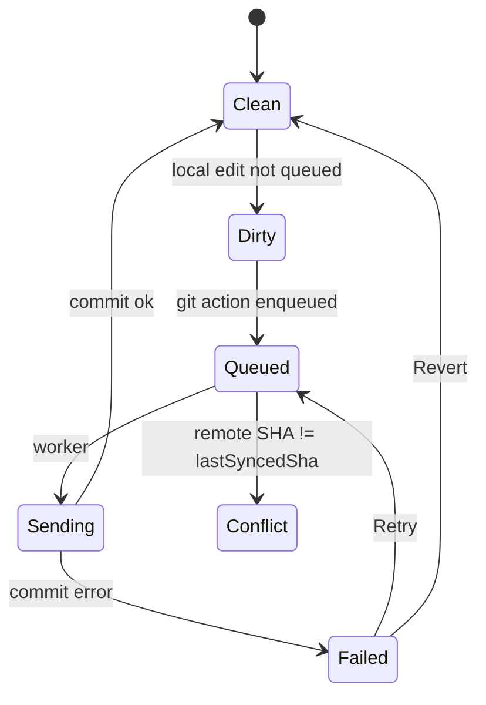

# Vault schema

How SurfCAD stores a Git vault today. The app is [surfcad.com](https://surfcad.com). Screen placement is [`UI_MAP.md`](UI_MAP.md). Runtime wiring is [`architecture.md`](architecture.md). The machine-readable copy is [`src/lib/surfcad/catalog/assembly.schema.json`](../src/lib/surfcad/catalog/assembly.schema.json), generated by `npm run export:agent` from `scripts/export-agent-catalog.mjs`.

Sources: `src/utils/git/vaultLayout.js`, `vault.js`, `surfJson.js`, `surfId.js`, `gitWorkspace.js`, `gitDeleteAssembly.js`, `gitRename.js`, `syncStore.js`, `syncWorker.js`, `src/utils/partGroups.js`, `src/utils/assembly.js`.

Local mode is not this layout. With no GitHub token the working copy autosaves in IndexedDB `surfcad-assembly`, and a part row id is a `local:` key. A GitHub token find-or-creates one private repo (default name `surfcad`) and writes the layout below.

## Tree

Paths are repo-relative, forward slashes, no leading slash. Writes use this shape. A new part is a name only; the app picks the folder and the `.js`.

```
surfcad.json                         { "kind": "surfcad-vault", "version": 1 }
README.md
assemblies/.gitkeep                  seed placeholder for an empty folder
assemblies/Gearbox/.surf.json
assemblies/Cover/.surf.json
assemblies/Gearbox/Lid.js
parts/.gitkeep
parts/Bracket.js
parts/M3 bolt.js
```

| Path | What it is |
| --- | --- |
| `surfcad.json` | Vault marker. A non-empty repo without it is not written. |
| `assemblies/<Name>/.surf.json` | Assembly document. The file name is `.surf.json`, not `<Name>.surf.json`. |
| `parts/<Part>.js` | Part script. New parts land here. Flat: `parts/a/b.js` is not a part path. |
| `assemblies/<Name>/<Part>.js` | Copy to this assembly only. New surf id. A name already in the folder becomes `Name 2`. |

`<Name>` and `<Part>` go through `vaultSegment`: no path or Windows-illegal characters, no control characters, whitespace collapsed, no leading or trailing dots, at most 60 characters. The `name` stored in `.surf.json` must already be that segment.

## Part scripts and ids

The first line of a part script is the stable id:

```
// @surf-id 2026-10-07-20-56-31-0423-a3f9
```

The body is UTC `yyyy-mm-dd-hh-mm-ss-SSSS-` plus 4 hex characters (`2026-10-07-20-56-31-0423-a3f9`). The id is minted once and never changes. A push does not rewrite it. Whether the part has been pushed is `isSynced` on the local IndexedDB part record. That flag is not part of the id and is never written to `.surf.json`. Add to Repo shows when `isSynced` is false. Blob SHA is not an identity.

A legacy id may still carry a `local-` prefix. It is accepted on read. One migration strips that prefix and keeps the body: IndexedDB first (the open document, script headers, outbox payloads, and sync-store keys), then one outbox commit rewrites `@surf-id` headers and `.surf.json` `id`, `copiedFrom`, group `id`, and group `partIds`. IndexedDB and the repo both strip a group id, so the two do not drift. The part path stays. Bytes after the header line stay, including a blank line or an indented first line, and a CRLF header line stays CRLF. The commit has no deletes. A second pass changes nothing. A row id that merely starts with `local-` and is not a surf id is left alone.

`.surf.json` stores `{ id, path }`. In the app the row id stays the repo path, and `surfId` carries `id`, so scripts stay keyed by file.

A reference matches a part by surf id when that id is known. A missing or unknown id falls back to the path. That is how delete and rename rewrite other assemblies (`findReferencedPart`, `rewriteSurfForDelete`, `rewriteSurfText`).

`id` may be omitted. `openVaultAssembly` reads the header when the script has one (the header wins). `backfillSurfIds` then fills any row that still has none: the cached path index, else a new id. Backfill does not rewrite the script and does not push. The header is written on the next real save.

## `.surf.json`

`format` is `surfcad.assembly`, `version` is `1`. No script source. Unknown keys are rejected. `stringifySurfJson` is 2-space JSON plus a trailing newline. `groups` is omitted when empty.

```json
{
  "format": "surfcad.assembly",
  "version": 1,
  "name": "Gearbox",
  "activeId": "parts/Bracket.js",
  "parts": [
    {
      "id": "2026-10-07-20-56-31-0423-a3f9",
      "path": "parts/Bracket.js",
      "name": "Bracket",
      "visible": true,
      "order": 0,
      "position": [0, 0, 0]
    },
    {
      "path": "parts/M3 bolt.js",
      "name": "M3 bolt",
      "visible": true,
      "order": 1
    },
    {
      "id": "2026-10-07-20-56-31-0424-b10c",
      "path": "assemblies/Cover/Plate.js",
      "name": "Plate",
      "visible": true,
      "order": 2,
      "copiedFrom": "2026-10-07-20-56-31-0999-abcd"
    }
  ],
  "groups": [
    {
      "id": "2026-10-08-02-00-00-0001-ab12",
      "name": "Cover",
      "source": "assemblies/Cover/.surf.json",
      "partIds": ["2026-10-07-20-56-31-0424-b10c"]
    }
  ]
}
```

The second part is a legacy row: no `id`. The third part is a link to another assembly's folder. `copiedFrom` is set when this row was made by Copy. `version` stays `1`. A face-coloring `colors` key is planned to join a later version bump, not this layout.

### Fields

`validateSurfJson` reports every problem. `parseSurfJson` / `toSurfJson` throw when it fails.

| Field | Required | Rule |
| --- | --- | --- |
| `format` | yes | `"surfcad.assembly"` |
| `version` | yes | `1` |
| `name` | yes | Path-safe folder name, equal to `vaultSegment(name)`. |
| `activeId` | no | `null` or one of the part `path` values. Omitted is allowed. |
| `parts` | yes | Array. `path` values are unique. |
| `parts[].path` | yes | Repo-relative vault script: `parts/<Part>.js`, this folder (a copy), another assembly's folder, or a legacy path below. Must end in `.js`. |
| `parts[].name` | yes | Non-empty after trim. |
| `parts[].visible` | yes | Boolean. |
| `parts[].order` | yes | Non-negative integer. |
| `parts[].id` | no | Surf id, unique in this file. Permanent. A legacy `local-` prefix is accepted on read. |
| `parts[].position` | no | `[x, y, z]` finite numbers. Viewport translation, millimetres. No mates. |
| `parts[].sheetMetal` | no | `{ sku, name?, thicknessIn?, gauge? }`. `sku` is required when the object is present. |
| `parts[].copiedFrom` | no | Surf id this row was copied from. |
| `groups` | no | Omitted on old files. No key means no groups. |
| `groups[].id` | when grouped | Surf-id shape. A group id, not a part id. |
| `groups[].name` | when grouped | Non-empty label. Starts as the source assembly name. Rename changes only this. |
| `groups[].source` | when grouped | `assemblies/<Name>/.surf.json` captured at insert, or `null` after that assembly is deleted. The name is the label. Renaming that assembly does not rewrite another assembly's `source`. Assemblies have no surf id, so no second identity field is stored. |
| `groups[].partIds` | when grouped | Non-empty surf ids. A part is in at most one group. |

On load, `pruneDanglingGroupPartIds` drops part ids that are not in `parts`, and drops a group that has nothing left. The same pass runs on every save (`normalizeGroups` inside `serializeAssembly`). A surf id listed twice stays on the first group. Collapse is UI state and is not stored.

## Groups, links, and copy

A group is a Parts-list folder for parts inserted from another assembly. It is not a multi-body solid and not a mate. Each member keeps its own script.

**Insert parts into current** (`planInsertVaultAssemblyParts` + `withInsertedGroup`) adds the source assembly's parts as links: same repo path, same surf id. A path already in this document is skipped. New rows are filed under one group named for the source assembly, `source` set to `assemblies/<Name>/.surf.json`. Inserting the same source again appends to that group and keeps its name. Parts already in some group stay where they are. The outbox commit rewrites this assembly's `.surf.json` only.

**Open Part** (`planOpenVaultPart`): a part already in the document is focused. A part in `parts/`, or in this assembly's folder, is a reference (same path). A part from another assembly's folder is a link. It is not copied.

A linked row is a path in another assembly's folder (`isExternalPartPath`). `parts/` is not external. The row shows **Caution: external part!** and **Copy to this assembly**.

**Copy to this assembly** (`planCopyToAssembly`) writes a new script in this folder. The new surf id is minted once. `isSynced` stays false until that part is pushed. `copiedFrom` records the source surf id (the row's id, else the header). The source file stays. A name already in this folder becomes `Name 2`. The group, if any, keeps the row and points `partIds` at the new id.

**Copy all to this assembly** (`copyGroupToAssembly`) runs that copy on each linked member. The group stays. A member that already lives in this folder is left alone.

Ungroup drops the group and leaves the parts. Remove group drops those parts from this assembly only. Linked files stay in the vault. The caller rewrites `.surf.json` and does not delete scripts.

## Delete assembly

One outbox commit, message `Delete assembly <Name>` (`planDeleteAssembly`). The cache snapshot is swapped only after the next tree is fully built, so a failure cannot leave some paths moved and others not.

| Choice | What the commit does |
| --- | --- |
| **Delete assembly, keep parts** | Deletes the assembly folder and `.surf.json`. Bytes already in `parts/` stay. An assembly-local copy moves to `parts/`. A name already there gets a numeric suffix (`Bracket.js`, then `Bracket 2.js`). The destination name is the file name, not the row label. Surf ids stay. |
| **Delete assembly and its parts** | The button stays disabled until the assembly name is typed. A script is deleted only when no other assembly references its surf id. An assembly-local copy that is still referenced moves to `parts/` and is not deleted. An unreferenced copy is deleted. |

A reference is another assembly on this branch: its tip `.surf.json`, the open working copy, and this branch's queued or failed outbox projected onto the tree. It matches `parts[].id`, or `parts[].path` when that row has no id, or `groups[].partIds`. `copiedFrom` is provenance, not a reference. `groups[].source` pointing at the deleted assembly is not a part reference.

Either way the folder's `.surf.json` is deleted (and the rest of `assemblies/<Name>/`). Every other `.surf.json` is rewritten in that same commit when a copy moves: part `path` follows the surf id, then the old path when the row has no id, and `activeId` follows the old path. A group whose `source` was this assembly (current or legacy metadata path) keeps its name and `source` becomes `null`. The commit refuses to drop a referenced part file or to overwrite a `parts/` file.

The confirm dialog lists referenced parts that will be kept: part name and the assemblies that use them. Keeping parts leaves files in `/parts` where they are. Deleting parts removes a script only when no other assembly uses it.

If the deleted assembly is the one open, the working copy switches to the most recently opened remaining assembly, else the first remaining name in sorted order, else an empty document named `Assembly`. An open assembly that only referenced the moved parts updates in place.

A failed push uses the same failure toast as rename (`data-rename-toast`): **Retry** requeues the outbox op, **Revert** drops it and puts the previous cache snapshot back.

## Cache and outbox

The UI reads and writes the local cache. Git create, save, rename, copy, link, and delete are appended to the outbox before anything is pushed.

IndexedDB `surfcad-sync` is the durable copy (`outbox` plus `kv` for the branch SHA, part rows, path index, and the whole-tree snapshot). Memory is the live copy, so a flush in the same turn sees the op. When IndexedDB is missing, memory still works. IndexedDB `surfcad-assembly` holds the open document and part records (row id → `{ script, savedAt, isSynced }`) in both modes. `isSynced` is local only.

The queue is FIFO per repo and branch. Ops for another branch stay queued and are not pushed onto this tip. The worker pushes immediately when online, and again on `online`. On reconnect it compares that branch's remote commit SHA to `lastSyncedSha` first. If they differ, it does not push and does not overwrite; the conflict popup opens. A push does not rewrite surf ids. The id migration commit is queued ahead of other pending ops, so a later rename still sees the bare id.

## Layout migration

One outbox commit (`migrate-layout`) moves assembly-folder scripts into `parts/`. This branch's pending outbox is projected onto the tree first. Surf ids stay. Every `.surf.json` path is rewritten by surf id, then by the old path. A name already in `parts/` becomes `Name 2` (`Bracket.js`, then `Bracket 2.js`). Nothing is overwritten. A row with `copiedFrom` is already a copy and stays in the assembly folder, so a later Copy is not swept and a second pass is a no-op. The commit refuses to drop a part file, change its body or surf id, or delete a `.surf.json`. Renaming an assembly then changes the folder and `.surf.json` only. `parts/` paths do not move. An assembly-local copy moves with the folder; the rename commit stamps `// @surf-id`, and a reload follows the pending rename so the id is not minted again. `groups[].source` on other assemblies is left as stored.



Row chrome: a yellow dot is a local edit not queued, a spinner is queued or sending, a red mark is failed.

## Legacy files

Read still accepts the old layout. Writes do not emit it.

| Legacy path | Current path |
| --- | --- |
| `assemblies/<Name>/<Name>.surf.json` | `assemblies/<Name>/.surf.json` |
| `assemblies/<Name>/parts/<Part>.js` | `assemblies/<Name>/<Part>.js` |

`openVaultAssembly` tries the current metadata path, then the legacy one. `migrateDocToCurrentLayout` remaps this assembly's nested part paths onto the flat folder. The layout migration then moves those scripts into `parts/` and rewrites the path. Shared `parts/` paths stay. The next Save deletes a leftover legacy `.surf.json` (`legacyCleanup`).

A `.surf.json` with no `groups` key loads as no groups. A part with no `id` loads; open backfills one as described above and does not mark the row dirty. The baseline is recaptured after backfill.
